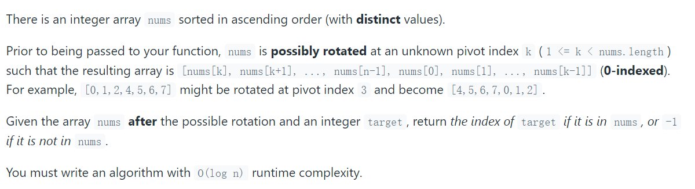

# LeetCode Note


## Array & HashMap

### 1. [Twp Sum](https://leetcode.com/problems/two-sum/)

Given an array of integers `nums` and an integer `target`, return *indices of the two numbers such that they add up to `target`*.You may assume that each input would have ***exactly\* one solution**, and you may not use the *same* element twice.You can return the answer in any order.

**Example 1:**

```txt
Input: nums = [2,7,11,15], target = 9
Output: [0,1]
Explanation: Because nums[0] + nums[1] == 9, we return [0, 1].
```

#### **Solution 1:**  

Do not using hashMap,   Force to sort and using two points, the time complexity is high(O^2), And it cost O(1) Space 

**Cost :**   time O(N^2), space: O(1), N is the length of nums

```kotlin
class Solution {
    fun twoSum(nums: IntArray, target: Int): IntArray {
        val size = nums.size
        for ( i in 0..size){
            for ( j in i+1 until size){
                if ( nums[i] + nums[j] == target){
                    return intArrayOf(i,j)
                }
            }
        }
        return IntArray(0)
    }
}
```

#### **Solution 2:**

 using a HashMap (map in C++, dict in python) , to store the numbers, the time complexity  of finding  "target - x"  can be reduced from O(N) to O(1) .  for each x, we first query the hash table to see if  "target - x" exists, and then insert x into the hash table to ensure that x does not match itself 

**Cost**:  time: O(N), space; O(N), N is the length of nums

```kotlin
class Solution {
    fun twoSum(nums: IntArray, target: Int): IntArray {
        var hash : HashMap<Int, Int> = HashMap()
        for ( i in nums.indices){
            if ( hash.containsKey( target - nums[i])){
                return intArrayOf(hash[target - nums[i]]!!, i)
            }
            hash[nums[i]] = i 
        }
        return IntArray(0)
    }
}
```

### [560. Subarray Sum Equals K](https://leetcode.com/problems/subarray-sum-equals-k/)  

Given an array of integers `nums` and an integer `k`, return *the total number of subarrays whose sum equals to `k`*.

**Example 1:**

```
Input: nums = [1,1,1], k = 2
Output: 2
```

**Example 2:**

```
Input: nums = [1,2,3], k = 3
Output: 2
```

#### **Solution 1:**  

1. there`s has other time-consuming, so I prefer to use Hash Map to deal this 

2. we can follow the  cumulative sum of all nums elemens,  until we find 
   $$
   sum[i] - sum[j] = k
   $$
    the sum of elements lying between indices i and *j* is k

3. Based on these thoughts, we make use of a hashmap  which is used to store the cumulative sum item
4.  Every time we encounter a new sum, we make a new entry in the hashmap corresponding to that sum, If the same sum item occurs again, we increment the count corresponding to that sum in the hashmap
5. we counted the number of occurrences of [sum-k], that means we alse get the number of times a subarray with sum k, because  *sum - (sum -k) = k*

**Complexity Analysis**

- Time complexity : *O*(*n*). The entire n**u**ms array is traversed only once.
- Space complexity : O(n). Hashmap can contain up to n distinct entries in the worst case.

```java
class Solution {
    public int subarraySum(int[] nums, int k) {
        int result = 0;
        int sum = 0;
        HashMap < Integer, Integer > map = new HashMap < > ();
        map.put(0,1);
        for (int i=0 ;i < nums.length; i++){
            sum += nums[i];
            
            if (map.containsKey(sum - k)){
                result += map.get(sum -k);
            }
            map.put(sum, map.getOrDefault(sum,0) + 1);
        }
        
        return result;
        
    }
}
```


### [128. Longest Consecutive Sequence](https://leetcode.com/problems/longest-consecutive-sequence/) 

Given an unsorted array of integers `nums`, return *the length of the longest consecutive elements sequence.*

You must write an algorithm that runs in `O(n)` time

**Example 1:**

``` text
Input: nums = [100,4,200,1,3,2]
Output: 4
Explanation: The longest consecutive elements sequence is [1, 2, 3, 4]. Therefore its length is 4.
```

#### solution 1

Sorting is valid, but time complexity is O(NLogN). could we have a better solution? yes 

#### solution 2

**Intuition**

It turns out that our initial brute force solution was on the right track, but missing a few optimizations necessary to reach *O*(*n*) time complexity.

**Algorithm**

This optimized algorithm contains only two changes from the brute force approach: 1. the numbers are stored in a `HashSet` (or `Set`, in Python) to allow O(1) lookups, and we only attempt to build sequences from numbers that are not already part of a longer sequence.

2. This is accomplished by first ensuring that the number that would immediately precede the current number in a sequence is not present, as that number would necessarily be part of a longer sequence.

**Complexity Analysis**

- Time complexity : *O*(*n*).

  Although the time complexity appears to be quadratic due to the `while` loop nested within the `for` loop, closer inspection reveals it to be linear. Because the `while` loop is reached only when `currentNum` marks the beginning of a sequence (i.e. `currentNum-1` is not present in `nums`), the `while` loop can only run for n iterations throughout the entire runtime of the algorithm. This means that despite looking like O*(*n*⋅*n*) complexity, the nested loops actually run in O(n + n) = O(n)* time. All other computations occur in constant time, so the overall runtime is linear.

- Space complexity : *O*(*n*).

  In order to set up O(1) containment lookups, we allocate linear space for a hash table to store the O(n)  numbers in `nums`. Other than that, the space complexity is identical to that of the brute force solution.

```Java
class Solution {
    public int longestConsecutive(int[] nums) {
        
        // we need a HastSet to Save time 
        Set<Integer> num_set = new HashSet<Integer>();
        for(int num : nums){
            num_set.add(num);
        }
        
        int longestStreak = 0;
        
        for (int num: num_set){
            // check if its the start of a sequence 
            // if not that means curretn num is not the smallest of the longest Consecutive (the begin one)
            if ( !num_set.contains(num-1)){
                int currentNum = num;
                int currentStreak  = 1;
                while( num_set.contains(currentNum+1)){
                    currentNum += 1;
                    currentStreak += 1;
                }
                
                longestStreak = Math.max(longestStreak,currentStreak);
            }
            
        }
        return longestStreak;
    }
}
```

### [49. Group Anagrams](https://leetcode.com/problems/group-anagrams/)

Given an array of strings `strs`, group **the anagrams** together. You can return the answer in **any order**.

An **Anagram** is a word or phrase formed by rearranging the letters of a different word or phrase, typically using all the original letters exactly once.

**Example 1:**

```
Input: strs = ["eat","tea","tan","ate","nat","bat"]
Output: [["bat"],["nat","tan"],["ate","eat","tea"]]
```


#### solution 1 

**Intuition**

Two strings are anagrams if and only if their sorted strings are equal.

**Algorithm**

Maintain a map `ans : {String -> List}` where each key \text{K}K is a sorted string, and each value is the list of strings from the initial input that when sorted, are equal to \text{K}K.

In Java, we will store the key as a string, eg. `code`. In Python, we will store the key as a hashable tuple, eg. `('c', 'o', 'd', 'e')`.

**Complexity Analysis**

- Time Complexity: O(NK log K) where *N* is the length of `strs`, and *K* is the maximum length of a string in `strs`. The outer loop has complexity *O*(*N*) as we iterate through each string. Then, we sort each string inO*(*K*log*K*) time.
- Space Complexity: O(NK) the total information content stored in`ans`.

```Java
class Solution {
    public List<List<String>> groupAnagrams(String[] strs) {
        if (strs.length == 0) return new ArrayList();
        
        Map<String, List> ans = new HashMap<String, List>();
        for (String s:strs){
            
            char[] currentString = s.toCharArray();
            Arrays.sort(currentString);
            String key = String.valueOf(currentString);
            // if currentString not exist, just creat the new List to save s
            if ( !ans.containsKey(key)) ans.put(key,new ArrayList());
            ans.get(key).add(s);
        }
        
        return new ArrayList(ans.values());
    }
}
```


#### solution 2

in the solution 1, if one String element is so long,  that will be very time Consuming , so we using character counts  to be the Keys in HashMap

**Intuition**

Two strings are anagrams if and only if their character counts (respective number of occurrences of each character) are the same.

**Algorithm**

We can transform each string s into a character count List, the  Count List consisting of 26 non-negative integers representing the letter from  a to z . We use these counts as the keys for our hash map.

**Complexity Analysis**

- Time Complexity: O(NK), where N is the length of  giving  strs List, and K is the maximum length of a element in `strs`. Counting each string is linear in the size of the string, and we count every string.
- Space Complexity: O(NK), the total information content stored in `ans`.

```python
class Solution(object):
    def groupAnagrams(self, strs):
        """
        :type strs: List[str]
        :rtype: List[List[str]]
        """
        ans = collections.defaultdict(list)
         
        for s in strs:
            count = [0] * 26  # a ...Z
            
            for c in s:
                count[ord(c) - ord('a')] += 1
            ans[tuple(count)].append(s)
        
        return ans.values()
```


### [189. Rotate Array](https://leetcode.com/problems/rotate-array/)

Given an array, rotate the array to the right by `k` steps, where `k` is non-negative.

**Example 1:**

```
Input: nums = [1,2,3,4,5,6,7], k = 3
Output: [5,6,7,1,2,3,4]
Explanation:
rotate 1 steps to the right: [7,1,2,3,4,5,6]
rotate 2 steps to the right: [6,7,1,2,3,4,5]
rotate 3 steps to the right: [5,6,7,1,2,3,4]
```

#### [Approach 1: three reverses](https://www.youtube.com/watch?v=gmu0RA5_zxs)

**Intuition**

1. we want the last k elements move to the front, we can though multi-reverse the array to get it 

2. there are three steps :

   1. | After reverse all numbers       | 7 6 5 4 3 2 1 |
      | ------------------------------- | ------------- |
      | After  reverse  first k numbers | 5 6 7 4 3 2 1 |
      | After reverse  last n-k numbers | 5 6 7 1 2 3 4 |

      

```c++
class Solution {
public:
    void rotate(vector<int>& nums, int k) {
        k = k % nums.size(); // make sure k is legal
        myReverse(nums,0,nums.size()-1);
        myReverse(nums,0,k-1);
        myReverse(nums,k,nums.size()-1);
        
    }
    
    void myReverse(vector<int>& nums, int start, int end){
        while (start < end){
            int temp = nums[start];
            nums[start] = nums[end];
            nums[end] = temp;
            start++;
            end--;
        }
    }
};
```

**Complexity Analysis**

- Time complexity : *O*(*n*). The entire n**u**ms array is traversed only once.
- Space complexity : O(1).  uses only constant extra space. 

## Sorting

### [148 Sort List](https://leetcode.com/problems/sort-list/)

Given the `head` of a linked list, return *the list after sorting it in **ascending order***.

- The number of nodes in the list is in the range `[0, 5 * 104]`.
- `-105 <= Node.val <= 105`

#### solution 1 

somehow tricky. Extract all the element into an array, sort and then fill the values in the linkedlist.

```python
class Solution:
    def sortList(self, head: Optional[ListNode]) -> Optional[ListNode]:
        arr, itr = [], head    # take an array to store all the extracted values
        while itr:             # iterate and copy
            arr.append(itr.val)    
            itr = itr.next
        arr.sort()             # sort it
        itr, i = head, 0       # take i to traverse the array along with linked list
				
        while itr:             # fill the sorted values
            itr.val = arr[i]  
            i += 1
            itr = itr.next
        return head
```

Time Complexity: O(NlogN)
Space Complexity: O(N)

#### solution 2

mergesort, could be devided into three subproblems:

**1. Merge Sort an Array (Leetcode 912)** [Clickhere](https://leetcode.com/problems/sort-an-array/)
**2. Middle of the Linked List( Leetcode 876)** [Clickhere](https://leetcode.com/problems/middle-of-the-linked-list/)
**3. Merge Two Sorted Lists( Leetcode 21)** [Clickhere](https://leetcode.com/problems/merge-two-sorted-lists/)

```python
class Solution:
    def getMid(self, head):            # we will be using two pointers
        slow = fast = head             # what we want? Middle right, but we will stop the loop at one node before the middle
        while fast and fast.next:      # try to think about odd and even length of the list to completely understand the while loop
            fast = fast.next.next
            if fast: slow = slow.next
        mid, slow.next = slow.next, None   # assign None to the last node's next of left half, that is why we broke the loop one node before the middle.
        return mid
        
    def merge(self, left, right):
        head = prev = None    # taking prev pointers to point previous
        while left and right:  
		#Find the minimum value node and change its pointer to next accordingly
            mini = right        
            if left.val < right.val:
                mini = left
                left = left.next
            else: right = right.next
        
            if not head: head = prev = mini      # if head is None assign the head
            else: prev.next = prev = mini        # point the previous next and prev to minimum node just found
        if left: prev.next = left                # adding the remainings of left, while loop could have stopped because of right
        if right: prev.next = right              # adding the remainings of right, while loop could have stopped because of left
        return head
        
    def sortList(self, head: Optional[ListNode]):
        if not (head and head.next): return head     # if lesser than 2 element no need to divide
        mid = self.getMid(head)                      # get the middle node
        left = self.sortList(head)                   # further divide the left part list
        right = self.sortList(mid)                   # further divide the right part of the list
        return self.merge(left, right)               # merge the sorted lists
```

Time Complexity: O(NlogN)
Space Complexity: O(N)

## Sliding Window

### [3. Longest Substring Without Repeating Characters](https://leetcode.com/problems/longest-substring-without-repeating-characters/)

Given a string `s`, find the length of the **longest substring** without repeating characters.

**Example 1:**

```
Input: s = "abcabcbb"
Output: 3
Explanation: The answer is "abc", with the length of 3.
```

**Example 2:**

```
Input: s = "bbbbb"
Output: 1
Explanation: The answer is "b", with the length of 1.
```


#### Approach 1: Brute Force

**Intuition**

Check all the substring one by one to see if it has no duplicate character.

**Algorithm**

1. iterate（Brute tranvers） through all the possible substrings of the given string `s`
2.  To check one of the subStrings has duplicate characters or not, we can use a set

**Complexity Analysis**

Time complexity : O*(*n*3).

#### Approach 2: Sliding Window.

**Intuition**

The naive approach is very straightforward. But it is too slow. So how can we optimize it?

if there exist a  subString  S(i,j)  respond to  the index i  to j-1 and it is already checked to have no duplicate characters, we only need to check current character S[j] is already in subString S[i,j]  or not. 

It`s easy to think about to use a Hash Set as a Sliding window,(Sliding  window reduce the Checking time cost to  O(1) )

**Algorithm**

Sliding window has two pointer, Left pointer .right pointer, using this two point to maintain a window [*i*,*j*) (left-closed, right-open). and hash Set can be the container of Sliding window


```C++
class Solution{
public :
    int lengthOfLongestSubstring(string s) {
         // key=charters,value = the number of key
        unordered_map<char,int> mp;
        int res = 0, left = 0, right = 0;
        
        for( ;right < s.size(); ++right){
            mp[s[right]]++;
            // if find duplicate character, left move one step, window shrinked 
            while( mp[s[right]] > 1){
                mp[s[left]]--;
                left++;
            }
            // after clean all duplicate  characters ,then cal the legth
            res = max(res, right-left+1);
        }
      	
        return res;
    }
};
```

**Complexity Analysis**

- Time complexity : O*(2*n*)=*O*(*n*). In the worst case each character will be visited twice by i and j.
- Space complexity : O(min(m, n)), Same as the previous approach. We need *O*(*k*) space for the sliding window, where k is the size of the `Set`. The size of the Set is upper bounded by the size of the string *n* and the size of the charset/alphabet *m*.


### [209.  Minimum Size Subarray Sum](https://leetcode.com/problems/minimum-size-subarray-sum/)

Given an array of positive integers `nums` and a positive integer `target`, return the minimal length of a **contiguous subarray** `[numsl, numsl+1, ..., numsr-1, numsr]` of which the sum is greater than or equal to `target`. If there is no such subarray, return `0` instead.

**Example 1:**

```tex
Input: target = 7, nums = [2,3,1,2,4,3]
Output: 2
Explanation: The subarray [4,3] has the minimal length under the problem constraint.
```

#### Approach 1 Brute force : 

**Intuition**

Do as directed in question. Find the sum for all the possible subarrays and update the ans when we get a better subarray that fulfill the requirements$ (sum≥ target).$

Time complexity: O(n^3).

#### Approach 2: Sliding Window.

**Intuition**

1. Until now, we have kept the starting index of subarray fixed, and found the last position. Instead, we could move the starting index of the current subarray as soon as we know that no better could be done with this index as the starting index. 

2. We could keep Sliding Window to cumulate the item sum , and make optimal moves so as to keep the sum greater than target as well as maintain the lowest size possible.

**Algorithm**

- **Algorithm**
  - Initialize $ left$ pointer to 0 and $sum$ to 0
  - Iterate over the $nums$
    - Add $nums[i]$ to $sum$ ： add num to Window
    - move windows to the end by giving rules 

```c++
int minSubArrayLen(int target, vector<int> &nums){
    int ans = INT_MAX;
    int left = 0, windowSum = 0;
    for(int right =0; right < nums.size(); ++i){
        windowSum += nums[right];
        while (windowSum >= target){ 
            ans = min(ans,right-left+1);
            windowSum -= nums[left++];
        }
    }
    return (ans != INT_MAX) ? ans : 0; 
}
```

**Complexity analysis**

- Time complexity: $O(N)$
  - Each element can be visited atmost twice, once by the right $pointer(i)$ and (atmost) once by the $ left pointer$.
- Space complexity: $O(1)$ extra space. Only constant space required. 

## Linked List

### [2. Add Two Numbers](https://leetcode.com/problems/add-two-numbers/) 

You are given two **non-empty** linked lists representing two non-negative integers. The digits are stored in **reverse order**, and each of their nodes contains a single digit. Add the two numbers and return the sum as a linked list.

You may assume the two numbers do not contain any leading zero, except the number 0 itself.

```
Input: l1 = [2,4,3], l2 = [5,6,4]
Output: [7,0,8]
Explanation: 342 + 465 = 807.
```

```
Input: l1 = [0], l2 = [0]
Output: [0]
```

#### **Solution 1:**  

**EXPLANATION**

- WE have to **Traverse Both Lists** & add **sum to new list**.
- **Sum is equivalent to val1 + val2 + carry** from previous Operation.
- The **resulting node** will be **sum%10.**
- **Carry is updated** by **sum/10** for next Opeartion.

Cost :  **Time Complexity** **O(n).** ,**Space Compelxity** **O(max(l1,l2))**

```java
class Solution {
    public ListNode addTwoNumbers(ListNode l1, ListNode l2) {
        ListNode dummy = new ListNode(0);
        ListNode cur = dummy;
        int carry = 0;
        // traverse two linked list 
        while (l1 != null || l2 != null || carry == 1){
            int sum = 0;
            if( l1 != null){
                sum +=  l1.val;
                l1 = l1.next;
            }
            
            if(l2 != null){
                sum += l2.val;
                l2 = l2.next;
            }
            sum += carry;
            carry = sum / 10; // divide 
            ListNode node = new ListNode(sum % 10); // moduloing it 
            cur.next = node;
            cur = cur.next;
        }
        return dummy.next;
    }
}
```

### [19. **Remove Nth Node From End of List**](https://leetcode.com/problems/remove-nth-node-from-end-of-list/)

#### solution 1 

1. get the size of the linked list by walking through entire list.
2. Do `size - n - 1` to see how many steps we need to take before retrive the node we about to remove
3. Walk that many steps and remove the node.
4. Return the head of the list.

```python
class Solution {
    public ListNode removeNthFromEnd(ListNode head, int n) {
        int size = length_of(head);
        if (n == size) {
            return head.next;
        } else {
            int steps = size - n - 1;
            ListNode node = head;
            while (steps-- > 0) {
                node = node.next;
            }
            node.next = node.next.next; // remove node
            return head;
        }
    }

    private int length_of(ListNode head) {
        ListNode n = head;
        int size = 0;
        while (n != null) {
            size++;
            n = n.next;
        }
        return size;
    }
}
```

#### solution 2

fast & slow pointer

1. We will have two pointers which will iterate over the linked list say fast and slow both initalized with head means pointing to the first node.

2. Now we will move the fast pointer to the number specified i.e, if we need to remove the last 2nd node then our fast node must be at last node and slow node must be just before deleting node and if we observe there the difference between both pointer will be of that N node.

   So, Idea is to move the fast pointer N times ahead than slow and then after move both pointer by one till fast reaches last node.

3. Once fast pointer reaches last node we will update the next filed of the node at which slow is pointing.

4. After hat we will free up the space of that deleted node bu making it reference to None to avoid dangling pointer.

5. Then we will return the head pointer.

```python
class Solution:
    def removeNthFromEnd(self, head: Optional[ListNode], n: int) -> Optional[ListNode]:
        LengthOfList = 0
        fast = slow = head
        for i in range (n):
            fast = fast.next
        if not fast:
            return head.next
        else:
            while(fast.next):
                fast = fast.next
                slow = slow.next
            DeletedNodePointer = slow.next
            slow.next = slow.next.next
            DeletedNodePointer.next = None #Removing dangling pointer
            return (head)
```

## Binary Search

### [33. Search in Rotated Sorted Array](https://leetcode.com/problems/search-in-rotated-sorted-array/)



**Example 1:**

```
Input: nums = [4,5,6,7,0,1,2], target = 0
Output: 4
```

**Example 2:**

```
Input: nums = [4,5,6,7,0,1,2], target = 3
Output: -1
```

[Video Explanation Link](https://www.youtube.com/watch?v=QdVrY3stDD4) （not elegant enough）


#### Approach 1:  modified Binary Search:

**Intuition**

1. the demanded complexity is O(log n), it`s a clue of using  Binary Search, and it's a Modified Binary Search problem
2. the pivot must be the smallest element, we can Divide array into sorted parts at the  pivot,  then we can using BS to Search target in two parts; and we do not need to find  this pivot  particularly;
3. Just Using Binary Search to Divide the array into two parts, one of them must be sorted, the other may be sorted or not. 
4. At this time, the sorted part is searched by binary method. 
5. The unsorted part is then divided into two parts, one of which must be sorted, the other may be sorted or Not.  
6. Repeat the algorithm like that , until we find the target 

```c++
class Solution {
public:
    int search(vector<int>& nums, int target) {
        if (nums.size() == 0) return -1;
        
        int left = 0, right = nums.size()-1;
        
        // right = size -1, so left must be less or equal right
        while (left <= right){
            // use bit operation to avoid integer Overflow
            int mid = left + ((right - left)>>1);
            // finded the target 
            if (nums[mid] == target) return mid;
            // check which part is sorted 
            if (nums[mid] >= nums[left]){
                // jump into left part Whatever it`s sorted 
                // keep dividing the array until every parts are sorted for using BS （alreay finded pivot）
                
                if(nums[left] <= target && target < nums[mid]) right = mid - 1;
                else left = mid + 1;
                
            }else{
                if(nums[mid] < target && target <= nums[right]) left = mid + 1;
                else right = mid - 1;
            }
        }
        
        return -1;
    }
};
```

**Complexity analysis**

- Time complexity: $O(Log N)$
- Space complexity: $O(1)$ extra space. Only constant level  space required. 


### [34. Find First and Last Position of Element in Sorted Array](https://leetcode.com/problems/find-first-and-last-position-of-element-in-sorted-array/)

Given an array of integers `nums` sorted in non-decreasing order, find the starting and ending position of a given `target` value.

If `target` is not found in the array, return `[-1, -1]`.

You must write an algorithm with `O(log n)` runtime complexity.

**Example 1:**

```
Input: nums = [5,7,7,8,8,10], target = 8
Output: [3,4]
```

**Example 2:**

```
Input: nums = [5,7,7,8,8,10], target = 6
Output: [-1,-1]
```

[Video Explanation Link](https://www.youtube.com/watch?v=bU-q1OJ0KWw)

**Intuition**

1. the demanded complexity is O(log n), there's noting  `O(log n)` runtime complexity except for Binary Search
2. it is a variation of regular Binary Search problem, the key is to control the index boundary of Binary Search

```C++
class Solution {
public:
    vector<int> searchRange(vector<int>& nums, int target) {
        vector<int> res;
        int left = binarySearchLeft(nums,target);
        int right = binarySearchRight(nums,target);
        res.push_back(left);
        res.push_back(right);
        return res;
    }
    
    int binarySearchLeft(vector<int>& nums, int target){
        // almost rigular BS
        int left = 0, right = nums.size() -1;
        int ans = -1;
        while (left <= right){
            // use bit operation to avoid integer Overflow
            int mid = left + ((right - left)>>1);
            // using bigger than or equal to move the index to leftMost target index 
            // it would`t stop at index[3]. index will keep move to left part array to find leftmost one    
            // [1,8,8,8,8,8,8]
            if( nums[mid] >= target){
                right = mid - 1;
            }else{
                left = mid + 1;
            }
            
            if(nums[mid] == target) ans = mid;
        }
        
        return ans;
    }
    // the Search logic of leftSearch and rightSearch is just same 
    int binarySearchRight(vector<int>& nums, int target){
        int left = 0, right = nums.size() -1;
        int ans = -1;
        while (left <= right){
            int mid = left + ((right - left)>>1);
            if( nums[mid] <= target){
                left = mid + 1;
            }else{
                right = mid - 1;
            }
            
            if(nums[mid] == target) ans = mid;
        }
        return ans;
    }
};
```

**Complexity analysis**

- Time complexity: $O(Log N)$
- Space complexity: $O(1)$ extra space. Only constant level space required. 


## Fast Slow  Pointers: Floyd's Cycle-Finding 

### [457. Circular Array Loop](https://leetcode.com/problems/circular-array-loop/)- infrequently

You are playing a game involving a **circular** array of non-zero integers `nums`. Each `nums[i]` denotes the number of indices forward/backward you must move if you are located at index `i`:

- If `nums[i]` is positive, move `nums[i]` steps **forward**, and
- If `nums[i]` is negative, move `nums[i]` steps **backward**.

**Example 1:**

```
Input: nums = [2,-1,1,2,2]
Output: true
Explanation:
There is a cycle from index 0 -> 2 -> 3 -> 0 -> ...
The cycle's length is 3.
```

**Example 2:**

```
Input: nums = [-1,2]
Output: false
Explanation:
The sequence from index 1 -> 1 -> 1 -> ... is not a cycle because the sequence's length is 1.
By definition the sequence's length must be strictly greater than 1 to be a cycle.
```


### [234 Palindrome Linked List](https://leetcode.com/problems/palindrome-linked-list/)

Given the `head` of a singly linked list, return `true` if it is a palindrome.

**Example 1:**


```
Input: head = [1,2,2,1]
Output: true
```

**Example 2:**


```
Input: head = [1,2]
Output: false
```


#### [Approach 1:  using Fast&Slow Pointer to reverse list](https://www.youtube.com/watch?v=yOzXms1J6Nk) 

**Intuition**

1. we can using an array to store the elements in singly linked list, Use indices as pointers, one from left to right and one from right to left, and then check if the element values are equal. it`s a easy solution, but it need extra memory ! not good enough
2. actually, this problem is a hybrid version from reverse Singly linked list  and fast&slow pointers 
3. let's Break the problem into two parts:  
   1. find the mid position of Linked list and divide list into 2 parts at mod position  
   2. reverse the left parts list  and  two parts all start from head to check every Node' value is equal or not 

4. Actually, we can reverse list and find the mid pointer at same time ! 

```python
 class Solution:
    def isPalindrome(self, head: Optional[ListNode]) -> bool:
        
        slow = head 
        fast = head 
        
        
        # make sure ther are enough node for us shift at least
        
        # find the midPoint 
        while fast and fast.next :     
            slow = slow.next
            fast = fast.next.next
            
        #reverse the seconed half
        prev = None 
        while slow:
            cur = slow.next
            slow.next = prev
            prev = slow
            slow = cur
        
        # check the value of two parts
        left, right = head, prev 
        while right :
            if left.val != right.val:
                return False 
            left = left.next
            right = right.next
        
        return True
            
```

**Complexity analysis**

- Time complexity: $O(N)$
- Space complexity: $O(1)$ extra space. Only constant space required. 


### [202. Happy Number](https://leetcode.com/problems/happy-number/)

Write an algorithm to determine if a number `n` is happy.

A **happy number** is a number defined by the following process:

- Starting with any positive integer, replace the number by the sum of the squares of its digits.
- Repeat the process until the number equals 1 (where it will stay), or it **loops endlessly in a cycle** which does not include 1.
- Those numbers for which this process **ends in 1** are happy.

Return `true` *if* `n` *is a happy number, and* `false` *if not*.

**Example 1:**

```
Input: n = 19
Output: true
Explanation:
12 + 92 = 82
82 + 22 = 68
62 + 82 = 100
12 + 02 + 02 = 1
```


#### [Approach 1:  Fast&Slow Pointer](https://www.youtube.com/watch?v=ljz85bxOYJ0) : Floyd's Cycle-Finding Algorithm

**Intuition**

1. Let's start with the number 19,  look at whole conduction chain, it's a *implicit* **LinkedList** .   *Implicit* means it don't have actual LinkedNode's and pointers, but the data still formed a LinkedList structure.  

   ```
   19 -> 82 -> 68 -> 100 -> 1 
   ```

2. Although *implicit* **LinkedList**  has no real next pointers, but we can using our computational function instead of the real next pointer。 

3. Now the problem turns into how to judge the linked list has a cycle

4. 1.  Floyd Cycle-Finding Algorithm ( Fast Slow pointers)： If n *is* a happy number, there is no cycle, then  eventually  the pointer cat get to 1
   2. using hash set to record whether the element has been visited

```Python
class Solution:
    def isHappy(self, n: int) -> bool:
        
        def myNext(n):
            res = 0
            while n:
                num = n % 10 # mod the every digits to get one's places value
                res +=  num**2 
                n = n // 10  # get the next digit
            return res
        
        slow = myNext(n)
        fast = myNext(myNext(n))
        while slow != fast:
            slow = myNext(slow)
            fast = myNext(myNext(fast))
        
        return slow == 1
```

**Complexity analysis**

- Time complexity: $O(Log N)$
  - the computatiom of myNext(n) Complexity has a litte hard, but it  is almost $O(Log N)$
  - If there is no cycle, then the fast runner will get to 1, and the slow runner will get halfway to 1； Because there were 2 runners instead of 1, we know that at worst, the cost was O($2 \cdot \log n$) = O($\log n$)
- Space complexity: $O(1)$ extra space. Only constant space required. 


### [287. Find the Duplicate Number](https://leetcode.com/problems/find-the-duplicate-number/)

Given an array of integers `nums` containing `n + 1` integers where each integer is in the range `[1, n]` inclusive.

There is only **one repeated number** in `nums`, return *this repeated number*.

You must solve the problem **without** modifying the array `nums` and uses only constant extra space.

**Example 1:**

```
Input: nums = [1,3,4,2,2]
Output: 2
```

**Example 2:**

```
Input: nums = [3,1,3,4,2]
Output: 3
```

#### Approach 1:  hashMap  or Sorted  

**Intuition**

 It's very easy to using hashMap or Sorted this array to solve this problem, but these solving are not elegant enough, and  it need to consume more time or space 

#### [Approach 2: Marking visited value within the array](https://www.youtube.com/watch?v=wjYnzkAhcNk)

**Intuition**

1. Since all values of the array are between `[1..n]` and the array size is `n+1`， that`s means we can using the value be  the index of giving array. 
2. the array is loop linked array, so we can using nums[i] be the index to Skip search the Duplicate Number
3. while scanning the array from left to right, we set the `nums[n]` to its negative value.
4. when the Duplicate value occurs for the second times, the Duplicate value already been negative


```C++
class Solution {
public:
    int findDuplicate(vector<int>& nums) {  
        for (int i = 0; i < nums.size(); ++i){
            // get the SkipIndex will go faster
            int skipIndex = abs(nums[i]);
            // if nums[skipIndex] < 0, that means the skipIndex as a value already visited in array
            if (nums[skipIndex] < 0){
                return skipIndex;
            }
            // using - to mark every element 
            nums[skipIndex] = -nums[skipIndex];  
        }
        return -1;  
    }
};
```


## Two Pointers

### [26. Remove Duplicates from Sorted Array](https://leetcode.com/problems/remove-duplicates-from-sorted-array/)

Given an integer array `nums` sorted in **non-decreasing order**, remove the duplicates [**in-place**](https://en.wikipedia.org/wiki/In-place_algorithm) such that each unique element appears only **once**. The **relative order** of the elements should be kept the **same**.

Since it is impossible to change the length of the array in some languages, you must instead have the result be placed in the **first part** of the array `nums`. More formally, if there are `k` elements after removing the duplicates, then the first `k` elements of `nums` should hold the final result. It does not matter what you leave beyond the first `k` elements.

Return `k` *after placing the final result in the first* `k` *slots of* `nums`.

Do **not** allocate extra space for another array. You must do this by **modifying the input array [in-place](https://en.wikipedia.org/wiki/In-place_algorithm)** with O(1) extra memory.

**Example 1:**

```
Input: nums = [1,1,2]
Output: 2, nums = [1,2,_]
Explanation: Your function should return k = 2, with the first two elements of nums being 1 and 2 respectively.
It does not matter what you leave beyond the returned k (hence they are underscores).
```

**Example 2:**

```
Input: nums = [0,0,1,1,1,2,2,3,3,4]
Output: 5, nums = [0,1,2,3,4,_,_,_,_,_]
Explanation: Your function should return k = 5, with the first five elements of nums being 0, 1, 2, 3, and 4 respectively.
It does not matter what you leave beyond the returned k (hence they are underscores).
```


#### [Approach 1:  two Pointers](https://www.youtube.com/watch?v=DEJAZBq0FDA)

**Intuition**

1.  remove duplicates ? it's more like to find how many unique value in the array
2.  it`s easy to think of HashSet, but this problem only allow to using constly extra space
3. using left & right pointer:  Because the array is in ascending order, the index of equal elements are consecutive. We use the fast pointer to traverse the array and ==copy the different elements from fast to slow,== so that slow can records different elements in the array.

```C++
class Solution {
public:
    int removeDuplicates(vector<int>& nums) {
        if (nums.empty()) return 0;
        int slow = 0, fast = 1;
        
        while (fast < nums.size()){
            // find the unique value 
            if(nums[fast] != nums[slow]){
                // slow increment  (counting !)
                slow++;
                //  copy the unique to slow (left part)
                nums[slow] = nums[fast];
            }
            // fast point need shift every time
            fast++;
        }
        // index start from 0 ,so need to + 1
        return slow + 1;
    }
};
```


### [167. Two Sum II - Input Array Is Sorted](https://leetcode.com/problems/two-sum-ii-input-array-is-sorted/)

Given a **1-indexed** array of integers `numbers` that is already ***sorted in non-decreasing order\***, find two numbers such that they add up to a specific `target` number. Let these two numbers be `numbers[index1]` and `numbers[index2]` where `1 <= index1 < index2 <= numbers.length`.

Return *the indices of the two numbers,* `index1` *and* `index2`*, **added by one** as an integer array* `[index1, index2]` *of length 2.*

The tests are generated such that there is **exactly one solution**. You **may not** use the same element twice.

Your solution must use only constant extra space.

[Video Explanation Link](https://www.youtube.com/watch?v=sAQT4ZrUfWo)

#### Approach 1:  Two Pointer  && Kind of  modified Binary Search :

**Intuition**

1. there has a limit of space cost, the problem ask for constant extra space, So we must give up using Hash Table 
2. It is a sorted array, and is a big clue(Intuition) to using Two Pointer or Binary Search;
3. using two pointer to close the target we want , it`s quit logic to using 

```C++
class Solution {
public:
    vector<int> twoSum(vector<int>& numbers, int target) {
         int left =0 , right = numbers.size()-1;
            while (left <= right){
                int sum = numbers[left] + numbers[right];
                if (sum == target) return {left+1, right+1};
                else if (sum < target) left++;
                else right--;
            }

            return {};
    }
};
```

**Complexity analysis**

- Time complexity: $O(Log N)$
- Space complexity: $O(1)$ extra space. Only constant level space required. 

### 713 Subarray Product Less Than K

Given an array of integers `nums` and an integer `k`, return *the number of contiguous subarrays where the product of all the elements in the subarray is strictly less than* `k`.

**Example 1:**

```
Input: nums = [10,5,2,6], k = 100
Output: 8
Explanation: The 8 subarrays that have product less than 100 are:
[10], [5], [2], [6], [10, 5], [5, 2], [2, 6], [5, 2, 6]
Note that [10, 5, 2] is not included as the product of 100 is not strictly less than k.
```

**Example 2:**

```
Input: nums = [1,2,3], k = 0
Output: 0
```

```c
int numSubarrayProductLessThanK(int* nums, int numsSize, int k){
    int left = 0, right = 0, cnt = 0, product = 1;
    while(right < numsSize){
        product *= nums[right];
        // subarray shrink until meet the < k requirement
        while(product >= k && left <= right){
            product /= nums[left++];
        } 
        // counting the subarrays starting with index left
        //Say now we have {1,2,3} and add {4} into it. Apparently, the new subarray introduced here are:
		//{1,2,3,4}, {2,3,4}, {3,4}, {4}, which is the number of elements in the new list.
		//If we also remove some at the left, say we we remove 1, then subarrays are:
		//{2,3,4}, {3,4}, {4}. It is easy to get the result is j - i + 1.
        cnt += right - left + 1;
        right++;
    }
    return cnt;
}
```

- Time complexity: $O(N)$
- Space complexity: $O(1)$ 

## Backtracing

### 139 Word Break

Given a string `s` and a dictionary of strings `wordDict`, return `true` if `s` can be segmented into a space-separated sequence of one or more dictionary words.

#### bad solution 1

```c
#include<string.h>
static int match_recursive(char* start, char ** wordDict, int wordDictSize){
    if(*start == '\0') {
        return 1;
    }
    char * cut_pt = start;
    while(*cut_pt != '\0'){
        for(int idx = 0; idx < wordDictSize; idx++){
            if(strlen(*(wordDict + idx)) != cut_pt - start + 1){
                continue;    
            }
            if(!memcmp(start, *(wordDict + idx), cut_pt - start + 1) &&
                match_recursive(cut_pt + 1, wordDict, wordDictSize)){
                return 1;
            }
        }
        cut_pt++;
    }
    return 0;
}
bool wordBreak(char * s, char ** wordDict, int wordDictSize){
    return match_recursive(s, wordDict, wordDictSize);
}
```

#### bad solution 2

```c
#include<string.h>
static int match_recursive(char* str, int offset, char ** wordDict, int wordDictSize, int *memo){
    
    if(memo[offset] == 1)  return 1;
    char *sub_start = str + offset, *sub_end = str + offset;
    
    if(*sub_start == '\0') {
        return 1;
    }
    
    while(*sub_end != '\0'){
        for(int idx = 0; idx < wordDictSize; idx++){
            if(strlen(*(wordDict + idx)) != sub_end - sub_start + 1) {
                continue;
            }
            if(!memcmp(sub_start, *(wordDict + idx), sub_end - sub_start + 1) &&
                match_recursive(str, (int)(sub_end - str) + 1, wordDict, wordDictSize, memo)){
                return memo[offset] = 1; 
            }
        }
        
        sub_end++;
    }
    return memo[offset] = 0;
}

bool wordBreak(char * s, char ** wordDict, int wordDictSize){
    int matched_memo[strlen(s) + 1];
    int offset = 0;
    memset(matched_memo, 0, (strlen(s) + 1) * sizeof(int));
    return match_recursive(s, offset, wordDict, wordDictSize, matched_memo);
}
```

solution

```c
// use dp
#include<string.h>
static bool segment_dp(char * s, char ** wordDict, int wordDictSize){
    
    int str_len = strlen(s);
    int dp[str_len + 1];
    memset(dp, 0, (str_len + 1) * sizeof(int));
    
    dp[str_len] = 1; 
    int dict_idx = 0;
    bool can_break = 0;
    
    for (int i = str_len - 1; i >= 0; i--){
        for (int j = i; j < str_len && !can_break; j++){  
            if(dp[j + 1] != 1) continue;
            for (dict_idx = 0; dict_idx < wordDictSize; dict_idx++){
                if(strlen(*(wordDict + dict_idx)) != j - i + 1) continue;
                if(memcmp(s + i, *(wordDict + dict_idx), j - i + 1) == 0){
                    can_break = 1;
                    break;
                }
            }
        }
        
        if(can_break){
            can_break = 0;
            dp[i] = 1;
            continue;
        }
        dp[i] = 0;
    }
    return dp[0];
}


bool wordBreak(char * s, char ** wordDict, int wordDictSize){
    return segment_dp(s, wordDict, wordDictSize);
}
```

### 76 word search

Given two strings `s` and `t` of lengths `m` and `n` respectively, return *the **minimum window substring** of* `s` *such that every character in* `t` *(**including duplicates**) is included in the window. If there is no such substring**, return the empty string* `""`*.*

The testcases will be generated such that the answer is **unique**.

A **substring** is a contiguous sequence of characters within the string.

```c
static int is_match_remainder(char** board, int line_pos, int col_pos, int line_max, int col_max, char *match_remiander){
    
    if(*match_remiander == '\0') return 1;
    // match current
    if(board[line_pos][col_pos] == *match_remiander){    
        // no dead loop
        if(*(match_remiander + 1) == '\0') return 1;
        board[line_pos][col_pos] = '*';
        if(line_pos > 0 && is_match_remainder(board, line_pos - 1, col_pos, line_max, col_max, match_remiander + 1)) return 1;
        if(line_pos < line_max && is_match_remainder(board, line_pos + 1, col_pos, line_max, col_max, match_remiander + 1)) return 1;
        
        if(col_pos > 0 && is_match_remainder(board, line_pos, col_pos - 1, line_max, col_max, match_remiander + 1)) return 1;
        if(col_pos < col_max && is_match_remainder(board, line_pos, col_pos + 1, line_max, col_max, match_remiander + 1)) return 1;
        // recover
        board[line_pos][col_pos] = *match_remiander;
    }
    return 0;
}
bool exist(char** board, int boardSize, int* boardColSize, char * word){
    // input check
    if(*word == '\0') return 1;
    if(boardSize == 0 || *boardColSize == 0) return 0;
    int res = 0;
    for(int j = 0; j < *boardColSize; j++){
        for(int i = 0; i < boardSize; i++){
            res |= is_match_remainder(board, i, j, boardSize - 1, *boardColSize - 1, word);
        }   
    }
    return res;
}
```

