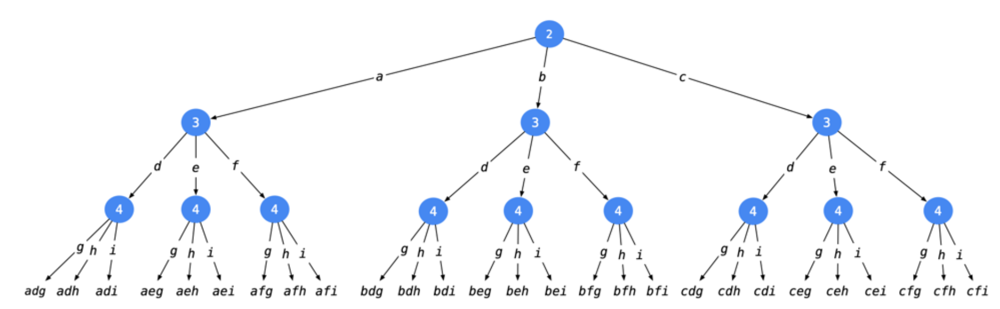
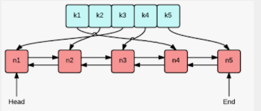
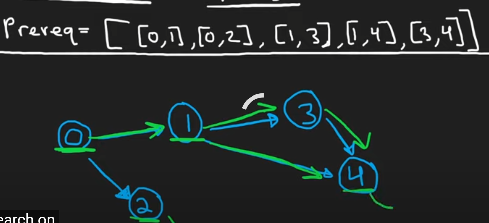
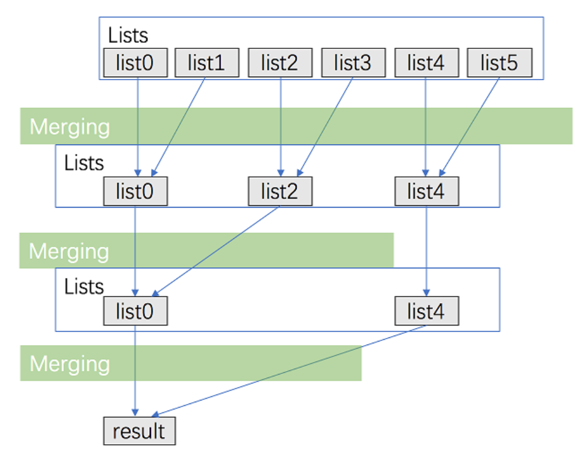
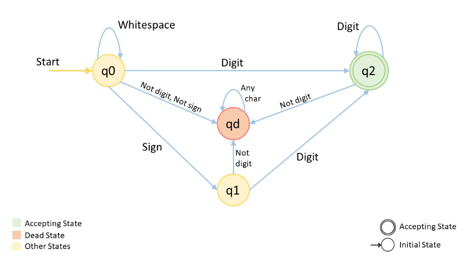
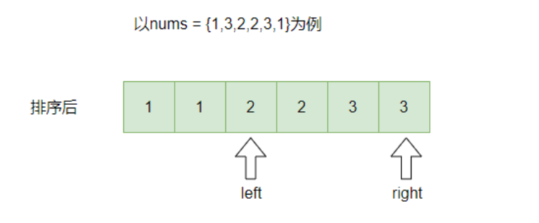
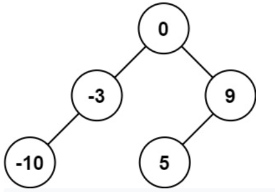
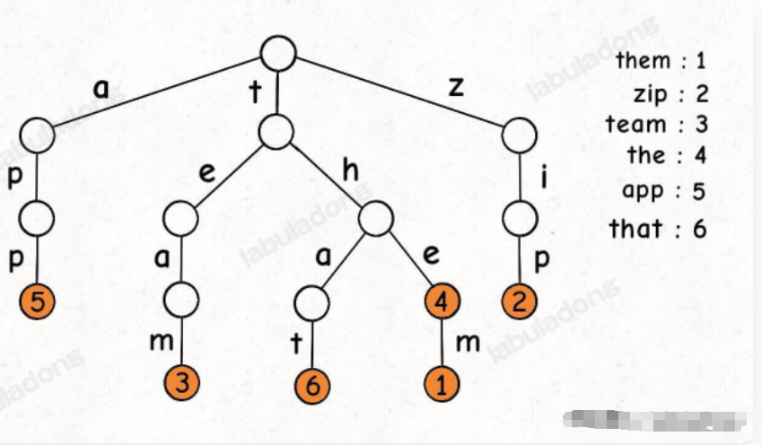

#  LeetCode Note

## Rules For added Problems and Explanations

1. Problem Title MUST fill a **LeetCode link**

2. Problem description MUST add a **text** or **picture** **example**(if you could)

3. the Answer should include series of Steps 
   - **Approach**: key Words for solving current problems (add **VIDEO** explanation if need)
     - **Intuition** : explanation for problems and ideas of solution to be used (please **NUMBER** each sentence )
     - **Algorithm** **steps** (if need)
     - **Code**: please add the NOTES
     - **Complexity Analysis** (if need)

4. Dedicated letters and formulas: such as `O(N)` or variable: `str` , please using **`ctrl + shift + ` ` to format it** 

   - Such as:  `leftPointer` , `nums[a] > nums[b]`

   

## Array & HashMap

### 1. [Twp Sum](https://leetcode.com/problems/two-sum/)

Given an array of integers `nums` and an integer `target`, return *indices of the two numbers such that they add up to `target`*.You may assume that each input would have ***exactly\* one solution**, and you may not use the *same* element twice.You can return the answer in any order.

**Example 1:**

```txt
Input: nums = [2,7,11,15], target = 9
Output: [0,1]
Explanation: Because nums[0] + nums[1] == 9, we return [0, 1].
```

#### **Solution 1:**   Brute Force

**intuition**

Do not using hashMap,   Force to sort and using two points, the time complexity is high(O^2), And it cost O(1) Space 

**Cost :**   time O(N^2), space: O(1), N is the length of nums

```kotlin
class Solution {
    fun twoSum(nums: IntArray, target: Int): IntArray {
        val size = nums.size
        for ( i in 0..size){
            for ( j in i+1 until size){
                if ( nums[i] + nums[j] == target){
                    return intArrayOf(i,j)
                }
            }
        }
        return IntArray(0)
    }
}
```

#### **Solution 2:** Hash

**intuition**

 using a `HashMap` (map in C++, dict in python) , to store the numbers, the time complexity  of finding  "target - x"  can be reduced from `O(N) to O(1)` .  for each x, we first query the hash table to see if  "target - x" exists, and then insert x into the hash table to ensure that x does not match itself 

**Cost**:  time: `O(N)`, space; `O(N)`, N is the length of `nums`

```kotlin
class Solution {
    fun twoSum(nums: IntArray, target: Int): IntArray {
        var hash : HashMap<Int, Int> = HashMap()
        for ( i in nums.indices){
            if ( hash.containsKey( target - nums[i])){
                return intArrayOf(hash[target - nums[i]]!!, i)
            }
            hash[nums[i]] = i 
        }
        return IntArray(0)
    }
}
```


### [560. Subarray Sum Equals K](https://leetcode.com/problems/subarray-sum-equals-k/)  

Given an array of integers `nums` and an integer `k`, return *the total number of subarrays whose sum equals to `k`*.

**Example 1:**

```
Input: nums = [1,1,1], k = 2
Output: 2
```

**Example 2:**

```
Input: nums = [1,2,3], k = 3
Output: 2
```

#### **Solution 1:**  cumulative sum+hash

**intuition**

1. there`s has other time-consuming, so I prefer to use Hash Map to deal this 

2. we can follow the  cumulative sum of all nums elemens,  until we find 
   $$
   sum[i] - sum[j] = k
   $$
    the sum of elements lying between indices i and *j* is k

3. Based on these thoughts, we make use of a hashmap  which is used to store the cumulative sum item
4.  Every time we encounter a new sum, we make a new entry in the `hashmap` corresponding to that sum, If the same sum item occurs again, we increment the count corresponding to that sum in the `hashmap`
5. we counted the number of occurrences of [sum-k], that means we also get the number of times a `subarray` with sum k, because  *`sum - (sum -k) = k`*

**Complexity Analysis**

- Time complexity : *O*(*n*). The entire n**u**ms array is traversed only once.
- Space complexity : `O(n)`. `Hashmap` can contain up to n distinct entries in the worst case.

```java
class Solution {
    public int subarraySum(int[] nums, int k) {
        int result = 0;
        int sum = 0;
        HashMap < Integer, Integer > map = new HashMap < > ();
        map.put(0,1);
        for (int i=0 ;i < nums.length; i++){
            sum += nums[i];
            
            if (map.containsKey(sum - k)){
                result += map.get(sum -k);
            }
            map.put(sum, map.getOrDefault(sum,0) + 1);
        }
        
        return result;
        
    }
}
```


### [128. Longest Consecutive Sequence](https://leetcode.com/problems/longest-consecutive-sequence/) 

Given an unsorted array of integers `nums`, return *the length of the longest consecutive elements sequence.*

You must write an algorithm that runs in `O(n)` time

**Example 1:**

``` text
Input: nums = [100,4,200,1,3,2]
Output: 4
Explanation: The longest consecutive elements sequence is [1, 2, 3, 4]. Therefore its length is 4.
```

#### solution 1： Sorting

Sorting is valid, but time complexity is O(NLogN). could we have a better solution? yes 

#### solution 2： hash+Greedy

**Intuition**

It turns out that our initial brute force solution was on the right track, but missing a few optimizations necessary to reach *O*(*n*) time complexity.

**Algorithm**

1. This optimized algorithm contains only two changes from the brute force approach:
2.  the numbers are stored in a `HashSet` (or `Set`, in Python) to allow O(1) lookups, and we only attempt to build sequences from numbers that are not already part of a longer sequence.
3. This is accomplished by first ensuring that the number that would immediately precede the current number in a sequence is not present, as that number would necessarily be part of a longer sequence.

**Complexity Analysis**

- Time complexity : *O*(*n*).

  Although the time complexity appears to be quadratic due to the `while` loop nested within the `for` loop, closer inspection reveals it to be linear. Because the `while` loop is reached only when `currentNum` marks the beginning of a sequence (i.e. `currentNum-1` is not present in `nums`), the `while` loop can only run for n iterations throughout the entire runtime of the algorithm. This means that despite looking like O*(*n*⋅*n*) complexity, the nested loops actually run in `O(n + n) = O(n)`* time. All other computations occur in constant time, so the overall runtime is linear.

- Space complexity : *O*(*n*).

  In order to set up `O(1)` containment lookups, we allocate linear space for a hash table to store the `O(n)`  numbers in `nums`. Other than that, the space complexity is identical to that of the brute force solution.

```Java
class Solution {
    public int longestConsecutive(int[] nums) {
        
        // we need a HastSet to Save time 
        Set<Integer> num_set = new HashSet<Integer>();
        for(int num : nums){
            num_set.add(num);
        }
        
        int longestStreak = 0;
        
        for (int num: num_set){
            // check if its the start of a sequence 
            // if not that means curretn num is not the smallest of the longest Consecutive (the begin one)
            if ( !num_set.contains(num-1)){
                int currentNum = num;
                int currentStreak  = 1;
                while( num_set.contains(currentNum+1)){
                    currentNum += 1;
                    currentStreak += 1;
                }
                
                longestStreak = Math.max(longestStreak,currentStreak);
            }
            
        }
        return longestStreak;
    }
}
```

### [242. Valid Anagram](https://leetcode.cn/problems/valid-anagram/)

Given two strings `s` and `t`, return `true` *if* `t` *is an anagram of* `s`*, and* `false` *otherwise*.

An **Anagram** is a word or phrase formed by rearranging the letters of a different word or phrase, typically using all the original letters exactly once.

**Example 1:**

```
Input: s = "anagram", t = "nagaram"
Output: true
```

#### Approach: Hash: Counting letters

```Java
class Solution {
    public boolean isAnagram(String s, String t) {
        if (s.length() != t.length()) return false;
        
        int[] table = new int[26];
        for(int i = 0; i < s.length(); ++i){
            table[s.charAt(i) - 'a']++;
        }
        for(int i = 0; i < t.length(); ++i){
            table[t.charAt(i) - 'a']--;
            if(table[t.charAt(i) - 'a'] < 0)
                return false;
        }
        return true;
    }
}
```


### [49. Group Anagrams](https://leetcode.com/problems/group-anagrams/)

Given an array of strings `strs`, group **the anagrams** together. You can return the answer in **any order**.

An **Anagram** is a word or phrase formed by rearranging the letters of a different word or phrase, typically using all the original letters exactly once.

**Example 1:**

```
Input: strs = ["eat","tea","tan","ate","nat","bat"]
Output: [["bat"],["nat","tan"],["ate","eat","tea"]]
```


#### solution 1 : Sorting

**Intuition**

Two strings are anagrams if and only if their sorted strings are equal.

**Algorithm**

Maintain a map `ans : {String -> List}` where each key \text{K}K is a sorted string, and each value is the list of strings from the initial input that when sorted, are equal to `K`.

In Java, we will store the key as a string, eg. `code`. In Python, we will store the key as a hashable tuple, eg. `('c', 'o', 'd', 'e')`.

**Complexity Analysis**

- Time Complexity: `O(NK log K)` where *N* is the length of `strs`, and *K* is the maximum length of a string in `strs`. The outer loop has complexity *O*(*N*) as we iterate through each string. Then, we sort each string in`O(KlogK)` time.
- Space Complexity: `O(NK)` the total information content stored in`ans`.

```Java
class Solution {
    public List<List<String>> groupAnagrams(String[] strs) {
        if (strs.length == 0) return new ArrayList();
        
        Map<String, List> ans = new HashMap<String, List>();
        for (String s:strs){
            
            char[] currentString = s.toCharArray();
            Arrays.sort(currentString);
            String key = String.valueOf(currentString);
            // if currentString not exist, just creat the new List to save s
            if ( !ans.containsKey(key)) ans.put(key,new ArrayList());
            ans.get(key).add(s);
        }
        
        return new ArrayList(ans.values());
    }
}
```


#### solution 2: hash

in the solution 1, if one String element is so long,  that will be very time Consuming , so we using character counts  to be the Keys in `HashMap`

**Intuition**

Two strings are anagrams if and only if their character counts (respective number of occurrences of each character) are the same.

**Algorithm**

We can transform each string s into a character count List, the  Count List consisting of 26 non-negative integers representing the letter from  a to z . We use these counts as the keys for our hash map.

**Complexity Analysis**

- Time Complexity: `O(NK)`, where N is the length of  giving  `strs` List, and `K` is the maximum length of a element in `strs`. Counting each string is linear in the size of the string, and we count every string.
- Space Complexity: `O(NK)`, the total information content stored in `ans`.

```python
class Solution(object):
    def groupAnagrams(self, strs):
        """
        :type strs: List[str]
        :rtype: List[List[str]]
        """
        ans = collections.defaultdict(list)
         
        for s in strs:
            count = [0] * 26  # a ...Z
            
            for c in s:
                count[ord(c) - ord('a')] += 1
            ans[tuple(count)].append(s)
        
        return ans.values()
```


### [189. Rotate Array](https://leetcode.com/problems/rotate-array/)

Given an array, rotate the array to the right by `k` steps, where `k` is non-negative.

**Example 1:**

```
Input: nums = [1,2,3,4,5,6,7], k = 3
Output: [5,6,7,1,2,3,4]
Explanation:
rotate 1 steps to the right: [7,1,2,3,4,5,6]
rotate 2 steps to the right: [6,7,1,2,3,4,5]
rotate 3 steps to the right: [5,6,7,1,2,3,4]
```

#### [Approach 1: three reverses](https://www.youtube.com/watch?v=gmu0RA5_zxs)

**Intuition**

1. we want the last k elements move to the front, we can though multi-reverse the array to get it 

2. there are three steps :

   1. | After reverse all numbers       | 7 6 5 4 3 2 1 |
      | ------------------------------- | ------------- |
      | After  reverse  first k numbers | 5 6 7 4 3 2 1 |
      | After reverse  last n-k numbers | 5 6 7 1 2 3 4 |

      

```c++
class Solution {
public:
    void rotate(vector<int>& nums, int k) {
        k = k % nums.size(); // make sure k is legal
        myReverse(nums,0,nums.size()-1);
        myReverse(nums,0,k-1);
        myReverse(nums,k,nums.size()-1);
        
    }
    
    void myReverse(vector<int>& nums, int start, int end){
        while (start < end){
            int temp = nums[start];
            nums[start] = nums[end];
            nums[end] = temp;
            start++;
            end--;
        }
    }
};
```

**Complexity Analysis**

- Time complexity : `O(n)`. The entire n**u**ms array is traversed only once.
- Space complexity : `O(1)`.  uses only constant extra space. 


### [763. Partition Labels](https://leetcode.com/problems/partition-labels/)

You are given a string `s`. We want to partition the string into as many parts as possible so that each letter appears in at most one part.

Note that the partition is done so that after concatenating all the parts in order, the resultant string should be `s`.

Return *a list of integers representing the size of these parts*.

**Example 1:**

```
Input: s = "ababcbacadefegdehijhklij"
Output: [9,7,8]
Explanation:
The partition is "ababcbaca", "defegde", "hijhklij".
This is a partition so that each letter appears in at most one part.
A partition like "ababcbacadefegde", "hijhklij" is incorrect, because it splits s into less parts.
```

**Example 2:**

```
Input: s = "eccbbbbdec"
Output: [10]
```


#### [Approach 1:  Maps+Greedy](https://www.youtube.com/watch?v=5NCjHqx2v-k)

**Intuition**

1. ​	two key points !
   1. one particular letter in one particular part, we split it after the last occurance of any letter we visited
   2. split String as many parts as possible 
2.  Find the last occurrence of any letter in every part/splits,  for letter `a` The first partition must include it, and also the last occurrence of `a`
3. `HashMap`:  to count the occurrence of letters 
4. Greedy Algorithm could make sure two things : 
   1. find the longest part/split
   2. find as many parts as possible

```C++
vector<int> ans;
        vector<int> lastMap(26,0);
        // record the position of every letter's last occurrence
        for(int i = 0; i < s.length();  ++i){
            lastMap[s[i] - 'a'] = i;
        }
        
        //  let anchor and j be the start and end of the current partition.
        // [archor,j] is our wanted Labeled Partition 
        int j = 0, archor = 0;
        for( int i = 0 ; i < s.length();  ++i){
            //extending the current partition [anchor, j] as longer as possible.
           j = max(j, lastMap[s[i] - 'a']);
           //  we at end of current partion
        // the last occurrence with longest partion showing up
           if( i == j){
               ans.push_back(i - archor + 1);
               archor = i + 1;
           }
        }
        
        return ans;
```

**Complexity Analysis**

- Time Complexity: `*O*(*N*)`, where *`N`* is the length of *`S`*.
- Space Complexity: `*O*(1)` . For  keep data structure `lastMap` which is not more than 26 characters.

### [41. First Missing Positive](https://leetcode.com/problems/first-missing-positive/)

Given an unsorted integer array `nums`, return the smallest missing positive integer.

You must implement an algorithm that runs in `O(n)` time and uses constant extra space.

**Example 1:**

```
Input: nums = [1,2,0]
Output: 3
```

**Example 2:**

```
Input: nums = [3,4,-1,1]
Output: 2
```


#### [Approach 1: self-Hash](https://www.youtube.com/watch?v=8g78yfzMlao)

**Intuition**：

1. It's easy to think of **sorting** array to find the first missing positive value, but sorting would bring `N*LogN`  time Complexity, we're allow to run in `O(n)` time  and constant extra space (Cannot use `HashSet`), **that's why it's a Hard level problem**
2. no matter what our input array is, no matter what the smallest missing positive value is,  the answer integer n should belong to the set `from 1 to length(array) + 1`, `which n between [1, length(array) + 1]`
3. if we have a Hash Set to memory each value. The we could  just brute force to go through all of these values,  try each of them is right
4. we can using some tricks to rebulid the giving array as our Hash Set, so it's not need extra space： 
   1. Write our own hash function
   2. the rule is: map the value `nums[i]` to  index of `i-1` 
   3. three cases we have to handle : negative, zero, positive 

```C++
class Solution {
public:
    int firstMissingPositive(vector<int>& nums) {
        // 1. set each negative integer to 0
        for(int i = 0 ;i < nums.size(); ++i){
            if ( nums[i] < 0 ) nums[i] = 0;
        }

        for(int i = 0; i < nums.size(); ++i){
            // 2. mark the positive integer into negetive integer
            // 3. mark the 0 into -1*(nums.size()+1)
            // 3. make sure val in [1,size+1) 
            int val = abs(nums[i]);
            if ( 1 <= val && val <= nums.size()){
                if(nums[val - 1] > 0){
                    nums[val - 1] = nums[val - 1] * -1;
                } else if ( nums[val - 1] == 0){
                    nums[val - 1] =  -1 * (nums.size() + 1);
                }
            }
        }
        // after self-hash, all positvie number and 0 had been hash to negative
        for( int i = 1; i < nums.size() + 1; ++i){
            // if find a positive one, that means we find the missing smallest positive integer ,which's escaped our hash operation 
            if( nums[i - 1] >= 0)
                return i;
        }
        return nums.size() + 1;
    }
};
```


### [36. Valid Sudoku](https://leetcode.cn/problems/valid-sudoku/) / 数独

Determine if a `9 x 9` `Sudoku` board is valid. Only the filled cells need to be validated **according to the following rules**:

1. Each row must contain the digits `1-9` without repetition.
2. Each column must contain the digits `1-9` without repetition.
3. Each of the nine `3 x 3` sub-boxes of the grid must contain the digits `1-9` without repetition.

**Note:**

- A `Sudoku` board (partially filled) could be valid but is not necessarily solvable.
- Only the filled cells need to be validated according to the mentioned rules.


Example 1:


```
Input: board = 
[["5","3",".",".","7",".",".",".","."]
,["6",".",".","1","9","5",".",".","."]
,[".","9","8",".",".",".",".","6","."]
,["8",".",".",".","6",".",".",".","3"]
,["4",".",".","8",".","3",".",".","1"]
,["7",".",".",".","2",".",".",".","6"]
,[".","6",".",".",".",".","2","8","."]
,[".",".",".","4","1","9",".",".","5"]
,[".",".",".",".","8",".",".","7","9"]]
Output: true
```

#### Approach 1 : follow the rules / Loop BackTracking 

**Intuition**

1. we here traverse the sudoku in breadth search manner this is row-wise we will assess each cell character.
2. if `1*1` cell conatins `'.'` then nothing needs to be checked
3. else store the present number and change it to `'.'` 
4. check the stored number if present anywhere in the row,in the column,or in the block associated with that cell ,immediately return false
5. else change it back to the number it was storing repeat the process until gets completed.

```Java
class Solution {
    public boolean isValidSudoku(char[][] board) {
        for( int i=0; i < 9; ++i){
            for( int j=0; j < 9; ++j){ //traverse in bfs manner 
                char ch=board[i][j];
                //if ch is apart from '.'we need to check whether the given number is verifiable
                if (ch != '.'){ 
                    board[i][j] = '.'; //change it to . so that it cannot consider itself
                    if( !isValid(board,ch,i,j)) //if not verifiable
                        return false; //invalid sudoku
                    board[i][j] = ch; //after checking change it to its initial value
                }
            }
        }
        return true;
    }
    
    static boolean isValid(char [][]board, char ch, int i, int j){
        for( int k = 0; k < 9; ++k){
            if(board[i][k] == ch) return false; //for checking row associated with it
            if(board[k][j] == ch) return false; //for checking column associated with it
            if(board[3*(i/3) + k/3][3*(j/3) + k%3] == ch) return false; //for checking block associated with it
        }
        return true;
    }
}
```

**Complexity Analysis**  

- Time : O(1)

- Space: O(1)


### [66. Plus One](https://leetcode.cn/problems/plus-one/)

You are given a **large integer** represented as an integer array `digits`, where each `digits[i]` is the `ith` digit of the integer. The digits are ordered from most significant to least significant in left-to-right order. The large integer does not contain any leading `0`'s.

Increment the large integer by one and return *the resulting array of digits*.

**Example 1:**

```
Input: digits = [1,2,3]
Output: [1,2,4]
Explanation: The array represents the integer 123.
Incrementing by one gives 123 + 1 = 124.
Thus, the result should be [1,2,4].
```

#### Approach: follow the rulers

1. two cases: last integers is 9 or Not  

```Java
class Solution {
    public int[] plusOne(int[] digits) {
        int len = digits.length;
        for (int i = len - 1; i >= 0; i--) {
            digits[i] = (digits[i] + 1) % 10;
            if (digits[i] != 0) {
                return digits;
            }
        }
        digits = new int[len + 1];
        digits[0] = 1;
        return digits;
    }
}
```


### [88. Merge Sorted Array](https://leetcode.cn/problems/merge-sorted-array/)

You are given two integer arrays `nums1` and `nums2`, sorted in **non-decreasing order**, and two integers `m` and `n`, representing the number of elements in `nums1` and `nums2` respectively.

**Merge** `nums1` and `nums2` into a single array sorted in **non-decreasing order**.

The final sorted array should not be returned by the function, but instead be *stored inside the array* `nums1`. To accommodate this, `nums1` has a length of `m + n`, where the first `m` elements denote the elements that should be merged, and the last `n` elements are set to `0` and should be ignored. `nums2` has a length of `n`.

**Example 1:**

```
Input: nums1 = [1,2,3,0,0,0], m = 3, nums2 = [2,5,6], n = 3
Output: [1,2,2,3,5,6]
Explanation: The arrays we are merging are [1,2,3] and [2,5,6].
The result of the merge is [1,2,2,3,5,6] with the underlined elements coming from nums1.
```

####  Approach： follow the rulers

```C++
class Solution {
public:
    void merge(vector<int>& nums1, int m, vector<int>& nums2, int n) {
        
        int lenAll =  m + n - 1;
        int i = m - 1, j = n - 1;
        
        while(i >= 0 and j >= 0){
            if (nums1[i] > nums2[j]){
                nums1[lenAll] = nums1[i];
                i -= 1;
                lenAll -= 1;
            }else{
                nums1[lenAll] = nums2[j];
                j -= 1;
                lenAll -= 1;
            }
            
        }
        
        while(j >= 0){
            nums1[lenAll] = nums2[j];
            j -= 1;
            lenAll -= 1;
        }
        
        return;
    }
};
```

### [169. Majority Element](https://leetcode.cn/problems/majority-element/)

Given an array `nums` of size `n`, return *the majority element*.

The majority element is the element that appears more than `⌊n / 2⌋` times. You may assume that the majority element always exists in the array.

**Example 1:**

```
Input: nums = [3,2,3]
Output: 3
```

####  Approach : Moore Voting method

1. Majority Element MUST appears more than `⌊n / 2⌋` times. SO we can choose anyone and counting the occurent times

```C++
class Solution {
public:
    int majorityElement(vector<int>& nums) {
        int count = 0;
        int candidate = INT_MIN;
        for( auto n : nums){
            if( count == 0) candidate = n;
            if( candidate == n) count++;
            else count--;
        }
        
        return candidate;
    }
};
```


### [217. Contains Duplicate](https://leetcode.cn/problems/contains-duplicate/) 

**Example 1:**

```
Input: nums = [1,2,3,1]
Output: true
```

**Example 2:**

```
Input: nums = [1,2,3,4]
Output: false
```

​	

#### Approach ：hashSet

**Intuition**

1. Using the `hashTab` to detect whether list has duplicate numbers or not 

```Java
class Solution {
    public boolean containsDuplicate(int[] nums) {
        Set<Integer> set = new HashSet<Integer>();
        for (int x : nums){
            if( !set.add(x)) return true;
        }
        return false;
    }
}
```

### [350. Intersection of Two Arrays II](https://leetcode.cn/problems/intersection-of-two-arrays-ii/)

Given two integer arrays `nums1` and `nums2`, return *an array of their intersection*. Each element in the result must appear as many times as it shows in both arrays and you may return the result in **any order**.

**Example 1:**

```
Input: nums1 = [1,2,2,1], nums2 = [2,2]
Output: [2,2]
```

#### Approach : Hash

```Java
class Solution {
    public int[] intersect(int[] nums1, int[] nums2) {
        if (nums1.length > nums2.length){
            return intersect(nums2,nums1);
        }
        
        Map<Integer,Integer> map = new HashMap<Integer,Integer>();
        for(int num : nums1){
            int count = map.getOrDefault(num,0) + 1;
            map.put(num,count);
        }
        
        int[] intersection = new int[nums1.length];
        int index = 0;
        for (int num : nums2){
            int count = map.getOrDefault(num,0);
            if(count > 0){
                intersection[index++] = num;
                count--;
                if (count > 0)
                    map.put(num,count);
                else
                    map.remove(num);
            }
        }
        
        return Arrays.copyOfRange(intersection, 0 ,index);
    }
}
```

### [387. First Unique Character in a String](https://leetcode.cn/problems/first-unique-character-in-a-string/)

Given a string `s`, *find the first non-repeating character in it and return its index*. If it does not exist, return `-1`.

**Example 1:**

```
Input: s = "leetcode"
Output: 0
```

**Example 2:**

```
Input: s = "loveleetcode"
Output: 2
```

#### Approach: Hash-Letter

```Java
class Solution {
    public int firstUniqChar(String s) {
        int [] count = new int[26];
        for (char c : s.toCharArray())
            count[c - 'a']++;
        for (int i = 0; i < s.length(); i++){
            char c = s.charAt(i);
            if (count[c - 'a'] == 1)
                return i;
        }
        return -1;
    }
}
```


### [238. Product of Array Except Self](https://leetcode.cn/problems/product-of-array-except-self/)

Given an integer array `nums`, return *an array* `answer` *such that* `answer[i]` *is equal to the product of all the elements of* `nums` *except* `nums[i]`.

The product of any prefix or suffix of `nums` is **guaranteed** to fit in a **32-bit** integer.

You must write an algorithm that runs in `O(n)` time and without using the division operation.

**Example 1:**

```
Input: nums = [1,2,3,4]
Output: [24,12,8,6]
```

**Example 2:**

```
Input: nums = [-1,1,0,-3,3]
Output: [0,0,9,0,0]
```

#### Approach： two pointer with prefix multiply 

**Intuition**

1. two pointer `left` and `right` 
2. `left pointer` multiply from left to right
3.  `right pointer` multiply from right to left,but except self

```C++
class Solution {
public:
    vector<int> productExceptSelf(vector<int>& nums) {
        int left = 1, right =1;
        int n = nums.size();
        vector<int> res(n,1);
        
        for(int i = 0; i < n; i++){
            // multiply from left to right 
            res[i] *= left;
            left *= nums[i];
            
            // multiply from right to left,but except self
            res[n - 1 - i] *= right;
            right *= nums[n - 1 -i];
        }
        
        return res;
    }
};
```


## Backtracking & Recursion & Memory Search

### Step of Backtracking

Please Remember the Step of Backtracking

```C++
1. exit of backTracking  
2. make choice in the backTracking tree
3. backTrack to next level of the tree
4. go back to the previous level 
```


### [17. Letter Combinations of a Phone Number](https://leetcode.cn/problems/letter-combinations-of-a-phone-number/)

Given a string containing digits from `2-9` inclusive, return all possible letter combinations that the number could represent. Return the answer in **any order**.

A mapping of digit to letters (just like on the telephone buttons) is given below. Note that 1 does not map to any letters.


**Example 1:**

```
Input: digits = "23"
Output: ["ad","ae","af","bd","be","bf","cd","ce","cf"]
```

#### Approach : map+Backtracking 

**Intuition**

1. NOTICE that **any order**  of  **combinations** from the problem description , that's a big clue/hint/sign of **Backtracking**
2. for the first number, there are `3` options, and these `3` options has there own 3 options for the second number and so on
3. The combinations from the first to the last will expand into a **recursive tree**.
4. just imagine that **Dicition tree** start from one of numbers, for example,  Take the `"234"` for example, look at the backtracking  tree:

5. When the index **reaches the end of digits**, we get a combination, and add it to the result, end the current recursion. Finally we will get all the combinations.


```C++
class Solution { 
public:
    vector<string> res;
    string combination;
    vector<string> letterCombinations(string digits) {
        
        if (!digits.size()) return res;
         map<char,string> mp = {
            {'2',"abc"},
            {'3',"def"},
            {'4',"ghi"},
            {'5',"jkl"},
            {'6',"mno"},
            {'7',"pqrs"},
            {'8',"tuv"},
            {'9',"wxyz"}};
        // backtracking starts from the first element
        backTrack(digits,0,mp);
        return res;
        
    
    }
    
    void backTrack(string digits, int curIndex, map<char,string>& mp){
        // 1. exit for backTracking  
        // curIndex reached the end of string digits
        if(curIndex == digits.size()){
            res.push_back(combination);
            return;
        }  
        // get current number
        char digit = digits[curIndex];
        // tranvers all letters of the digit represented
        for(auto& letter: mp[digit]){
            // 2. make choice in the Dicition tree for combination
            combination.push_back(letter);
            // 3. backTrack to next level of the tree
            backTrack(digits,curIndex + 1,mp);
            // 4. go back to the previous level 
            combination.pop_back();
        }
    }
};
```


**complexity analysis**

There's huge time and space required for backtracking. because we want to generate all of combination, that means that we need to enumerate each possible results

1. **Time Complexity**: `O(3^M*4^N)` , M = amount of numbers which has three letters(2,3,4,5,6),   N = amount of numbers which has four letters(7,9) 
2. **Space Complexity**: `O(3^M*4^N)` : YES lots of **stack** space required 


### [22.  Generate Parentheses](https://leetcode.com/problems/generate-parentheses/)

Given `n` pairs of parentheses, write a function to *generate all combinations of well-formed parentheses*.

**Example 1:**

```C++
Input: n = 3
Output: ["((()))","(()())","(())()","()(())","()()()"]
```

**Example 2:**

```C++
Input: n = 1
Output: ["()"]
```


#### [Approach : Recurvise, backtracking](https://www.youtube.com/watch?v=s9fokUqJ76A)

**Intuition** :

1. NOTICE that  **combinations**  from the problem description , that's a big clue/hint/sign of using **Backtracking** algorithm
2. let's add `(` or `)` when we know it will remain a **valid** sequence. **we need to make sure open brackets can match the close brackets** 
3. we **can't have a close parentheses come before a open parenthesis: `eg: ) (`**
4. We can do this by keeping track of the number of  open`(` and colse`)` parenthesis we have placed so far.
   1. the Count of  colseing  parenthesis  <  the count of opening parenthesis

```C++
class Solution {
public:
    vector<string> generateParenthesis(int n) {
        vector<string> res;
        // we need a tmp string "" to store the combination
        backtrack(res,"",0,0,n);
        return res;
    }

    void backtrack(vector<string> &res, string str,int openCount, int closeCount, int n){
        // it means all brackets used up, then we get one combination 
        if(openCount == n and closeCount == n){
            res.push_back(str) ;
            return ;
        } 
        // here we keep tracking the amount of "(" and ")" by using two variables
        // leftIndex < n : means  we can added a "(" 
        if(openCount < n) backtrack(res,str+'(', openCount+1,closeCount,n);
        // rightIndex < left: means there's has a "(",so we can added a ")" 
        if(closeCount < openCount)backtrack(res,str+')', openCount, closeCount+1,n);
    }
};
```

**Complexity Analysis**:

Our complexity analysis rests on understanding how many elements there are in `generateParenthesis(n)`. This analysis is outside the scope of this article, but it turns out this is the `n`-th Catalan number $ \dfrac{1}{n+1}\binom{2n}{n}$, which is bounded asymptotically(渐进的) by $\dfrac{4^n}{n\sqrt{n}}$  

- Time Complexity : O($\dfrac{4^n}{\sqrt{n}}$). Each valid sequence has at most `n` steps during the backtracking procedure.
- Space Complexity : O($\dfrac{4^n}{\sqrt{n}}$), as described above, and using `O(n)` space to store the sequence.


### [46. Permutations](https://leetcode.cn/problems/permutations/)

Given an array nums of distinct integers, return all the possible permutations. You can return the answer in **any order.**

**Example 1:**

```
Input: nums = [1,2,3]
Output: [[1,2,3],[1,3,2],[2,1,3],[2,3,1],[3,1,2],[3,2,1]]
```

**Example 2:**

```
Input: nums = [0,1]
Output: [[0,1],[1,0]]
```


#### [Approach:  Calssic backtracking- 3step](https://www.youtube.com/watch?v=s7AvT7cGdSo&ab_channel=NeetCode)

**Intuition** 

1. NOTICE that  **combinations & Any Order**  from the problem description , that's a big clue/hint/sign of using **Backtracking** algorithm

2. It's a very classic banktracking prpblem,  YES, permutations , combination they are very simliar. And most of them can be sovled by backtracking 

3. we just have to placed every integer to every position without duplicate 

4. Just imagine that **Dicition tree** ,  BALALALALALALA 

   ```C++
   1 -> 2 -> 3
     -> 3 -> 2
   Dicition tree
   1. exit of tree
   2. make choice to pick up one node
   3. go to next level node
   4. go back pervious level
   ```

5. Careful of the edge case And using a `visited` array to mark weather current integer is visited 

```C++
class Solution {
public:
    vector<vector<int>> res;
    
    vector<vector<int>> permute(vector<int>& nums) {
        // edge case
        if (nums.empty()) return {};
        // need a visited array to make sure every integer only use once  
        vector<int> visited(nums.size(),0);
        // need a vector to save current combination
        vector<int> combination;
        backTrack(nums,combination,visited);
        return res;
    }

    void backTrack(vector<int>& nums,vector<int>& combination,vector<int> & visited){
        // 1. exit for BackTracking (means we used up all of numbers)
        if(combination.size() == nums.size()) {
            res.push_back(combination);
            return ;
        }

        for(int i = 0; i < nums.size();i++){
            // Make sure there are no duplicate numbers (pruning: pruned current node)
            if(visited[i] != 0) continue;
            // 2. make choice on Dicition tree (pick up one to add to combination)
            combination.push_back(nums[i]);
            visited[i] = 1;
            // 3. get into next level of tree
            backTrack(nums,combination,visited);
            // 4. go back to previous level 
            combination.pop_back();
            visited[i] = 0;

        }

    }
};
```

**Complexity Analysis**

- Time Complexity: `O(n×n!)`:  n is the length of input array.  the time Complexity isn't  `O(n^n)`,because there has a **pruning**! Therefore the time has reduce to factorial 

- Space Complexity: `O(n)`, Except the result array, we used a visited array And the backtracking alse needs stack space, But the stack space required for backtracking depends on its **depth**,. In this problem depth is `N`


### [78. Subsets](https://leetcode.cn/problems/subsets/)

Given an integer array `nums` of **unique** elements, return *all possible subsets (the power set)*.

The solution set **must not** contain duplicate subsets. Return the solution in **any order**.

**Example 1:**

```
Input: nums = [1,2,3]
Output: [[],[1],[2],[1,2],[3],[1,3],[2,3],[1,2,3]]
```

#### Approach: Just backtracking 

**Intuition**

1.  original backtracking and 
2. `SubSet` means we need to append every node and leaf  in the backtracking Tree

```Java
class Solution {
    
    List<List<Integer>> res = new ArrayList<List<Integer>>();
    
    public List<List<Integer>> subsets(int[] nums) {   
        backtrack(0, nums, new ArrayList<>());
        return res;
    }
    
    void backtrack(int cur, int[] nums,List<Integer> track){
        res.add(new ArrayList<>(track));
        for( int i = cur; i < nums.length; ++i){
            track.add(nums[i]);
            backtrack(i + 1,nums,track);
            track.remove(track.size()-1);
        }
    }
}
```


## Binary Search

### [33. Search in Rotated Sorted Array](https://leetcode.com/problems/search-in-rotated-sorted-array/)

There is an integer array `nums` sorted in ascending order (with **distinct** values).

Prior to being passed to your function, `nums` is **possibly rotated** at an unknown pivot index `k` (`1 <= k < nums.length`) such that the resulting array is `[nums[k], nums[k+1], ..., nums[n-1], nums[0], nums[1], ..., nums[k-1]]` (**0-indexed**). For example, `[0,1,2,4,5,6,7]` might be rotated at pivot index `3` and become `[4,5,6,7,0,1,2]`.

Given the array `nums` **after** the possible rotation and an integer `target`, return *the index of* `target` *if it is in* `nums`*, or* `-1` *if it is not in* `nums`.

You must write an algorithm with `O(log n)` runtime complexity.

**Example 1:**

```
Input: nums = [4,5,6,7,0,1,2], target = 0
Output: 4
```

**Example 2:**

```
Input: nums = [4,5,6,7,0,1,2], target = 3
Output: -1
```

[Video Explanation Link](https://www.youtube.com/watch?v=QdVrY3stDD4) （not elegant enough）


#### Approach 1:  modified Binary Search:

**Intuition**

1. the demanded complexity is O(log n), it`s a clue of using  Binary Search, and it's a Modified Binary Search problem
2. the pivot must be the smallest element, we can Divide array into sorted parts at the  pivot,  then we can using BS to Search target in two parts; and we do not need to find  this pivot  particularly;
3. Just Using Binary Search to Divide the array into two parts, one of them must be sorted, the other may be sorted or not. 
4. At this time, the sorted part is searched by binary method. 
5. The unsorted part is then divided into two parts, one of which must be sorted, the other may be sorted or Not.  
6. Repeat the algorithm like that , until we find the target 

```c++
class Solution {
public:
    int search(vector<int>& nums, int target) {
        if (nums.size() == 0) return -1;
        
        int left = 0, right = nums.size()-1;
        
        // right = size -1, so left must be less or equal right
        while (left <= right){
            // use bit operation to avoid integer Overflow
            int mid = left + ((right - left)>>1);
            // finded the target 
            if (nums[mid] == target) return mid;
            // check which part is sorted 
            if (nums[mid] >= nums[left]){
                // jump into left part Whatever it`s sorted 
                // keep dividing the array until every parts are sorted for using BS （alreay finded pivot）
                
                if(nums[left] <= target && target < nums[mid]) right = mid - 1;
                else left = mid + 1;
                
            }else{
                if(nums[mid] < target && target <= nums[right]) left = mid + 1;
                else right = mid - 1;
            }
        }
        
        return -1;
    }
};
```

**Complexity analysis**

- Time complexity: $O(Log N)$
- Space complexity: $O(1)$ extra space. Only constant level  space required. 


### [34. Find First and Last Position of Element in Sorted Array](https://leetcode.com/problems/find-first-and-last-position-of-element-in-sorted-array/)

Given an array of integers `nums` sorted in non-decreasing order, find the starting and ending position of a given `target` value.

If `target` is not found in the array, return `[-1, -1]`.

You must write an algorithm with `O(log n)` runtime complexity.

**Example 1:**

```
Input: nums = [5,7,7,8,8,10], target = 8
Output: [3,4]
```

**Example 2:**

```
Input: nums = [5,7,7,8,8,10], target = 6
Output: [-1,-1]
```

[Video Explanation Link](https://www.youtube.com/watch?v=bU-q1OJ0KWw)

#### Approach: BF

**Intuition**

1. the demanded complexity is O(log n), there's noting  `O(log n)` runtime complexity except for Binary Search
2. it is a variation of regular Binary Search problem, the key is to control the index boundary of Binary Search

```C++
class Solution {
public:
    vector<int> searchRange(vector<int>& nums, int target) {
        vector<int> res;
        int left = binarySearchLeft(nums,target);
        int right = binarySearchRight(nums,target);
        res.push_back(left);
        res.push_back(right);
        return res;
    }
    
    int binarySearchLeft(vector<int>& nums, int target){
        // almost rigular BS
        int left = 0, right = nums.size() -1;
        int ans = -1;
        while (left <= right){
            // use bit operation to avoid integer Overflow
            int mid = left + ((right - left)>>1);
            // using bigger than or equal to move the index to leftMost target index 
            // it would`t stop at index[3]. index will keep move to left part array to find leftmost one    
            // [1,8,8,8,8,8,8]
            if( nums[mid] >= target){
                right = mid - 1;
            }else{
                left = mid + 1;
            }
            
            if(nums[mid] == target) ans = mid;
        }
        
        return ans;
    }
    // the Search logic of leftSearch and rightSearch is just same 
    int binarySearchRight(vector<int>& nums, int target){
        int left = 0, right = nums.size() -1;
        int ans = -1;
        while (left <= right){
            int mid = left + ((right - left)>>1);
            if( nums[mid] <= target){
                left = mid + 1;
            }else{
                right = mid - 1;
            }
            
            if(nums[mid] == target) ans = mid;
        }
        return ans;
    }
};
```

**Complexity analysis**

- Time complexity: $O(Log N)$
- Space complexity: $O(1)$ extra space. Only constant level space required. 


### 81.Search in Rotated Sorted Array II

#### Approach: Binary Search

the detail is that moving the left pointer and right pointer to delete the repeating elements

```C++
class Solution {
public:
    bool search(vector<int>& nums, int target) {
        int n = nums.size();
        if (n == 0) return false;
        if (n == 1) return nums[0] == target;
        int left = 0;
        int right = n-1;
        while (left <=right){
            int mid = (left+right) >>1;
            if (nums[mid]== target) return true;
            if(nums[mid] == nums[left] && nums[mid]== nums[right]){
                left ++;
                right --;
            }
            else if (nums[left] <=nums[mid]){
                if (nums[left] <= target && nums[mid] > target) right  = mid -1;
                else left = mid +1;
            }
            else {
                if (nums[right] >=target && nums[mid] < target) left = mid +1;
                else right = mid -1;
            }
        } 
        return false;
    }
};
```


###  [74. Search a 2D Matrix](https://leetcode.com/problems/search-a-2d-matrix/)

Write an efficient algorithm that searches for a value target in an m x n integer matrix matrix. This matrix has the following properties:

- Integers in each row are sorted from left to right.

- The first integer of each row is greater than the last integer of the previous row.

  

#### Approach: Binary Search

now it has two solution to find the target position

1. using twice binary searching :the first binary searching is to find the position of last small than or equal to the target , the second binary searching is to find the position of the target in the column 

2. `2d` matrix change to the `1d` matrix ,the details of `solution2` is to `1d` & `2d` conversion（transform）.how the abstract mid position is to transform the actual position .

```c++
class Solution {
  public:

     bool searchMatrix(vector<vector<int>>& matrix, int target) {
        // 2d to 1d
        int m = matrix.size();
        int n = matrix[0].size();

        int left = 0;
        int right = m*n-1;
        while(left <=right){
            int mid = left + ((right - left) >> 1);
            if (matrix[mid/n][mid%n] == target){
                return true;
            }
            else if (matrix[mid/n][mid%n] > target) {
                right = mid-1;
            }
            else left = mid+1;
        }
        return false;
    }
};
```

### [153. Find Minimum in Rotated Sorted Array](https://leetcode.com/problems/find-minimum-in-rotated-sorted-array/)

Suppose an array of length `n` sorted in ascending order is **rotated** between `1` and `n` times. For example, the array `nums = [0,1,2,4,5,6,7]` might become:

- `[4,5,6,7,0,1,2]` if it was rotated `4` times.
- `[0,1,2,4,5,6,7]` if it was rotated `7` times.

Notice that **rotating** an array `[a[0], a[1], a[2], ..., a[n-1]]` 1 time results in the array `[a[n-1], a[0], a[1], a[2], ..., a[n-2]]`.

Given the sorted rotated array `nums` of **unique** elements, return *the minimum element of this array*.

You must write an algorithm that runs in `O(log n) time.`

**Example 1:**

```
Input: nums = [3,4,5,1,2]
Output: 1
Explanation: The original array was [1,2,3,4,5] rotated 3 times.
```

#### Approach: Binary Search

**Intuition**

 - the Minimum is the division point of the input array. it means that the `nums[m+1]> nums[m]` and `nums[m-1] > nums[m]`.
 - using two pointer to cut half of the input array.
 - the input array is divised by two sort array.

``` c++
class Solution {
public:
    int findMin(vector<int>& nums) {
        int n = nums.size();
        int left = 0;
        int right = n-1;
        if (nums[left] <= nums[right] || n ==1) return nums[0];
        while (left <= right){
            int mid = (left+right)/2;
            if (nums[mid] < nums[mid-1]) return nums[mid];
            else if (nums[mid] > nums[mid+1] ) return nums[mid+1];
            
            else if (nums[mid] > nums[left]) left = mid+1;
            else right = mid -1;
        }
        return -1;
    }
};
```

### [240. Search a 2D Matrix II](https://leetcode.com/problems/search-a-2d-matrix-ii/)

Write an efficient algorithm that searches for a value target in an `m x n` integer matrix matrix. This matrix has the following properties:

- Integers in each row are sorted in ascending from left to right.
- Integers in each column are sorted in ascending from top to bottom.

**Example 1:**


```
Input: matrix = [[1,4,7,11,15],[2,5,8,12,19],[3,6,9,16,22],[10,13,14,17,24],[18,21,23,26,30]], target = 5
Output: true
```

#### Approach 1: binary search+ two pointer

**Intuition**

In this problem , we should focus two details:

-   it is not absolutely ordered .it is relatively ordered.
-   how to find the division point in the `2d` matrix
    So the points are :
-   The top left element is the relative (abstract) middle value of `2d` matrix .
-   abstract binary searching is to move column and line step by step

``` c++
class Solution {
public:
    bool searchMatrix(vector<vector<int>>& matrix, int target) {
        int m = matrix.size();
        if (m == 0)return false; 
        int n = matrix[0].size();
        int left =0;
        int right = n-1;
        while(left <m && right >=0){
            if(matrix[left][right] == target) return true;
            else if(matrix[left][right] > target) right --;
            else left ++;
            
            if (left >=m) return false;
            if (right <0) return false;
        }
        return false;
    }
};
```

### [4. Median of Two Sorted Arrays](https://leetcode.cn/problems/median-of-two-sorted-arrays/)

Given two sorted arrays `nums1` and `nums2` of size `m` and `n` respectively, return **the median** of the two sorted arrays.

The overall run time complexity should be `O(log (m+n))`.

**Example 1:**

```
Input: nums1 = [1,3], nums2 = [2]
Output: 2.00000
Explanation: merged array = [1,2,3] and median is 2.
```

**Example 2:**

```
Input: nums1 = [1,2], nums2 = [3,4]
Output: 2.50000
Explanation: merged array = [1,2,3,4] and median is (2 + 3) / 2 = 2.5.
```

#### Approach : Binary Search

**Intuition**

1. First of all, we make sure `first input array` is always greater than or equal to `second input array`
2. The idea is to imagine the combined sorted array, with a total size of `size_total = nums1.size() + nums2.size()`
3. Now we divide the combined array into two parts.
   1. if `odd` then first part has size of `size_total/2` and second part has size of `size_total/2+1`
   2. if `even` then both first part and second part will have `size_total/2` elements

4. now we define first part as the first size_total/2 elements of combined sorted array
5. Our binary search is to find **the number of elements from the `second input array` that are in `first part`**
6. This value ranges between [0, size of `second input array`]


```C++
class Solution {
public:
    double findMedianSortedArrays(vector<int>& nums1, vector<int>& nums2) {
        int len1 = nums1.size(), len2 = nums2.size();
        // final res between in [0, halfSizeOfCombined]
        int halfSizeOfCombined = (len1+len2 + 1) >>1; 
        // if nums1.length > nums2.length --> swap the input, because we need a longer array for the seconed array
        if( len1 > len2) return findMedianSortedArrays(nums2, nums1);
        int low = 0, high = len1-1; 
        
        // Binary Search to find the min1_index(middle point of nums1)
        while(low <= high){
            int mid1 = (low+high)>>1;
            int mid2 = halfSizeOfCombined - mid1;
            if( nums1[mid1] < nums2[mid2-1])
                low = mid1 + 1;
            else 
                high = mid1 - 1;
        }
        // the nums1's mid = low, SO the nums2's mid = the Subtrack
        int mid1_index = low ;
        int mid2_index = halfSizeOfCombined - mid1_index;
        //calculate the oddMid and evenMid (for the merged big array)
        double oddMid = max( mid1_index>0? nums1[mid1_index-1]: INT_MIN,
                          mid2_index>0? nums2[mid2_index-1]: INT_MIN);
        double evenMid = min( mid1_index < len1?  nums1[mid1_index]: INT_MAX,
                           mid2_index < len2? nums2[mid2_index]:INT_MAX);
        if( (len1+len2) & 1 == 1) return oddMid;
        return (oddMid+evenMid)/2;
        
    }
};
```

**Complexity Analysis**

- Time complexity : `O(Log(M+N))`. because it's Binary Search for the combined two array
- Space complexity : `O(1)`.

### [162. Find Peak Element](https://leetcode.cn/problems/find-peak-element/)

A peak element is an element that is strictly greater than its neighbors.

Given an integer array `nums`, find a peak element, and return its index. If the array contains multiple peaks, return the index to **any of the peaks**.

You may imagine that `nums[-1] = nums[n] = -∞`.

You must write an algorithm that runs in `O(log n)` time.

**Example 1:**

```
Input: nums = [1,2,3,1]
Output: 2
Explanation: 3 is a peak element and your function should return the index number 2.
```

#### Approach: Binary Search + Climbing Manner

**Intuition**

1. Problem ask for log level time, so binary search is necessary 
2. Cause `nums[-1] = nums[n] = -INT_MIN`, there must has a peak, at least in the end of array
3. Think we using Binary Search to Climbing the peak, keep shrink the searching interval
4. So there are two cases:
   - `nums[mid] < nums[mid+1]`: that means must has a peak element exist in `[mid+1, n]`
     - `nums[mid+1] > nums[mid+2]`  then the `nums[mid+1]` is the peak
     - `nums[mid+1] < nums[mid+2]` then just keep shrink the searching interval
   - `nums[mid] > nums[mid+1]` : then means must has a peak element exist in `[1, mid]`

```Java
class Solution {
    public int findPeakElement(int[] nums) {
        int left = 0, right = nums.length -1;
        while(left < right){
            int mid = left + ((right - left)>>1);
            if (nums[mid] > nums[mid + 1]){
                // search the left part
                right = mid;
            }else{
                // search the right part and assum the nums[mid+1] is peak
                left = mid + 1;
            }
        }
        return left;
    }
}
```


## Bit Manipulation

### [29 .Divide Two Integers](https://leetcode.cn/problems/divide-two-integers/) - Unimportant

Example 1:

```
nput: dividend = 10, divisor = 3
Output: 3
Explanation: 10/3 = 3.33333.. which is truncated to 3.
```

This **Fucking** problem is so **boring**, So I just decide not to copy the code, Cause it's too redundant, If I meet this problem in the interview. **I admit it's my daddy** 

[Here is the solution](https://leetcode.cn/problems/divide-two-integers/solution/liang-shu-xiang-chu-by-leetcode-solution-5hic/)  

#### Approach: Bit Manipulation

**Intuition**

1. In a division formula, the relationship between dividend, remainder, divisor and quotient is: `(dividend - remainder) ÷ divisor = quotient`
   - And then deduce: quotient × divisor + remainder = dividend.
2. Then we can use the `Bit Manipulation`, because the computer is very efficient when doing `Bit Manipulation`, shifting 1 to the left is equivalent to multiplying by 2, and shifting 1 to the right is equivalent to dividing by 2
3. We can divide a dividend (dividend) by `2^n` first, `n` is initially `31`, and continuously decrease `n` to try, when a certain n satisfies `divide/2^n >= divisor`
   1. Indicates that we have found a large enough number, this `number*divisor` is not greater than `dividend`, so we can `subtract 2^n from dividend`

4. Edge Cases: such as divisor cannot be 0, Integer.MIN_VALUE and Integer.MAX_VALUE


```Java
class Solution {
     /**
     * 解题思路：这题是除法，所以先普及下除法术语
     * 商，公式是：(被除数-余数)÷除数=商，记作：被除数÷除数=商...余数，是一种数学术语。
     * 在一个除法算式里，被除数、余数、除数和商的关系为：(被除数-余数)÷除数=商，记作：被除数÷除数=商...余数，
     * 进而推导得出：商×除数+余数=被除数。
     *
     * 要求商，我们首先想到的是减法，能被减多少次，那么商就为多少，但是明显减法的效率太低
     *
     * 那么我们可以用位移法，因为计算机在做位移时效率特别高，向左移1相当于乘以2，向右位移1相当于除以2
     *
     * 我们可以把一个dividend（被除数）先除以2^n，n最初为31，不断减小n去试探,当某个n满足dividend/2^n>=divisor时，
     *
     * 表示我们找到了一个足够大的数，这个数*divisor是不大于dividend的，所以我们就可以减去2^n个divisor，以此类推
     *
     * 我们可以以100/3为例
     *
     * 2^n是1，2，4，8...2^31这种数，当n为31时，这个数特别大，100/2^n是一个很小的数，肯定是小于3的，所以循环下来，
     *
     * 当n=5时，100/32=3, 刚好是大于等于3的，这时我们将100-32*3=4，也就是减去了32个3，接下来我们再处理4，同样手法可以再减去一个3
     *
     * 所以一共是减去了33个3，所以商就是33
     *
     * 这其中得处理一些特殊的数，比如divisor是不能为0的，Integer.MIN_VALUE和Integer.MAX_VALUE
     *
     */
    public int divide(int dividend, int divisor) {
        if (dividend == 0) {
            return 0;
        }
        if (dividend == Integer.MIN_VALUE && divisor == -1) {
            return Integer.MAX_VALUE;
        }
        boolean negative;
        negative = (dividend ^ divisor) < 0;//using XOR(^) to compute wheather the sign is different
        long t = Math.abs((long) dividend);
        long d= Math.abs((long) divisor);
        int result = 0;
        for (int i=31; i>=0;i--) {
            if ((t>>i)>=d) {// 找出足够大的数2^n*divisor;  find a big integer: 2^n*divisor
                result+=1<<i;//将结果加上2^n;  added 2^n to result
                t-=d<<i;//将被除数减去2^n*divisor ;  subtract 2^n from dividend
            }
        }
        return negative ? -result : result;//符号相异取反; if negative just negate it 
    
```

**Complexity Analysis**

- Time complexity: $O(1)$  almost `O(1)`
- Space complexity: $O(1)$ extra space. Only constant space required. 


### [136. Single Number](https://leetcode.cn/problems/single-number/)

Given a **non-empty** array of integers `nums`, every element appears *twice* except for one. Find that single one.

You must implement a solution with a linear runtime complexity and use only constant extra space.

**Example 1:**

```
Input: nums = [2,2,1]
Output: 1
```

#### Approach : XOR

**Intuition**

1. a ^ a = 0,   a ^ 0 = a

2. XOR could consumed pair of number if it appears twice 

   ```C++
   class Solution {
   public:
       int singleNumber(vector<int>& nums) {
           int res = 0;
           for( int n : nums){
               // x ^ X = 0,so the single one lefted
               res ^= n;
           }
           return res;
       }
   };
   ```

   

### [190. Reverse Bits](https://leetcode.cn/problems/reverse-bits/)

Reverse bits of a given 32 bits unsigned integer.

**Example 1:**

```
Input: n = 00000010100101000001111010011100
Output:    964176192 (00111001011110000010100101000000)
Explanation: The input binary string 00000010100101000001111010011100 represents the unsigned integer 43261596, so return 964176192 which its binary representation is 00111001011110000010100101000000.
```

#### Approach: Loop

**Intuition**

1.   `(n & 1) `  will get `first right` bit of n , then `n >> 1` will keep move the bit of n to right 

```C++
class Solution {
public:
    uint32_t reverseBits(uint32_t n) {
        uint32_t rev = 0;
        for (int i = 0; i < 32 && n > 0; ++i){
            rev  |= (n & 1) << (31 - i);
            n >>= 1;
        }
        return rev;
    }
};
```

#### Approach: Binary Search(divided And conquer)


### [191. Number of 1 Bits](https://leetcode.cn/problems/number-of-1-bits/)

Write a function that takes an unsigned integer and returns the number of '1' bits it has (also known as the [Hamming weight](http://en.wikipedia.org/wiki/Hamming_weight)).

Example 1:

```
Input: n = 00000000000000000000000000001011
Output: 3
Explanation: The input binary string 00000000000000000000000000001011 has a total of three '1' bits.
```

#### Approach : n & ( n - 1) : mop the last 1 bit 

```C++
class Solution {
public:
    int hammingWeight(uint32_t n) {
        int res = 0;
        while ( n != 0){
            n = n & ( n - 1);
            res++;
        }
        return res;
    }
};
```

### [268. Missing Number](https://leetcode.cn/problems/missing-number/)

Given an array `nums` containing `n` distinct numbers in the range `[0, n]`, return *the only number in the range that is missing from the array.*

**Example 1:**

```
Input: nums = [3,0,1]
Output: 2
Explanation: n = 3 since there are 3 numbers, so all numbers are in the range [0,3]. 2 is the missing number in the range since it does not appear in nums.
```

#### Approach 1 : XOR with index

1. missing number we could use Hash to find ,it's pretty easy.  But the problem ask for constant space, So hash does not fit/meet the requirements
2. the index range is `[0,n-1]` and  we extend it to `[0,n]`,  and the `nums` range is `[0,n]` , so the index and `nums` has almost same pair elements expert missing numbers 
3. we all know that `XOR : 1 ^ 1 = 0` , `1 ^ 3^ 1 = 1 ^ 1 ^ 3 = 3`  , the order of element don't affect the outcome of XOR binary operation.
4. `index XOR nums`  finally we could get the missing number

```C++
class Solution {
public:
    int missingNumber(vector<int>& nums) {
        int n = nums.size();
        int res = 0;
        // XOR with index n : index range extend to [0,n]
        res ^= n;
        for(int i = 0; i < n; ++i){
            res ^= i ^ nums[i];
        }
        return res;
    }
};
```


#### Approach 2： Arithmetic Progression

1. `sum(index)+n - sum(nums[i]) = missing number`
2. index list is an Arithmetic progression, we can use sum formula to calculate the index list 

```C++
class Solution {
public:
    int missingNumber(vector<int>& nums) {
        int n = nums.size();
        int total = n * (n + 1) / 2;
        int numSum = 0;
        for (int i = 0; i < n; ++i){
            numSum += nums[i];
        }
        return total - numSum;
    }
};
```


### [371. Sum of Two Integers](https://leetcode.cn/problems/sum-of-two-integers/)

**Example 1:**

```
Input: a = 1, b = 2
Output: 3
```

**Example 2:**

```
Input: a = 2, b = 3
Output: 5
```

#### Approach ： Bitwise XOR

**Intuition**

1. Using the Bit Manipulation instead of operation, It's quite often in the previous years

2. We could using XOR to mock the plus operation, Actually that's how computer really did it when people using plus operator 

3. XOR will added two numbers in every bit places, and we need to deal with the carry like

4. ```
   +01
    01
    10 
   ```

   we need to using  `(a & b) << 1 t`o left shift the carry  

```C++
class Solution {
public:
    int getSum(int a, int b) {
        while ( b != 0){
            // using unsigned type to avoid out of boundary
            // find out which bit need to left shift(carry)
            unsigned int carry = (unsigned int)(a & b) << 1;
            a = a ^ b;
            b = carry;
        }
        
        return a;
    }
};
```


## DFS(Depth-First Searching) / BFS(Breadth-First Searching)

### [79. Word Search](https://leetcode.cn/problems/word-search/)

Given an `m x n` grid of characters `board` and a string `word`, return `true` *if* `word` *exists in the grid*.

The word can be constructed from letters of sequentially adjacent cells, where adjacent cells are horizontally or vertically neighboring. The same letter cell may not be used more than once.

 

**Example 1:**


```
Input: board = [["A","B","C","E"],["S","F","C","S"],["A","D","E","E"]], word = "ABCCED"
Output: true
```

#### Approach: toy! DFS

**Intuition**

1. Loop + dfs

```C++
class Solution {
public:
    bool exist(vector<vector<char>>& board, string word) {
        for(int i =0 ; i < board.size(); ++i){
            for(int j = 0; j < board[0].size(); ++j){
                if(dfs(board, word, 0, i, j ))
                    return true;
            }
        }
        return false;
    }
    
    bool dfs(vector<vector<char>>& board, string word, int cur, int x, int y) {
        if (x < 0 || x >= board.size() || y < 0 || 
           y >= board[0].size() || board[x][y] != word[cur])
            return false;
        if ( cur >= word.size() - 1) return true;
        
        char tmp = board[x][y];
        board[x][y] = '#';
        bool res = 
            dfs(board, word, cur + 1, x + 1, y) ||
            dfs(board, word, cur + 1, x - 1, y) ||
            dfs(board, word, cur + 1, x, y - 1) ||
            dfs(board, word, cur + 1, x, y + 1);
        board[x][y] = tmp;
        
        return res;
    }
};
```


### [212. Word Search II](https://leetcode.cn/problems/word-search-ii/)

Given an `m x n` `board` of characters and a list of strings `words`, return *all words on the board*.

Each word must be constructed from letters of sequentially adjacent cells, where **adjacent cells** are horizontally or vertically neighboring. The same letter cell may not be used more than once in a word.

 

**Example 1:**


```
Input: board = [["o","a","a","n"],["e","t","a","e"],["i","h","k","r"],["i","f","l","v"]], words = ["oath","pea","eat","rain"]
Output: ["eat","oath"]
```

#### Approach : DFS + prefix Tree (Trie)

**Intuition**

1. Using prefix tree to build  every words 
2. Search every grid (`dfs`) in the matrix by using  prefix tree's function " `find`" ,
3. Using the "`startWith`" function to pruning the search path in the `DFS` progress 
4. Delete the duplicate words in the which is not the matched answer in the `trie`

```python
from collections import defaultdict

class Trie:
    def __init__(self):
        self.children = defaultdict(Trie)
        self.word = ""

    def insert(self, word):
        cur = self
        for c in word:
            cur = cur.children[c]
        cur.is_word = True
        cur.word = word


class Solution:
    def findWords(self, board: List[List[str]], words: List[str]) -> List[str]:
        trie = Trie()
        for word in words:
            trie.insert(word)
		
        def dfs(now, i1, j1):
            if board[i1][j1] not in now.children:
                return

            ch = board[i1][j1]

            nxt = now.children[ch]
            if nxt.word != "":
                ans.append(nxt.word)
                nxt.word = ""

            if nxt.children:
                board[i1][j1] = "#"
                for i2, j2 in [(i1 + 1, j1), (i1 - 1, j1), (i1, j1 + 1), (i1, j1 - 1)]:
                    if 0 <= i2 < m and 0 <= j2 < n:
                        dfs(nxt, i2, j2)
                board[i1][j1] = ch

            if not nxt.children:
                now.children.pop(ch)

        ans = []
        m, n = len(board), len(board[0])

        for i in range(m):
            for j in range(n):
                dfs(trie, i, j)

        return ans
```


### [329. Longest Increasing Path in a Matrix](https://leetcode.cn/problems/longest-increasing-path-in-a-matrix/)

Given an `m x n` integers `matrix`, return *the length of the longest increasing path in* `matrix`.

From each cell, you can either move in four directions: left, right, up, or down. You **may not** move **f** or move **outside the boundary** (i.e., wrap-around is not allowed).

 

**Example 1:**


```
Input: matrix = [[9,9,4],[6,6,8],[2,1,1]]
Output: 4
Explanation: The longest increasing path is [1, 2, 6, 9]
```

#### [Approach ： DFS+Memo](https://www.youtube.com/watch?v=wCc_nd-GiEc&ab_channel=NeetCode) 

**Intuition**

1. we could find the path from every position, and try four direction, and using the Greedy to make sure we get the longest one 
2. That's kind of brute force Depth-first-search methods, we all know that's quite time consuming 
3. So we need a  cache memo to avoid that **dulipcate(repeat) path search work**, the memo will cut done lots of branch of the programming decision tree, that's will optimise a lot for the time cost/complexity 
4. This memo is a table, it has same size of matrix,  eg: `memo[1][1]` represent the longest increasing path from `matrix [1][1]` position, we will record that result though a **basic DFS-process**, and when we serach path from `matrix[1][2]` to `matrix[1][1]` , we don't have to serach again, cause we can get the LIP result for `memo[1][1]`

**Code**

```python
class Solution(object):
    def longestIncreasingPath(self, matrix):
        """
        :type matrix: List[List[int]]
        :rtype: int
        """
        if not matrix: return 0
        m = len(matrix)
        n = len(matrix[0])
        memo = [[0]*n for _ in range(m)]
        
        def dfs(matrix,i,j):
            # cut this path(pruning)
            if memo[i][j] != 0: return  memo[i][j]
            localRes = 1
            for dx,dy in [[-1,0], [1,0], [0,1], [0,-1]]:
                x = dx + i
                y = dy + j
                if 0 <= x < m and 0 <= y < n and matrix[x][y] > matrix[i][j]:
                    localRes = max(localRes, 1 + dfs(matrix,x,y))
            #save current position's result 
            memo[i][j] = max(localRes, memo[i][j])
            return memo[i][j]
        res = 1
        for i in range(m):
            for j in range(n):
                res = max(res, dfs(matrix,i,j))
        return res
```


**Complexity Analysis**

- Time: `O(m*n)`: M is the rows and n is the column of the matrix
- Space:  `O(m*n)`:  space cost deu to the our cache memo (`O(m*n)`) and recursion depth (the depth less than `M*N`)


### [130. Surrounded Regions](https://leetcode.cn/problems/surrounded-regions/)

Given an `m x n` matrix `board` containing `'X'` and `'O'`, *capture all regions that are 4-directionally surrounded by* `'X'`.

A region is **captured** by flipping all `'O'`s into `'X'`s in that surrounded region.

**Example 1:**


#### Approach 1: DFS/BFS

**Intuition**

1. how to judge which `O` region were surrounded by `X` , NOTICE that, the region linked to `O` in the boundary was never been surrounded
2. SO `DFS/BFS` Should start from the boundary `O`, then we can find all O surrounded region, mark them 
3. Finally scanning whole matrix, shifted the element based on the mark

```python
class Solution:
    def solve(self, board: List[List[str]]) -> None:
        """
        Do not return anything, modify board in-place instead.
        """
        def dfs(board,i,j):
            board[i][j] = '#'
            for dx, dy in [[0,1],[1,0],[-1,0],[0,-1]]:
                x = dx + i
                y = dy + j
                if 0 <= x < len(board) and 0 <= y < len(board[0]) and board[x][y] == 'O':
                    dfs(board, x, y)
        
        def bfs(board,i,j):
            board[i][j] = '#'
            queue = [(i,j)]
            
            while queue:
                i, j = queue.pop(0)
                for dx, dy in [[0,1],[1,0],[-1,0],[0,-1]]:
                    x = dx + i
                    y = dy + j
                    if 0 <= x < len(board) and 0 <= y < len(board[0]) and board[x][y] == 'O':
                        board[x][y] = '#'
                        queue.append((x,y))
        
        for i in range(len(board)):
            for j in range(len(board[0])):
                if (i==0 or i==len(board)-1 or j==0 or j==len(board[0])-1) and board[i][j] == 'O':
                    bfs(board,i,j)
        
        for i in range(len(board)):
            for j in range(len(board[0])):
                if board[i][j] == 'O':
                    board[i][j] = 'X'
                if board[i][j] == '#':
                    board[i][j] = 'O'
```


#### Approach 2: Union Find


### [200. Number of Islands](https://leetcode.cn/problems/number-of-islands/)
Given an m x n 2D binary grid grid which represents a map of '1's (land) and '0's (water), return the number of islands.

An island is surrounded by water and is formed by connecting adjacent lands horizontally or vertically. You may assume all four edges of the grid are all surrounded by water.
***Example 1:***

```
Input: grid = [
  ["1","1","1","1","0"],
  ["1","1","0","1","0"],
  ["1","1","0","0","0"],
  ["0","0","0","0","0"]
]
Output: 1
```


***Example 2:***
```
Input: grid = [
  ["1","1","0","0","0"],
  ["1","1","0","0","0"],
  ["0","0","1","0","0"],
  ["0","0","0","1","1"]
]
Output: 3
```

#### Approach 1: Depth-First Searching
***Instuition***
-   using  Depth-First Searching to tarverse the islands because we define the constant '1' element as the islands.
-   we should mark whether visit the elements in the Depth-First Searching, so we modify the '1' to '0' .

***Code:***

```C++
class Solution {
public:
    int row ;
    int column;
    void dfs(vector<vector<char>>& grid, int n ,int m){
        grid[n][m] = '0';
        if(n-1 >=0 && grid[n-1][m] == '1') dfs(grid,n-1,m);
        if(m-1 >=0 && grid[n][m-1] == '1') dfs(grid,n,m-1);
        if(n+1 <row && grid[n+1][m] == '1') dfs(grid,n+1,m);
        if(m+1 < column && grid[n][m+1] == '1') dfs(grid,n,m+1);

        return ;
    }
    int numIslands(vector<vector<char>>& grid) {
        row = grid.size();
        if (row == 0) return 0;
        column = grid[0].size();
        

        int res =0;

        for (int i = 0;i< row;++i){
            for(int j =0;j < column; ++j){
                if(grid[i][j] == '1') {
                    res +=1;
                    dfs(grid,i,j);
                }
            }
        }
        return res;
    }
};
```

#### Approach 2: Breadth-first searching

#### Approach 3: Union Find 


## Design

### [146. LRU Cache](https://leetcode.cn/problems/lru-cache/)

Design a data structure that follows the constraints of a **[Least Recently Used (LRU) cache](https://en.wikipedia.org/wiki/Cache_replacement_policies#LRU)**.

Implement the `LRUCache` class:

- `LRUCache(int capacity)` Initialize the LRU cache with **positive** size `capacity`.
- `int get(int key)` Return the value of the `key` if the key exists, otherwise return `-1`.
- `void put(int key, int value)` Update the value of the `key` if the `key` exists. Otherwise, add the `key-value` pair to the cache. If the number of keys exceeds the `capacity` from this operation, **evict** the least recently used key.

The functions `get` and `put` must each run in `O(1)` average time complexity.

**Example 1:**

```
Input
["LRUCache", "put", "put", "get", "put", "get", "put", "get", "get", "get"]
[[2], [1, 1], [2, 2], [1], [3, 3], [2], [4, 4], [1], [3], [4]]
Output
[null, null, null, 1, null, -1, null, -1, 3, 4]

Explanation
LRUCache lRUCache = new LRUCache(2);
lRUCache.put(1, 1); // cache is {1=1}
lRUCache.put(2, 2); // cache is {1=1, 2=2}
lRUCache.get(1);    // return 1
lRUCache.put(3, 3); // LRU key was 2, evicts key 2, cache is {1=1, 3=3}
lRUCache.get(2);    // returns -1 (not found)
lRUCache.put(4, 4); // LRU key was 1, evicts key 1, cache is {4=4, 3=3}
lRUCache.get(1);    // return -1 (not found)
lRUCache.get(3);    // return 3
lRUCache.get(4);    // return 4
```

#### Approach：HashMap+Doubly Linked List = LinkedHashMap



**Intuition**

1. It's a  classic Date structure that were very usual in programming
2. Here's the hunch, cause they request for `O(1)` average time complexity, So we have to use `hashMap`
3. The linked list will mark the order of node(key-value) being used , head of list is the most Recently used `key-value`, tail node is the least Recently `used key-value`
4. The hash Map will map the key to the position in the linked list 
5. After that: 
   1. Firsty: we use hashMap to locate the position of data node we wanted 
   2. Secondly: we move the node we just found to the head of the list

6. So that's the whole idea

**Code**

```Java
class LRUCache {
    class DLinkedNode{
        int key;
        int value;
        DLinkedNode prev;
        DLinkedNode next;
        public DLinkedNode(){};
        public DLinkedNode(int _key, int _value) {key = _key; value = _value;}
    }
    
    private Map<Integer,DLinkedNode> cache = new HashMap<Integer, DLinkedNode> ();
    private int size;
    private int capacity;
    // declare/define the pointer
    private DLinkedNode head, tail;
    
    public LRUCache(int capacity) {
        this.size = 0;
        this.capacity = capacity;
        // using dummy head and tail nodes
        // initialise the pointer 
        head = new DLinkedNode();
        tail = new DLinkedNode();
        head.next = tail;
        tail.prev = head;
    }
    
    int get(int key) {
        DLinkedNode node = cache.get(key);
        if (node == null){
            return -1;
        }
        //
        moveToHead(node);
        return node.value;
    }
    
    void put(int key, int value) {
        DLinkedNode node = cache.get(key);
        if (node == null){
            // creat a new node 
            DLinkedNode newNode = new DLinkedNode(key,value);
            // added to hashMap
            cache.put(key,newNode);
            addToHead(newNode);
            ++size;
            
            // over sized -> just remove the tail node
            if (size > capacity){
                // remove the tail node from the doublely linked list 
                DLinkedNode tail = removeTail();        
                // Don't forget to remove the item from the hashMap
                cache.remove(tail.key);
                --size;
            }
        } else {
            node.value = value;
            moveToHead(node);
        }
    }
    
    private void addToHead(DLinkedNode node){
        node.prev = head;
        node.next = head.next;
        head.next.prev = node;
        head.next = node;
    }
    
    private void removeNode(DLinkedNode node){
        node.prev.next = node.next;
        node.next.prev = node.prev;
    }
    
    private void moveToHead(DLinkedNode node){
        removeNode(node);
        addToHead(node);
    }
    
    private DLinkedNode removeTail(){
        DLinkedNode res = tail.prev;
        removeNode(res);
        return res;
    }
}
```


### [380. Insert Delete GetRandom O(1)](https://leetcode.cn/problems/insert-delete-getrandom-o1/)

Implement the `RandomizedSet` class:

- `RandomizedSet()` Initializes the `RandomizedSet` object.
- `bool insert(int val)` Inserts an item `val` into the set if not present. Returns `true` if the item was not present, `false` otherwise.
- `bool remove(int val)` Removes an item `val` from the set if present. Returns `true` if the item was present, `false` otherwise.
- `int getRandom()` Returns a random element from the current set of elements (it's guaranteed that at least one element exists when this method is called). Each element must have the **same probability** of being returned.

You must implement the functions of the class such that each function works in **average** `O(1)` time complexity.

**Example 1:**

```
Input
["RandomizedSet", "insert", "remove", "insert", "getRandom", "remove", "insert", "getRandom"]
[[], [1], [2], [2], [], [1], [2], []]
Output
[null, true, false, true, 2, true, false, 2]

Explanation
RandomizedSet randomizedSet = new RandomizedSet();
randomizedSet.insert(1); // Inserts 1 to the set. Returns true as 1 was inserted successfully.
randomizedSet.remove(2); // Returns false as 2 does not exist in the set.
randomizedSet.insert(2); // Inserts 2 to the set, returns true. Set now contains [1,2].
randomizedSet.getRandom(); // getRandom() should return either 1 or 2 randomly.
randomizedSet.remove(1); // Removes 1 from the set, returns true. Set now contains [2].
randomizedSet.insert(2); // 2 was already in the set, so return false.
randomizedSet.getRandom(); // Since 2 is the only number in the set, getRandom() will always return 2.
```

#### Approach ： List + hashMap

**Intuition**

1. They want constant level time to insert and remove item. only `hashMap` is suitable for that. and we all know that `hashMap` has no index, so we need another list to `getRandom` index
2. Insert: For each new item, just insert it to the `List` and `HashMap` 
3. Remove: find the value and index from `hashMap` and copy last item value to the current index, then delete the last item, that's will avoid move a list with `O(N)` time
4. `getRandom` ：  get the random index from list index 

**Code**

```Java
class RandomizedSet {
    List<Integer> nums;
    Map<Integer, Integer> indices;
    Random random;
    
    public RandomizedSet() {
        nums = new ArrayList<Integer>();
        indices = new HashMap<Integer, Integer>();
        random = new Random();
    }
    
    public boolean insert(int val) {
        if (indices.containsKey(val)) {
            return false;
        }
        int index = nums.size();
        nums.add(val);
        indices.put(val,index);
        return true;
    }
    
    public boolean remove(int val) {
        if (!indices.containsKey(val)){ 
            return false;
        }
        int index = indices.get(val);
        int last = nums.get(nums.size() - 1);
        nums.set(index,last);
        indices.put(last,index);
        nums.remove(nums.size() - 1);
        indices.remove(val);
        return true;
    }
    
    public int getRandom() {
        int randomIndex = random.nextInt(nums.size());
        return nums.get(randomIndex);
    }
}

/**
 * Your RandomizedSet object will be instantiated and called as such:
 * RandomizedSet obj = new RandomizedSet();
 * boolean param_1 = obj.insert(val);
 * boolean param_2 = obj.remove(val);
 * int param_3 = obj.getRandom();
 */
```


## Fast Slow  Pointers: Floyd's Cycle-Finding 

### [457. Circular Array Loop](https://leetcode.com/problems/circular-array-loop/)- infrequently

You are playing a game involving a **circular** array of non-zero integers `nums`. Each `nums[i]` denotes the number of indices forward/backward you must move if you are located at index `i`:

- If `nums[i]` is positive, move `nums[i]` steps **forward**, and
- If `nums[i]` is negative, move `nums[i]` steps **backward**.

**Example 1:**

```
Input: nums = [2,-1,1,2,2]
Output: true
Explanation:
There is a cycle from index 0 -> 2 -> 3 -> 0 -> ...
The cycle's length is 3.
```

**Example 2:**

```
Input: nums = [-1,2]
Output: false
Explanation:
The sequence from index 1 -> 1 -> 1 -> ... is not a cycle because the sequence's length is 1.
By definition the sequence's length must be strictly greater than 1 to be a cycle.
```


### [234 Palindrome Linked List](https://leetcode.com/problems/palindrome-linked-list/)

Given the `head` of a singly linked list, return `true` if it is a palindrome.

**Example 1:**


```
Input: head = [1,2,2,1]
Output: true
```

**Example 2:**


```
Input: head = [1,2]
Output: false
```


#### [Approach 1:  using Fast&Slow Pointer to reverse list](https://www.youtube.com/watch?v=yOzXms1J6Nk) 

**Intuition**

1. we can using an array to store the elements in singly linked list, Use indices as pointers, one from left to right and one from right to left, and then check if the element values are equal. it`s a easy solution, but it need extra memory ! not good enough
2. actually, this problem is a hybrid version from reverse Singly linked list  and fast&slow pointers 
3. let's Break the problem into two parts:  
   1. find the mid position of Linked list and divide list into 2 parts at mod position  
   2. reverse the left parts list  and  two parts all start from head to check every Node' value is equal or not 

4. Actually, we can reverse list and find the mid pointer at same time ! 

```python
 class Solution:
    def isPalindrome(self, head: Optional[ListNode]) -> bool:
        
        slow = head 
        fast = head 
        
        
        # make sure ther are enough node for us shift at least
        
        # find the midPoint 
        while fast and fast.next :     
            slow = slow.next
            fast = fast.next.next
            
        #reverse the seconed half
        prev = None 
        while slow:
            cur = slow.next
            slow.next = prev
            prev = slow
            slow = cur
        
        # check the value of two parts
        left, right = head, prev 
        while right :
            if left.val != right.val:
                return False 
            left = left.next
            right = right.next
        
        return True
            
```

**Complexity analysis**

- Time complexity: $O(N)$
- Space complexity: $O(1)$ extra space. Only constant space required. 


### [202. Happy Number](https://leetcode.com/problems/happy-number/)

Write an algorithm to determine if a number `n` is happy.

A **happy number** is a number defined by the following process:

- Starting with any positive integer, replace the number by the sum of the squares of its digits.
- Repeat the process until the number equals 1 (where it will stay), or it **loops endlessly in a cycle** which does not include 1.
- Those numbers for which this process **ends in 1** are happy.

Return `true` *if* `n` *is a happy number, and* `false` *if not*.

**Example 1:**

```
Input: n = 19
Output: true
Explanation:
12 + 92 = 82
82 + 22 = 68
62 + 82 = 100
12 + 02 + 02 = 1
```


#### [Approach 1:  Fast&Slow Pointer](https://www.youtube.com/watch?v=ljz85bxOYJ0) : Floyd's Cycle-Finding Algorithm

**Intuition**

1. Let's start with the number 19,  look at whole conduction chain, it's a *implicit* **`LinkedList`** .   *Implicit* means it don't have actual `LinkedNode's` and pointers, but the data still formed a `LinkedList` structure.  

   ```
   19 -> 82 -> 68 -> 100 -> 1 
   ```

2. Although *implicit* `LinkedList`  has no real next pointers, but we can using our computational function instead of the real next pointer。 

3. Now the problem turns into how to judge the linked list has a cycle

4. 1.  Floyd Cycle-Finding Algorithm ( `Fast Slow pointers`)： If `n` *is* a happy number, there is no cycle, then  eventually  the pointer cat get to 1
   2.  using hash set to record whether the element has been visited

```Python
class Solution:
    def isHappy(self, n: int) -> bool:
        
        def myNext(n):
            res = 0
            while n:
                num = n % 10 # mod the every digits to get one's places value
                res +=  num**2 
                n = n // 10  # get the next digit
            return res
        
        slow = myNext(n)
        fast = myNext(myNext(n))
        while slow != fast:
            slow = myNext(slow)
            fast = myNext(myNext(fast))
        
        return slow == 1
```

**Complexity analysis**

- Time complexity: $O(Log N)$
  - the computatiom of myNext(n) Complexity has a litte hard, but it  is almost $O(Log N)$
  - If there is no cycle, then the fast runner will get to 1, and the slow runner will get halfway to 1； Because there were 2 runners instead of 1, we know that at worst, the cost was O($2 \cdot \log n$) = O($\log n$)
- Space complexity: $O(1)$ extra space. Only constant space required. 


### [287. Find the Duplicate Number](https://leetcode.com/problems/find-the-duplicate-number/)

Given an array of integers `nums` containing `n + 1` integers where each integer is in the range `[1, n]` inclusive.

There is only **one repeated number** in `nums`, return *this repeated number*.

You must solve the problem **without** modifying the array `nums` and uses only constant extra space.

**Example 1:**

```
Input: nums = [1,3,4,2,2]
Output: 2
```

**Example 2:**

```
Input: nums = [3,1,3,4,2]
Output: 3
```

#### Approach 1:  hashMap  or Sorted  

**Intuition**

 It's very easy to using hashMap or Sorted this array to solve this problem, but these solving are not elegant enough, and  it need to consume more time or space 

#### Approach 2: Fast & Slow Pointer

```java
class Solution {
    public int findDuplicate(int[] nums) {
        /**
        快慢指针思想, fast 和 slow 是指针, nums[slow] 表示取指针对应的元素
        注意 nums 数组中的数字都是在 1 到 n 之间的(在数组中进行游走不会越界),
        因为有重复数字的出现, 所以这个游走必然是成环的, 环的入口就是重复的元素, 
        即按照寻找链表环入口的思路来做
        **/
        int fast = 0, slow = 0;
        while(true) {
            fast = nums[nums[fast]];
            slow = nums[slow];
            if(slow == fast) {
                fast = 0;
                while(nums[slow] != nums[fast]) {
                    fast = nums[fast];
                    slow = nums[slow];
                }
                return nums[slow];
            }
        }
        return -1;
    }
}
```


#### [Approach 3: Marking visited value within the array](https://www.youtube.com/watch?v=wjYnzkAhcNk)

**Intuition**

1. Since all values of the array are between `[1..n]` and the array size is `n+1`， that`s means we can using the value be  the index of giving array. 
2. the array is loop linked array, so we can using nums[i] be the index to Skip search the Duplicate Number
3. while scanning the array from left to right, we set the `nums[n]` to its negative value.
4. when the Duplicate value occurs for the second times, the Duplicate value already been negative

```C++
class Solution {
public:
    int findDuplicate(vector<int>& nums) {  
        for (int i = 0; i < nums.size(); ++i){
            // get the SkipIndex will go faster
            int skipIndex = abs(nums[i]);
            // if nums[skipIndex] < 0, that means the skipIndex as a value already visited in array
            if (nums[skipIndex] < 0){
                return skipIndex;
            }
            // using - to mark every element 
            nums[skipIndex] = -nums[skipIndex];  
        }
        return -1;  
    }
};
```

### [27. Remove Element](https://leetcode.cn/problems/remove-element/)

Given an integer array `nums` and an integer `val`, remove all occurrences of `val` in `nums` [**in-place**](https://en.wikipedia.org/wiki/In-place_algorithm). The relative order of the elements may be changed.

Example 1:

```
Input: nums = [3,2,2,3], val = 3
Output: 2, nums = [2,2,_,_]
Explanation: Your function should return k = 2, with the first two elements of nums being 2.
It does not matter what you leave beyond the returned k (hence they are underscores).
```

#### Approach : Fast Slow Replace 

**Intuition**

1. Fast pointer will scan the array, if find the val which should be removed, Fast just  skip, and slow pointer will move forward and replace the found val 
2. Finally the index of slow is the amount of rest numbers

```C++
class Solution {
public:
    int removeElement(vector<int>& nums, int val) {
        int fast = 0, slow = 0;
        while (fast < nums.size()){
            if(nums[fast]  != val){
                nums[slow] = nums[fast];
                slow++;
            }
            fast++;
        }
        return slow;
    }
};
```


#### [83. Remove Duplicates from Sorted List](https://leetcode.cn/problems/remove-duplicates-from-sorted-list/)

Given the `head` of a sorted linked list, *delete all duplicates such that each element appears only once*. Return *the linked list **sorted** as well*.

**Example 1:**


```
Input: head = [1,1,2]
Output: [1,2]
```

#### Approach:  Fast Slow + Replace (just same to above problem)

```Java
class Solution {
    public ListNode deleteDuplicates(ListNode head) {
        if(head == null) return null;
        ListNode slow = head, fast = head;
        while (fast != null){
            if(fast.val != slow.val){
                slow.next = fast;
                slow = slow.next;    
            }
            fast = fast.next;
        }
        // slow is the end of unique val list 
        slow.next = null;
        return head;
    }
}
```


### [283. Move Zeroes](https://leetcode.cn/problems/move-zeroes/)

Given an integer array `nums`, move all `0`'s to the end of it while maintaining the relative order of the non-zero elements.

**Note** that you must do this in-place without making a copy of the array.

**Example 1:**

```
Input: nums = [0,1,0,3,12]
Output: [1,3,12,0,0]
```

**Example 2:**

```
Input: nums = [0]
Output: [0]
```

#### Approach : Fast Slow + Replace

**Intuition**

1. Almost same to No.27
2. After remove 0 ,just replace the rest of  list to 0

```C++
class Solution {
    public void moveZeroes(int[] nums) {
        
        // return the end of list without 0
        int p = removeElement(nums,0);
        for( ; p < nums.length; p++)
            nums[p] = 0;
    }

      int removeElement(int[] nums, int val) {
        int fast = 0, slow = 0;
        while (fast < nums.length) {
            if (nums[fast] != val) {
                nums[slow] = nums[fast];
                slow++;
            }
            fast++;
        }
        return slow;
    }
}
```

## Graph /  Topology

### [207. Course Schedule](https://leetcode.cn/problems/course-schedule/)

There are a total of `numCourses` courses you have to take, labeled from `0` to `numCourses - 1`. You are given an array `prerequisites` where `prerequisites[i] = [ai, bi]` indicates that you **must** take course `bi` first if you want to take course `ai`.

- For example, the pair `[0, 1]`, indicates that to take course `0` you have to first take course `1`.

Return `true` if you can finish all courses. Otherwise, return `false`.

**Example 1:**

```
Input: numCourses = 2, prerequisites = [[1,0]]
Output: true
Explanation: There are a total of 2 courses to take. 
To take course 1 you should have finished course 0. So it is possible.
```

**Example 2:**

```
Input: numCourses = 2, prerequisites = [[1,0],[0,1]]
Output: false
Explanation: There are a total of 2 courses to take. 
To take course 1 you should have finished course 0, and to take course 0 you should also have finished course 1. So it is impossible.
```

#### Approach :DFS -Topology Sort (Transpose  Graph  Circle Check)

```python
class Solution:
    def canFinish(self, numCourses: int, prerequisites: List[List[int]]) -> bool:
        
        # map each course to prereq list
        preMap = {i : [] for i in range(numCourses)}
        for crs, pre in prerequisites:
            preMap[crs].append(pre);
        
        # visitSet = all courses aLong the curr DFS path
        visitSet = set()
        def dfs(crs):
            if crs in visitSet:
                return False 
            if preMap[crs] == []:
                return True 
            
            visitSet.add(crs)
            for pre in preMap[crs]:
                if not dfs(pre): 
                    return False 
            visitSet.remove(crs)
            preMap[crs] = []
            return True 
        
        for crs in range(numCourses):
            if not dfs(crs): return False 
        return True
        
```


#### Approach:  BFS

**Intuition**

1. the every prerequisite contains is a `connection` between two Course . `eg [1,0]` that means, edge outward going from 1 point to 0. so the 0 has no any prerequisite. we can finish course 0 without any limit
2. If we plot every connection using a line, It will be a Transpose  graph structure
3. Here's solution, If we can `Traverse done whole  Transpose  Graph`, that means there `no conflict` for Schedule course 
4. But if we `find a circle in graph`, that;s means we can't scan all node and It is impossible to finish all courses
5. Using `BFS` to scan whole graph

```C++
class Solution {
public:
    bool canFinish(int numCourses, vector<vector<int>>& prerequisites) {
         // store the connection (edges)
         vector<vector<int>> edges(numCourses);
        // The count the times of current node being pointed to 
        vector<int> inEdges(numCourses);
        
        for (auto& edge: prerequisites){
            edges[edge[1]].push_back(edge[0]);
            inEdges[edge[0]]++;
        }
        
        queue<int> q;
        for (int i = 0; i < inEdges.size(); ++i)
            // if count=0, that means current course has no prerequisites
            // we can learn this course withour any condition 
            if (inEdges[i] == 0) q.push(i);
        
        int cnt = 0;
        // BFS 
        while (!q.empty()){
            auto top = q.front();
            // find the no prerequisite course-> learned 
            cnt++;
            q.pop();
            // search current node's all edges
            for(auto item: edges[top]){
                // remove the edges which point to current node
                inEdges[item]--;
                // find a no prerequisite, push to q for next round search
                if(inEdges[item] == 0) q.push(item);
            }
        }
        return cnt == numCourses;
    }
};
```

**Complexity Analysis**

- time: `O(M + N)`， m is the length of prerequisites, `N = numCourses`
- space : `O(M + N)`


### [210. Course Schedule II](https://leetcode.cn/problems/course-schedule-ii/)

There are a total of `numCourses` courses you have to take, labeled from `0` to `numCourses - 1`. You are given an array `prerequisites` where `prerequisites[i] = [ai, bi]` indicates that you **must** take course `bi` first if you want to take course `ai`.

- For example, the pair `[0, 1]`, indicates that to take course `0` you have to first take course `1`.

Return *the ordering of courses you should take to finish all courses*. If there are many valid answers, return **any** of them. If it is impossible to finish all courses, return **an empty array**.

**Example 1:**

```
Input: numCourses = 2, prerequisites = [[1,0]]
Output: [0,1]
Explanation: There are a total of 2 courses to take. To take course 1 you should have finished course 0. So the correct course order is [0,1].
```

#### Approach:  Topology Sort (Transpose  Graph  Circle Check)

almost same to 207, just return the path of scanning/traversing the graph

```Java
class Solution {
   
     public int[] findOrder(int numCourses, int[][] prerequisites) {
        
        List<List<Integer>> edges = new ArrayList<List<Integer>>();
        for (int i =0; i <numCourses; ++i){
            edges.add(new ArrayList<Integer>());
        }
         
        int[] inEdges = new int[numCourses];
        int[] result = new int[numCourses];
        
        for (int[] edge : prerequisites){
            edges.get(edge[1]).add(edge[0]);
            inEdges[edge[0]]++;
        }
         
        Queue<Integer> q = new LinkedList<Integer>();
        for (int i = 0; i < numCourses; ++i){
            if(inEdges[i] == 0) q.offer(i);
        }
        
        int cnt = 0;
        while (!q.isEmpty()){
            int top = q.poll();
            result[cnt++] = top;
            for (int item : edges.get(top)) {
                --inEdges[item];
                if(inEdges[item] == 0) q.offer(item);
            }
        }
         
        if (cnt != numCourses) {
            return new int[0];
        }
        return result;
    }
}
```


## Heap（Priority Queue） 

### [215. Kth Largest Element in an Array](https://leetcode.cn/problems/kth-largest-element-in-an-array/)

Given an integer array `nums` and an integer `k`, return *the* `kth` *largest element in the array*.

Note that it is the `kth` largest element in the sorted order, not the `kth` distinct element.

**Example 1:**

```
Input: nums = [3,2,1,5,6,4], k = 2
Output: 5
```

#### Approach ： Heap Sort

**Intuition**

1. It's easy to figure out this problem by using Sort 
2. But for thus kind of `Kth` Largest problem, usually. we use heap / priority Queue to solve 
3. we using min-Heap to maintain k numbers , the length of heap should be `k`
4. After scanned all elements, the most largest k integers already stored in the heap, the top value of heap should be `K-th` largest element in array

```Java
class Solution {
    public int findKthLargest(int[] nums, int k) {
        //initialize the heap
        
        PriorityQueue<Integer> pq = new PriorityQueue<>();
        for (int e: nums){
            // push each element to pq
            pq.offer(e);
            // keep k elements in Heap
            if (pq.size() > k){
                pq.poll();
            }
        }
        
        return pq.peek();
        
    }
}
```

**Complexity Analysis**

- Time : `O(N*logK)`
- Space: `O(K)`

### [347. Top K Frequent Elements](https://leetcode.cn/problems/top-k-frequent-elements/)

Given an integer array `nums` and an integer `k`, return *the* `k` *most frequent elements*. You may return the answer in **any order**.

**Example 1:**

```
Input: nums = [1,1,1,2,2,3], k = 2
Output: [1,2]
```

**Example 2:**

```
Input: nums = [1], k = 1
Output: [1]
```

#### Approach : HashMap + Heap

**Intuition**

1. Using `HashMap` to counting each values, so the `key = num[i] , value = occurrences` 
2. Build the `MIN-Heap` for the `HashMap's` elements, the ruler of heap sorting should be the occurrences of each `HashMap's` elements
3. finally just pop the heap (heap length should be k)

```Java
class Solution {
    public int[] topKFrequent(int[] nums, int k) {
        Map<Integer,Integer> occurrences = new HashMap<Integer,Integer>();
        for (int num : nums){
            occurrences.put(num, occurrences.getOrDefault(num, 0) + 1);
        }
        
        // initialize MIn-heap
        PriorityQueue<int[]> heap = new PriorityQueue<int[]>(
            new Comparator<int[]>(){
            public int compare(int[] m, int[] n){
                    return m[1] - n[1];
                }
        });
        
        for (Map.Entry<Integer,Integer> entry : occurrences.entrySet()) {
            int num = entry.getKey(), count = entry.getValue();
            if (heap.size() == k){
                if (heap.peek()[1] < count){
                    heap.poll();
                    heap.offer(new int[]{num, count});
                }
            }else{
                heap.offer(new int[]{num,count});
            }
        }
        int [] res = new int[k];
        for (int i = 0; i < k; ++i){
            res[i] = heap.poll()[0];
        }
        return res;
    }
}
```

**Python Version**

```Python
class Solution(object):
    def topKFrequent(self, nums, k):
        """
        :type nums: List[int]
        :type k: int
        :rtype: List[int]
        """
        if not nums or k == 0: return []
        heap = []
        hashMap = collections.Counter(nums)

        for value,freq in hashMap.items():
            if len(heap) < k:
                heapq.heappush(heap,[freq,value])
            else:
                if freq > heap[0][0]:
                    heapq.heappop(heap)
                    heapq.heappush(heap,[freq,value])
        
        return [ item[1] for item in heap]
```


**Complexity Analysis**

- Time : `O(N * log K)` ， the push of heap cost `log k` time  
- Space: `O(N)`


### [378. Kth Smallest Element in a Sorted Matrix](https://leetcode.cn/problems/kth-smallest-element-in-a-sorted-matrix/)

Given an `n x n` `matrix` where each of the rows and columns is sorted in ascending order, return *the* `kth` *smallest element in the matrix*.

Note that it is the `kth` smallest element **in the sorted order**, not the `kth` **distinct** element.

You must find a solution with a memory complexity better than `O(n2)`.

**Example 1:**

```
Input: matrix = [[1,5,9],[10,11,13],[12,13,15]], k = 8
Output: 13
Explanation: The elements in the matrix are [1,5,9,10,11,12,13,13,15], and the 8th smallest number is 13
```

#### Approach 1: heap Sort 

**Intuition**

1. There has a memory constraints smaller than `O(n^2)`, So we could consider to use the heap(priority Queue) to reduce the memory cost 
2. Using the heap to merge the n lists (matrix: n * n) ,It' kind of like problem  23: Merge k sorted list

```Java
class Solution {
    public int kthSmallest(int[][] matrix, int k) {
        PriorityQueue<int[]> pq = new PriorityQueue<int[]>(new Comparator<int[]>(){
            public int compare(int[] a, int[] b){
                return a[0] - b[0];
            }
        });
        
        int n = matrix.length;
        // push the head of each list to heap 
        for (int i =0; i < n; ++i){
            pq.offer(new int[]{matrix[i][0], i, 0});
        }
        for (int i = 0; i < k - 1; ++i){
            int[] now = pq.poll();
            // check is the end of list 
            if (now[2] != n - 1){
                pq.offer(new int[]{matrix[now[1]][now[2] + 1], now[1], now[2] + 1});
            }
        }
        return pq.poll()[0];
    }
}
```

**Complexity Analysis**

- Time : `O(k*log N)` :cause  the size of heap is N (heap push require `O(log N)`), we need to merge k times
- Space : `O(N)`


#### Approach 2: binary Search

**Intuition**

1. from the description of problem, we could know , It's a Sorted matrix, 

   ```tex
   matrix[0][0] < matrix[0][n-1] .... < matrix[n-1][n-1]
   matrix[n-1][0] < matrix[0][n-1] .... < matrix[n-1][n-1]
   ```

2. So we could use this matrix sorting feature for our Binary Search 
3. we start from bottom left is `matrix[n-1][0]`, to use Binary Search , `left bound = matrix[0][0]`, r`ight bound = matrix[n-1][n-1]`
   1. if too big , we jump up to above row 
   2. if too small, we jump right  to next column
   3. until we go out of matrix

4. after that  when we checking the middle value, we will count the jump times for middle value and compare to `k` 

**Code**

```C++
class Solution {
public:
    bool check(vector<vector<int>>& matrix, int mid, int k, int n){
        int i = n - 1,j = 0, count = 0;
        while (i >= 0 && j < n){
            if (matrix[i][j] <= mid){
                count += i + 1;
                j++;
            } else {
                i--;
            }
        }
        return count >= k;
    }
    
    int kthSmallest(vector<vector<int>>& matrix, int k) {
        int n = matrix.size();
        int left = matrix[0][0];
        int right = matrix[n-1][n-1];
        while (left < right){
            int mid = left + ((right - left) >> 1);
            if (check(matrix, mid, k, n)){
                right = mid ;
            } else {
                left = mid + 1;
            }
        }
        return left;
    }
};
```

**Complexity Analysis**

- Time : `O(n*log (right - left))` 
- Space : `O(1)`

## Intervals

### [56. Merge Intervals](https://leetcode.cn/problems/merge-intervals/)

Given an array of `intervals` where `intervals[i] = [starti, endi]`, merge all overlapping intervals, and return *an array of the non-overlapping intervals that cover all the intervals in the input*.

**Example 1:**

```
Input: intervals = [[1,3],[2,6],[8,10],[15,18]]
Output: [[1,6],[8,10],[15,18]]
Explanation: Since intervals [1,3] and [2,6] overlaps, merge them into [1,6].
```

#### Approach : Sorting + Greedy

1.  two cases: overlap or not. if overlap happen , we **merge**,  but how to find overlap easily: **Sorting** , how to merge? **Greedy**
2. It's a pair list, we could sort list by the `start` of pair or `end` , After **sorting** the list, then we insert the **first interval into our `merged` array**
3. If the current interval begins  bigger than  the previous interval ends,then they **do not overlap**, just append current interval to `merged` array
4. Otherwise, they **do overlap**, we compare  the `current interval's end` and `merged' end` , and choose the bigger one as to the **new merged array' end**

```C++
class Solution {
public:
    vector<vector<int>> merge(vector<vector<int>>& intervals) {
        
        // C++ Sort by begin of the pair Defaultly
        sort(intervals.begin(), intervals.end() );
        vector<vector<int>> merged;
        for(auto interval : intervals){
            // if the list of merged intervals is empty or if the current            
            // interval does not overlap with the previous, simply append it 
            if (merged.empty() || merged.back()[1] < interval[0])
                merged.push_back(interval);
            
            // otherwise, there is overlap, so we merge the current and previous intervals
            else
                merged.back()[1] = max(merged.back()[1], interval[1]);
        }
        
        return merged;
    }
};
```


## Linked List

### [206. Reverse Linked List](https://leetcode.cn/problems/reverse-linked-list/)

Given the `head` of a singly linked list, reverse the list, and return *the reversed list*.

**Example 1:**


```
Input: head = [1,2,3,4,5]
Output: [5,4,3,2,1]
```

#### Approach ： head insert methods

```C++
class Solution {
public:
    ListNode* reverseList(ListNode* head) {
        ListNode * cur = head;
        ListNode * pre = nullptr;
        
        while ( cur != nullptr){
            ListNode *tmp = cur->next;
            cur->next = pre;
            pre = cur;
            cur = tmp;
        }
        return pre;
    }
};
```


### [2. Add Two Numbers](https://leetcode.com/problems/add-two-numbers/) 

You are given two **non-empty** linked lists representing two non-negative integers. The digits are stored in **reverse order**, and each of their nodes contains a single digit. Add the two numbers and return the sum as a linked list.

You may assume the two numbers do not contain any leading zero, except the number 0 itself.

```
Input: l1 = [2,4,3], l2 = [5,6,4]
Output: [7,0,8]
Explanation: 342 + 465 = 807.
```

```
Input: l1 = [0], l2 = [0]
Output: [0]
```

#### **Solution 1:**  Linked Like Sum+two Pointers

**EXPLANATION**

- WE have to **Traverse Both Lists** & add **sum to new list**.
- **Sum is equivalent to val1 + val2 + carry** from previous Operation.
- The **resulting node** will be **sum%10.**
- **Carry is updated** by **sum/10** for next `Opeartion`.

Cost :  **Time Complexity** **O(n).** ,**Space Compelxity** **O(max(l1,l2))**

```java
class Solution {
    public ListNode addTwoNumbers(ListNode l1, ListNode l2) {
        ListNode dummy = new ListNode(0);
        ListNode cur = dummy;
        int carry = 0;
        // traverse two linked list 
        while (l1 != null || l2 != null || carry == 1){
            int sum = 0;
            if( l1 != null){
                sum +=  l1.val;
                l1 = l1.next;
            }
            
            if(l2 != null){
                sum += l2.val;
                l2 = l2.next;
            }
            sum += carry;
            carry = sum / 10; // divide 
            ListNode node = new ListNode(sum % 10); // moduloing it 
            cur.next = node;
            cur = cur.next;
        }
        return dummy.next;
    }
}
```

### [19. **Remove Nth Node From End of List**](https://leetcode.com/problems/remove-nth-node-from-end-of-list/)

#### solution 1 : ArrayCount

1. get the size of the linked list by walking through entire list.
2. Do `size - n - 1` to see how many steps we need to take before retrive the node we about to remove
3. Walk that many steps and remove the node.
4. Return the head of the list.

```python
class Solution {
    public ListNode removeNthFromEnd(ListNode head, int n) {
        int size = length_of(head);
        if (n == size) {
            return head.next;
        } else {
            int steps = size - n - 1;
            ListNode node = head;
            while (steps-- > 0) {
                node = node.next;
            }
            node.next = node.next.next; // remove node
            return head;
        }
    }

    private int length_of(ListNode head) {
        ListNode n = head;
        int size = 0;
        while (n != null) {
            size++;
            n = n.next;
        }
        return size;
    }
}
```

#### solution 2: Fast-slow pointer (Folyd's Cycle Finding)

fast & slow pointer

1. We will have two pointers which will iterate over the linked list say fast and slow both initalized with head means pointing to the first node.

2. Now we will move the fast pointer to the number specified i.e, if we need to remove the last 2nd node then our fast node must be at last node and slow node must be just before deleting node and if we observe there the difference between both pointer will be of that N node.

   So, Idea is to move the fast pointer N times ahead than slow and then after move both pointer by one till fast reaches last node.

3. Once fast pointer reaches last node we will update the next filed of the node at which slow is pointing.

4. After hat we will free up the space of that deleted node bu making it reference to None to avoid dangling pointer.

5. Then we will return the head pointer.

```python
class Solution:
    def removeNthFromEnd(self, head: Optional[ListNode], n: int) -> Optional[ListNode]:
        LengthOfList = 0
        fast = slow = head
        for i in range (n):
            fast = fast.next
        if not fast:
            return head.next
        else:
            while(fast.next):
                fast = fast.next
                slow = slow.next
            DeletedNodePointer = slow.next
            slow.next = slow.next.next
            DeletedNodePointer.next = None #Removing dangling pointer
       return (head)
```

### [21. Merge Two Sorted Lists](https://leetcode.cn/problems/merge-two-sorted-lists/)

You are given the heads of two sorted linked lists `list1` and `list2`.

Merge the two lists in a one **sorted** list. The list should be made by splicing together the nodes of the first two lists.

Return *the head of the merged linked list*.

 

**Example 1:**


```
Input: list1 = [1,2,4], list2 = [1,3,4]
Output: [1,1,2,3,4,4]
```

#### Approach: Normal  traverse 

**Intuition**

1. Use to pointers to compare every two node's value, and pick the smaller one extend to the new list  

```C++
/**
 * Definition for singly-linked list.
 * struct ListNode {
 *     int val;
 *     ListNode *next;
 *     ListNode() : val(0), next(nullptr) {}
 *     ListNode(int x) : val(x), next(nullptr) {}
 *     ListNode(int x, ListNode *next) : val(x), next(next) {}
 * };
 */
class Solution {
public:
    ListNode* mergeTwoLists(ListNode* list1, ListNode* list2) {
        ListNode *head = new ListNode();
        ListNode *cur = head;
        
        while( list1 != nullptr and list2 != nullptr){
            // To linked the smaller one to the cur
            if(list1->val >= list2->val){
                cur->next = list2;
                list2 = list2->next;
            }else{
                cur->next  = list1;
                list1 = list1->next;
            }
            
            cur = cur->next;
        }
     	// To linked the rest list of longer list 
        cur->next = list1 != nullptr ? list1 : list2; 
        return head->next;
    }
};
```


### 23. [Merge k Sorted Lists](https://leetcode.com/problems/merge-k-sorted-lists/)

You are given an array of `k` linked-lists `lists`, each linked-list is sorted in ascending order.

*Merge all the linked-lists into one sorted linked-list and return it.*

**Example 1:**

```
Input: lists = [[1,4,5],[1,3,4],[2,6]]
Output: [1,1,2,3,4,4,5,6]
Explanation: The linked-lists are:
[
  1->4->5,
  1->3->4,
  2->6
]
merging them into one sorted list:
1->1->2->3->4->4->5->6
```


#### Approach 1: Merge with Divide And Conquer (Recursion)

**Intuition:**

1. if `K ==2` ,that's be easy, Just merge 2 Sorted list, 
2. So we can divide the whole list array into many parts, every part has two lists
3. So the `Divide And Conquer` is whole idea 
4. Finally we do not need to find the smallest value particularly

**Algorithm** 

1. Pair up `k` lists and merge each pair.
2. After the first pairing, `k` lists will be merged into `k/2`(half of k), then `k/4`(quarter of k), `k/8`(k eighth) and so on.
3. Repeat this procedure until we get the final sorted linked list.

```python
# Definition for singly-linked list.
# class ListNode(object):
#     def __init__(self, val=0, next=None):
#         self.val = val
#         self.next = next
class Solution(object):
    def mergeKLists(self, lists):
        """
        :type lists: List[ListNode]
        :rtype: ListNode
        """
        return self.mergeSort(lists)
        
    def mergeSort(self,lists):
        if len(lists) == 1: return lists[0]
        mid = len(lists)//2
        # Pair up k lists 
        left = self.mergeSort(lists[:mid])
        right = self.mergeSort(lists[mid:])
        # Merge each pair.
        return self.merge2list(left,right)
    
    def merge2list(self,left,right):
        if not left: return right
        if not right: return left 
        
        fakehead = ListNode(-1)
        cur = fakehead
        while left and right:
            if left.val < right.val:
                cur.next = left 
                left = left.next 
                cur = cur.next 
            else:
                cur.next = right
                right = right.next 
                cur = cur.next 
        if left: cur.next = left 
        if right: cur.next = right 
        return fakehead.next
```

**Complexity Analysis**

- Time complexity : `O(N*log k)` where `k` is the number of linked lists.
  - We can merge two sorted linked list in `O(n)` time where `n` is the total number of nodes in two lists.
  - Sum up the merge process and we can get: `O(N*logk)`
- Space complexity : `O(N)`
  - We can merge two sorted linked lists in O(1) (constant level )space.
  - But we need temporary list to store the divided lists And need stack space to do the recursion

#### Approach 2: Priority Queue

**Intuition**

1. If we could compared each value `One by One`, then can get the sorted list  
2. How do we find the smallest node
3. We can use  `Priority Queue`  to Compare every k nodes (head of every linked list) and get the node with the smallest value.
4. Extend the final sorted linked list with the selected nodes.

```python
from Queue import PriorityQueue
class Solution(object):
    def mergeKLists(self, lists):
        """
        :type lists: List[ListNode]
        :rtype: ListNode
        """
        head = point = ListNode(0)
        q = PriorityQueue()
        
        for list in lists:
            if list:
                # start to bulid current Q with every head of list
                # PriorityQueue already help us sorted the nodes
                q.put((list.val,list))
        
        while not q.empty():
            # smallest one from last K nodes(head of every list)
            val, node = q.get()
            # extend smallest one to result 
            point.next = ListNode(val)
            point = point.next
            # current node move on 
            node = node.next
            if node:
                # push the next node to Q with sorting 
                q.put((node.val,node))
        return head.next
```

**Complexity Analysis**

- Time complexity : `O(N*log k)` where `k` is the number of linked lists.
  - Using `PriorityQueue` to compare (put) nodes will take `O(log k)` time, and `get()` costs `O(1)` time 
  - Every put takes `o(log k)` , we need to put `N` times (N is the amount of all nodes from lists)
- Space complexity : `O(N)`
  - Priority Queue costs `O(k)`
  - new linked list required `O(N)`

#### Approach 3: Merge with Divide And Conquer (Loop)

**Intuition**

1. Recursion will consume stack space , How do we divide and Conquers this problem without  Recursion 
2. Can we just Using loop instead of  Recursion ,YES
3. Through control the interval to merge the differ list to  the giving lists 

```python
# Definition for singly-linked list.
# class ListNode(object):
#     def __init__(self, val=0, next=None):
#         self.val = val
#         self.next = next
class Solution(object):
    def mergeKLists(self, lists):
        """
        :type lists: List[ListNode]
        :rtype: ListNode
        """
        amount = len(lists)
        interval = 1
        while interval < amount:
            # interval = 1, merge (list1,list2)  & (list3,list4) .... Create a new lists already pair merged 
            # interval = 2, merge ( merge(list1,list2), merge(list3,list4) ) ....
            # ....... finally we got all list merged 
            for i in range(0, amount - interval, interval * 2):
                lists[i] = self.merge2List(lists[i], lists[i + interval])
            interval *= 2
        return lists[0] if amount > 0 else None
    
    def merge2List(self,left,right):
        if not left: return right
        if not right: return left 
        
        fakehead = ListNode(-1)
        cur = fakehead
        while left and right:
            if left.val < right.val:
                cur.next = left 
                left = left.next 
                cur = cur.next 
            else:
                cur.next = right
                right = right.next 
                cur = cur.next 
        if left: cur.next = left 
        if right: cur.next = right 
        return fakehead.next
```

**Complexity Analysis**

- Time complexity : `O(N*log k)` where `k` is the number of linked lists.
  - We can merge two sorted linked list in `O(n)` time where `n` is the total number of nodes in two lists.
  - Sum up the merge process and we can get: `O(N*logk)`
- Space complexity : `O(1)`
  - We can merge two sorted linked lists in O(1) (constant level )space.


### [141. Linked List Cycle](https://leetcode.cn/problems/linked-list-cycle/)

Given `head`, the head of a linked list, determine if the linked list has a cycle in it.

There is a cycle in a linked list if there is some node in the list that can be reached again by continuously following the `next` pointer. Internally, `pos` is used to denote the index of the node that tail's `next` pointer is connected to. **Note that `pos` is not passed as a parameter**.

Return `true` *if there is a cycle in the linked list*. Otherwise, return `false`.

**Example 1:**


```
Input: head = [3,2,0,-4], pos = 1
Output: true
Explanation: There is a cycle in the linked lis
```

#### Approach ： Fast-Slow Pointers

```C++
class Solution {
public:
    bool hasCycle(ListNode *head) {
        ListNode* fast = head;
        ListNode* slow = head;
        
        while(fast != nullptr and fast->next != nullptr){
            fast = fast->next->next;
            slow = slow->next;
            if( slow == fast)
                return true;
        }
        return false;
    }
};
```

### [160. Intersection of Two Linked Lists](https://leetcode.cn/problems/intersection-of-two-linked-lists/)

Given the heads of two singly linked-lists `headA` and `headB`, return *the node at which the two lists intersect*. If the two linked lists have no intersection at all, return `null`.

For example, the following two linked lists begin to intersect at node `c1`:


The test cases are generated such that there are no cycles anywhere in the entire linked structure.

#### Approach : two pointers traversing same time

```C++
class Solution {
public:
    ListNode *getIntersectionNode(ListNode *headA, ListNode *headB) {
        ListNode *p1 = headA;
        ListNode *p2 = headB;
        
        while (p1 != p2){
            if( p1 != nullptr) p1 = p1->next;
            else p1 = headB; // start from another list, that menas p1 and p2 is scanning one same list(listA+listB)
            
            if( p2 != nullptr) p2 = p2->next;
            else p2 = headA;
        }
        return p1;
    }
};
```

### [237. Delete Node in a Linked List](https://leetcode.cn/problems/delete-node-in-a-linked-list/)

Write a function to **delete a node** in a singly-linked list. You will **not** be given access to the `head` of the list, instead you will be given access to **the node to be deleted** directly.

It is **guaranteed** that the node to be deleted is **not a tail node** in the list.

**Example 1:**


#### Approach： Swap the next node

```C++
class Solution {
public:
    void deleteNode(ListNode* node) {
        if(node->next == nullptr) return;
        node->val = node->next->val;
        node->next = node->next->next;
    }
};
```


### [138. Copy List with Random Pointer](https://leetcode.cn/problems/copy-list-with-random-pointer/)

A linked list of length `n` is given such that each node contains an additional random pointer, which could point to any node in the list, or `null`.

Construct a `deep copy of the list.` The deep copy should consist of exactly n brand new nodes

None of the pointers in the new list should point to nodes in the original list.

For example, if there are two nodes X and Y in the original list, where `X.random --> Y`, then for the corresponding two nodes x and y in the copied list, `x.random --> y`.

```
   public Node(int val) {
        this.val = val;
        this.next = null;
        this.random = null;
    }
```

**Example 1:**


```
Input: head = [[7,null],[13,0],[11,4],[10,2],[1,0]]
Output: [[7,null],[13,0],[11,4],[10,2],[1,0]]
```

#### Approach: Hash + Recursion 

1. Biggest problem : If the random pointer's object hasn't been created ,what do we copy that ?  how do we know a node's address which event don't exist 
2. Recursion : we can using recursion to linked these new copied node  `from back to front`, finally return the head 
3. Using Hash to make sure do not copy duplicate nodes

```C++
class Solution {
public:
    unordered_map<Node*, Node*> cachedNode;
    Node* copyRandomList(Node* head) {
        if (head == nullptr) return nullptr;
        
        if( !cachedNode.count(head)){
            Node* headNew = new Node(head->val);
            cachedNode[head] = headNew;
            headNew->next = copyRandomList(head->next);
            // using recursion linked the random pointered node
            headNew->random = copyRandomList(head->random);
        }
        return cachedNode[head];
    }
};
```

**Complexity Analysis**

- Time: `O(N)` ,Cause traverse each Node
- Space: `O(N)` Map required N Node

### [328. Odd Even Linked List](https://leetcode.cn/problems/odd-even-linked-list/)

Given the `head` of a singly linked list, group all the nodes with odd indices together followed by the nodes with even indices, and return *the reordered list*.

The **first** node is considered **odd**, and the **second** node is **even**, and so on.

Note that the relative order inside both the even and odd groups should remain as it was in the input.

You must solve the problem in `O(1)` extra space complexity and `O(n)` time complexity.

**Example 1:**


```
Input: head = [1,2,3,4,5]
Output: [1,3,5,2,4]
```

#### Approach : separate and reLinked

**Intuition**

1. we need two list, odd list and even list ,after scanning the original list, just link the even list to the tail of odd list 

```Java
class Solution {
    public ListNode oddEvenList(ListNode head) {
        if (head == null || head.next == null){
            return head;
        }
        // odd pointer
        ListNode odd = head;
        // p is head of even
        ListNode p = head.next;
        // even pointer 
        ListNode even = p;
        // keep separate the odd node and even nodes 
        while(odd.next != null && even.next != null){
            odd.next = even.next;
            odd = odd.next;
            even.next = odd.next;
            even = even.next;
        }
        // odd point to the end of odd list 
        odd.next = p;
        return head;
    }
}
```


## Math Tricks

### [7. Reverse Integer](https://leetcode.com/problems/reverse-integer/solution/)

Given a signed 32-bit integer `x`, return `x` *with its digits reversed*. If reversing `x` causes the value to go outside the signed 32-bit integer range `[-231, 231 - 1]`, then return `0`.

**Assume the environment does not allow you to store 64-bit integers (signed or unsigned).**

**Example 1:**

```
Input: x = 123
Output: 321
```

#### Approach : Pop and Push Digits  & Check before Overflow

**intuition**

1.  We can build up the reverse integer one digit at a time.
2. Reversing an integer can be done similarly to reversing a string.
3. we want to repeatedly `pop` the last digit of `x` and `push` it to the back of our `result` . in the end, `result` will be the reverse of the `x`
4. In Fact, we don't really need a real stack. We can using math operation to instead of  a real stack
5. However, this approach is dangerous, because the statement  `temp = result*10 + pop` may can cause overflow

```C++
class Solution {
public:
    int reverse(int x) {
        int res = 0;
        while (x != 0){
            // make sure res avoid causing a overflow
            // becuase if res < INT_MIN / 10, that means the next shifted res < INT_MIN 
            // similr to reach the upper eage case 
            if (res < INT_MIN / 10 || res > INT_MAX / 10){
                return 0;
            }
            // pop : % could be a pop operation
            // push : (res*10 + poped val) is kind of push operation
            res = res * 10 + x % 10;
            // move to next digit
            x /= 10;
        }

        return res;
    }
};
```

**Complexity Analysis**

- Time Complexity: `O(log(x)).` There are roughly $ \log_{10}(x) $  digits in `x`.
- Space Complexity: `O(1)` . constant space required


### [13. Roman to Integer](https://leetcode.cn/problems/roman-to-integer/)

Roman numerals are represented by seven different symbols: `I`, `V`, `X`, `L`, `C`, `D` and `M`.

```
Symbol       Value
I             1
V             5
X             10
L             50
C             100
D             500
M             1000
```

**Example 1:**

```
Input: s = "III"
Output: 3
Explanation: III = 3.
```

**Example 2:**

```
Input: s = "LVIII"
Output: 58
Explanation: L = 50, V= 5, III = 3.
```


#### Approach: Follow the rules

**Intuition**

1. Using a tiny `HashMap` to store these Symbol and Value
2. Here I basically check if the next number is larger then the current one. If so, I subtract the current number and move to the next.
3. As soon as there is only one number left, that one is simply added to the result .

```python
class Solution(object):
    def romanToInt(self, s):
        """
        :type s: str
        :rtype: int
        """
        
        mp = {'I':1, 'V':5 , 'X':10, 'L':50, 'C':100,  'D':500, 'M':1000}
        
        res = 0
        # scan s
        for i in range(len(s)):
            # if the current integer less than next integer,just subtract the current integer
            if  i+1 < len(s) and mp[s[i]] < mp[s[i+1]]:
                res -= mp[s[i]]
            else:
                res += mp[s[i]]

        return res    
```

**Complexity Analysis**:

too easy! It's not necessary to fill that

### [326. Power of Three](https://leetcode.cn/problems/power-of-three/)

Given an integer `n`, return *`true` if it is a power of three. Otherwise, return `false`*.

An integer `n` is a power of three, if there exists an integer `x` such that `n == 3x`.

**Example 1:**

```
Input: n = 27
Output: true
```

#### Approach： Keep Division

```Java
class Solution {
    public boolean isPowerOfThree(int n) {
        while ( n != 0 && n % 3 == 0){
            n /= 3;
        }
        return n == 1;
    }
}
```


### [50. Pow(x, n)](https://leetcode.cn/problems/powx-n/)

Implement [pow(x, n)](http://www.cplusplus.com/reference/valarray/pow/), which calculates `x` raised to the power `n` (i.e., `xn`).

**Example 1:**

```
Input: x = 2.00000, n = 10
Output: 1024.00000
```

**Example 2:**

```
Input: x = 2.10000, n = 3
Output: 9.26100
```

#### Approach: Binary Search 

**Intuition**

1. Using the Binary Search Manners to find the answer (it's log of N time costs) by divided the `n`,  Until n turn into  0
2. Careful the edge cases :  
   - `if n < 0` , we have to return the reciprocal
   -  if n is odd, then we need to multiply extra x 

```C++
class Solution {
public:
    double myPow(double x, int n) {
        double res = 1.0;
        for(int i = n ; i != 0; i /= 2){
            if(i % 2 != 0) res *= x;
            x = x * x;
        }
        return n < 0 ? 1 / res : res;
    }
};
```

### [69. Sqrt(x)](https://leetcode.cn/problems/sqrtx/)

Given a non-negative integer `x`, compute and return *the square root of* `x`.

Since the return type is an integer, the decimal digits are **truncated**, and only **the integer part** of the result is returned.

**Note:** You are not allowed to use any built-in exponent function or operator, such as `pow(x, 0.5)` or `x ** 0.5`.

**Example 1:**

```
Input: x = 4
Output: 2
```

#### Approach : Binary Search 

**Intuition**

1. easy problem, Just using the Binary Search more fast

```C++
class Solution {
public:
    int mySqrt(int x) {
        if(x == 0 || x == 1) return x;
        int left = 0, right = x;
        while( left < right-1){
            int mid = (left + right) / 2;
            if (mid <= x/mid)
                left = mid;
            else
                right = mid;
        }
        
        return left;
    }
};
```


### [171. Excel Sheet Column Number](https://leetcode.cn/problems/excel-sheet-column-number/)

Given a string `columnTitle` that represents the column title as appears in an Excel sheet, return *its corresponding column number*.

For example:

```
A -> 1
B -> 2
C -> 3
...
Z -> 26
AA -> 27
AB -> 28 
...
```

**Example 1:**

```
Input: columnTitle = "A"
Output: 1
```

#### Approach： 26 to Decimal

```C++
class Solution {
public:
    int titleToNumber(string columnTitle) {
        int res = 0;
        for (int i = 0; i < columnTitle.size(); ++i){
            res = res*26 + (int)(columnTitle[i] - 'A' + 1);
        }
        return res;
    }
};
```

### [412. Fizz Buzz](https://leetcode.cn/problems/fizz-buzz/)

Given an integer `n`, return *a string array* `answer` *(**1-indexed**) where*:

- `answer[i] == "FizzBuzz"` if `i` is divisible by `3` and `5`.
- `answer[i] == "Fizz"` if `i` is divisible by `3`.
- `answer[i] == "Buzz"` if `i` is divisible by `5`.
- `answer[i] == i` (as a string) if none of the above conditions are true.

**Example 1:**

```
Input: n = 3
Output: ["1","2","Fizz"]
```

**Example 2:**

```
Input: n = 5
Output: ["1","2","Fizz","4","Buzz"]
```

#### Approach: follow the truth

```Java
class Solution {
    public List<String> fizzBuzz(int n) {
        List<String> answer = new ArrayList<String>();
        for(int i = 1; i <=n; ++i){
            StringBuffer sb = new StringBuffer();
            if (i % 3 == 0)
                sb.append("Fizz");
            if (i % 5 == 0)
                sb.append("Buzz");
            if (sb.length() == 0)
                sb.append(i);
            answer.add(sb.toString());
        }
        return answer;
    }
}
```


### [204. Count Primes](https://leetcode.cn/problems/count-primes/)

Given an integer `n`, return *the number of prime numbers that are strictly less than* `n`. 

**Example 1:**

```
Input: n = 10
Output: 4
Explanation: There are 4 prime numbers less than 10, they are 2, 3, 5, 7.
```

#### Approach: Exclude the Composite number

**Intuition**

1. checking primes number is time consuming
2. So if we exclude the composite number, the rest number is primes number
3. we only need to check the interval `[2, sqrt(x)]`, Because if `y` is a factor of `x`，that means  `x/y` also a factor of `x` , so we only need check the number till  `min(y, x/y)`, then the smaller number must between the interval `[2, sqrt(x)]`

```Java
class Solution {
    public int countPrimes(int n) {
        boolean[] isPrime = new boolean[n];
        Arrays.fill(isPrime,true);
        // only need to check the interval [0, sqrt(x)]
        for (int i = 2; i * i < n; ++i){
            if (isPrime[i]){
                for(int j = i * i; j < n; j += i){
                    isPrime[j] = false;
                }
            }
        }
        
        int count = 0;
        for (int i = 2; i < n; ++i){
            if (isPrime[i]) count++;
        }
        
        return count;
    }
}
```

**Complexity Analysis**

- time: `O(n*log log N)`
- space: `O(N)`


### [172. Factorial Trailing Zeroes](https://leetcode.cn/problems/factorial-trailing-zeroes/)

Given an integer `n`, return *the number of trailing zeroes in* `n!`.

Note that `n! = n * (n - 1) * (n - 2) * ... * 3 * 2 * 1`.

**Example 1:**

```
Input: n = 3
Output: 0
Explanation: 3! = 6, no trailing zero.
```

**Example 2:**

```
Input: n = 5
Output: 1
Explanation: 5! = 120, one trailing zero.
```

#### Approach 1: factorization

**Intuition** 

1.  Factorial `5 ! = 5 * 4 * 3 * 2 * 1`, How do we make sure the result has a Trailing zero

2. For the trailing zero that due to the factor 2 and 5 

3. So we could count the 2 or 5 ? Actually we only need to count the 5, because the 2 is also a factor of other numbers, like 4 = 2 * 2, 8 = 2 * 2 *2. if we count 2, there's no help to get correct amount of Trailing zeros

4. Careful the  Factorial  number has multiple 5  like `n = 25`, 

   -  finally result should be `6 =  ( 25 / 5  = 5  + 5 / 5 = 1)` ， because we need to keep repeating the divide until they're completely broken down to 1

     

```Java
class Solution {
    public int trailingZeroes(int n) {
        int numberOfFive = 0;
        while (n >= 5){
            numberOfFive += n / 5;
            n = n / 5;
        }
        return numberOfFive;
    }
}
```

**Complexity Analysis**  

- Time : `O(log n)`
- Space : `O(1)` 

### [166. Fraction to Recurring Decimal](https://leetcode.cn/problems/fraction-to-recurring-decimal/)

Given two integers representing the `numerator` and `denominator` of a fraction, return *the fraction in string format*.

If the fractional part is repeating, enclose the repeating part in parentheses.

If multiple answers are possible, return **any of them**.

It is **guaranteed** that the length of the answer string is less than `104` for all the given inputs.

**Example 1:**

```
Input: numerator = 1, denominator = 2
Output: "0.5"
```

**Example 2:**

```
Input: numerator = 2, denominator = 1
Output: "2"
```

#### Approach : imitating the vertical Division 

**Intuition**

1. imitating the vertical Division  to deal the Recurring Decimal

```Java
class Solution {
    public String fractionToDecimal(int numerator, int denominator) {
        
        // convert to long to avoid out of bounary 
        long a = numerator, b = denominator;
        // if it could be divid down (without Recurring Decimal),just return the result
        if (a % b == 0) return String.valueOf(a / b);
        StringBuilder sb = new StringBuilder();
        // if has negative integer,just append '-'
        if (a * b < 0) sb.append('-');
        a = Math.abs(a); 
        b = Math.abs(b);
        // compute the integer part of fraction
        sb.append(String.valueOf(a / b) + '.');
        a %= b;
        Map<Long, Integer> map = new HashMap<>();
        // start to mock the vertical division
        while (a != 0){
            // mark the position of Remainder
            map.put(a, sb.length());
            a *= 10;
            sb.append(a / b);
            a %= b;
            // if current Remainder is visited,then means recurring Decimal shows up
            if (map.containsKey(a)){
                int u = map.get(a);
                return String.format("%s(%s)", sb.substring(0,u),sb.substring(u));
            }
        }
        return sb.toString();
    }
}
```


### [279. Perfect Squares](https://leetcode.cn/problems/perfect-squares/)

Given an integer `n`, return *the least number of perfect square numbers that sum to* `n`.

A **perfect square** is an integer that is the square of an integer; in other words, it is the product of some integer with itself. For example, `1`, `4`, `9`, and `16` are perfect squares while `3` and `11` are not.

**Example 1:**

```
Input: n = 12
Output: 3
Explanation: 12 = 4 + 4 + 4.
```

**Example 2:**

```
Input: n = 13
Output: 2
Explanation: 13 = 4 + 9.
```

#### Approach : dp 

**Intuition**

1. `dp[i] = the amount of perfect squares of i` 
   1. the worst case: `dp[n] = n` ( all group by 1 (1 + 1 + ....+ 1 = n) )
   2. otherwise there muse exist one number is perfect squares between the [1, sqrt(i) + 1) 
      1. why we only need to search [1, sqrt(i) + 1), cause the `sqrt(i) ^ 2 = i, sqrt(i+1) ^ 2 > i` so the  sqrt(i)  is big enough to reach i

2. `dp[i] = min(dp[i], dp[i - j*j] + 1)    j in [1, sqrt(i) + 1]` 

```Java
class Solution {
    public int numSquares(int n) {
        int[] dp = new int[n + 1];
        // base case (assume the worst case: 1 + 1 +....+ 1)
        for (int i = 0; i < n + 1; ++i){
            dp[i] = i;
        }
        
        for (int i = 1; i <= n; ++i){
            for (int j = 1; j * j <= i; ++j){
                // find the pre solution 
                dp[i] = Math.min(dp[i], dp[i - j*j] + 1);
            }
        }
        return dp[n];
    }
}
```

#### Approach 2： BFS

#### Approach 3 ： Lagrange's four-square theorem

## Matrix

### [48  Rotate Image](https://leetcode.com/problems/rotate-image/)

You are given an `n x n` 2D `matrix` representing an image, rotate the image by **90** degrees (clockwise).

You have to rotate the image [**in-place**](https://en.wikipedia.org/wiki/In-place_algorithm), which means you have to modify the input 2D matrix directly. **DO NOT** allocate another 2D matrix and do the rotation.

**Example 1:**


```
Input: matrix = [[1,2,3],[4,5,6],[7,8,9]]
Output: [[7,4,1],[8,5,2],[9,6,3]]
```

#### Approach : Reverse on Diagonal and then Reverse Left to Right

**Intuition：**

1. **Transpose** ：The most elegant solution for rotating the matrix is to firstly reverse the matrix around the main diagonal
2. **reflect**：  And then reverse it from left to right. 
3. These operations are called **transpose** and **reflect** in linear algebra.

```C++
class Solution {
public:
    void rotate(vector<vector<int>>& matrix) {
        transpose(matrix);
        reflect(matrix);
    }
    
    void transpose(vector<vector<int>>& matrix){
        int n = matrix.size();
        for (int i = 0; i < n ;++i){
            // j starts from i + 1 (Diagonal)
            for ( int j = i + 1; j < n; ++j){
                int temp = matrix[j][i];
                matrix[j][i] = matrix[i][j];
                matrix[i][j] = temp;
            }
        }
    }
    
    void reflect(vector<vector<int>>& matrix){
        int n = matrix.size();
        for (int i = 0; i < n ;++i){
            // left -> right: only need traverse half 
            for ( int j = 0; j < n / 2; ++j){
                int temp = matrix[i][j];
                matrix[i][j] = matrix[i][n - j - 1];
                matrix[i][n - j -1] = temp;
            }
        }
    }
};
```

**Complexity Analysis**:

Let `M` be the number of cells in the grid.

- Time: O(M) : Reversing each row also has a cost of `O(M)`, because again we're moving the value of each cell once.
- Space: O(1)


### [54. Spiral Matrix](https://leetcode.cn/problems/spiral-matrix/)

Given an `m x n` `matrix`, return *all elements of the* `matrix` *in spiral order*.

**Example 1:**


```
Input: matrix = [[1,2,3],[4,5,6],[7,8,9]]
Output: [1,2,3,6,9,8,7,4,5]
```

#### Approach: Spiral Traversing(Scaning)

**too easy, Sorry No intuition**

```C++
class Solution {
public:
    vector<int> spiralOrder(vector<vector<int>>& matrix) {
        if(matrix.empty()) return {};
        
        int left = 0, right = matrix[0].size()-1, up = 0, down = matrix.size() - 1;
        vector<int> res;
        
        while(1){
            for(int i = left; i <= right; ++i)
                res.push_back(matrix[up][i]);
            up++;
            if( up > down) break;
            
            for(int i = up; i <= down; ++i)
                res.push_back(matrix[i][right]);
            right--;
            if(right < left) break;
            
            for(int i = right; i >= left; --i)
                res.push_back(matrix[down][i]);
            down--;
            if(down < up) break;
            
            for(int i = down; i >= up; --i)
                res.push_back(matrix[i][left]);
            left++;
            if(left > right) break;
        }
        return res;        
    }
};
```

### [59. Spiral Matrix II](https://leetcode.cn/problems/spiral-matrix-ii/)

Given a positive integer `n`, generate an `n x n` `matrix` filled with elements from `1` to `n2` in spiral order.

**Example 1:**


```
Input: n = 3
Output: [[1,2,3],[8,9,4],[7,6,5]]
```

#### Approach:  Spiral Traversing

```C++
class Solution {
public:
    vector<vector<int>> generateMatrix(int n) {
        if( n < 1) return {};
        
        int left = 0, right = n-1, up = 0, down = n-1;
        vector<vector<int>> matrix(n,vector<int>(n,0));
        int step = 0;
        while ( step < n*n ){
            for( int i = left; i <= right; ++i){
                step++;
                matrix[up][i] = step;
            }
            up++;
            
            for(int i = up; i <= down; ++i){
                step++;
                matrix[i][right] = step;
            }
            right--;
            
            for(int i = right; i >= left; --i){
                step++;
                matrix[down][i] = step;
            }
            down--;
            
            for(int i = down; i >= up; --i){
                step++;
                matrix[i][left] = step;
            }
            left++;
                
        }
        return matrix;
    }
};
```

### [73. Set Matrix Zeroes](https://leetcode.cn/problems/set-matrix-zeroes/)

Given an `m x n` integer matrix `matrix`, if an element is `0`, set its entire row and column to `0`'s.

You must do it [in place](https://en.wikipedia.org/wiki/In-place_algorithm).

**Example 1:**


```
Input: matrix = [[1,1,1],[1,0,1],[1,1,1]]
Output: [[1,0,1],[0,0,0],[1,0,1]]
```

#### Approach :  Flag array 

**Intuition**

1. Using two `Flag array` to mark whether has zero exist in each column and row
2. If find a `0` in matrix, just reflect `True` to the `Flag array`
3. Finally, Re-traverse `matrix` and using Flag array to `shift matrix`  

```C++
class Solution {
public:
    void setZeroes(vector<vector<int>>& matrix) {
        int m = matrix.size();
        int n = matrix[0].size();
        vector<int> row(m), col(n);
        
        for (int i = 0; i < m; ++i){
            for (int j = 0; j < n; ++j){
                if( !matrix[i][j]){
                    row[i] = col[j] = true;
                }
            }
        }
        
        for (int i = 0; i < m; ++i){
            for (int j = 0; j < n; ++j){
                if( row[i] || col[j])
                    matrix[i][j] = 0;
            }
        }
    }
};
```


#### Approach: Optimized: one Flag variable 

**Intuition**

1. Based on Approach 1, we do really need two arrays, We can using only one flag instead of two array
2. `FlagColZero` represent  whether first column has zero
3. then the element of each column can be marked to  whether current cow has zero
4. `Back traverse` needed to make sure first element would not be shifted at beginning 

```C++
class Solution {
public:
    void setZeroes(vector<vector<int>>& matrix) {
        int m = matrix.size();
        int n = matrix[0].size();
        int flagColZero = false;
        
        for(int i =0; i < m; ++i){
            if(!matrix[i][0])
                flagColZero = true;
            for(int j = 1; j < n; ++j){
                if(!matrix[i][j])
                    matrix[i][0] = matrix[0][j] = 0;
            }
        }
        
        for (int i = m - 1; i >= 0; --i){
            for( int j = 1; j < n; ++j){
                if( !matrix[i][0] || !matrix[0][j])
                    matrix[i][j] = 0;
            }
            
            if(flagColZero)
                matrix[i][0] = 0;
        }
        
    }
};
```

## Randomized

### [384. Shuffle an Array](https://leetcode.cn/problems/shuffle-an-array/)

Given an integer array `nums`, design an algorithm to randomly shuffle the array. All permutations of the array should be **equally likely** as a result of the shuffling.

Implement the `Solution` class:

- `Solution(int[] nums)` Initializes the object with the integer array `nums`.
- `int[] reset()` Resets the array to its original configuration and returns it.
- `int[] shuffle()` Returns a random shuffling of the array.

**Example 1:**

```
Input
["Solution", "shuffle", "reset", "shuffle"]
[[[1, 2, 3]], [], [], []]
Output
[null, [3, 1, 2], [1, 2, 3], [1, 3, 2]]
```

#### Approach ： **Fisher-Yates **- Shuffle Algorithm

**Intuition**

1. There has n! (factorial )  possible combination outcomes fro the Shuffled Array 

2. The probability for we get a random array should be  `1 / n!`

   1. That's the point, how do we make sure we can get that probability 

   ```
   1 / n! = 
   1 
   / 
   (n) * (n - 1) * (n - 2) * (n-3) ...*1
   ```

3. Could we mock this progress? yes!
4. Create a loop : `i -> n` 
   1. get `random_index` from `(i,n-1)`
   2. swap `nums[i]` and `nums[randow_index]`

```Java
class Solution {
    int[] nums;
    int[] copy;
    
    public Solution(int[] nums) {
        this.nums = nums;
        this.copy = new int[nums.length];
        System.arraycopy(nums, 0, copy, 0, nums.length);
    }
    
    public int[] reset() {
        System.arraycopy(copy, 0, nums, 0, nums.length);
        return nums;
    }
    
    public int[] shuffle() {
        Random random = new Random();
        for (int i = 0; i < nums.length; ++i){
            // i goes forward , the number of choices for pick keep shrinking
            // n * n-1 * n-2 .....
            // the time for random.NextInt is O(1)
            int j = i + random.nextInt(nums.length - i);
            int temp = nums[i];
            nums[i] = nums[j];
            nums[j] = temp;
        }
        return nums;
    }
}

/**
 * Your Solution object will be instantiated and called as such:
 * Solution obj = new Solution(nums);
 * int[] param_1 = obj.reset();
 * int[] param_2 = obj.shuffle();
 */
```


## Sliding Window

### [3. Longest Substring Without Repeating Characters](https://leetcode.com/problems/longest-substring-without-repeating-characters/)

Given a string `s`, find the length of the **longest substring** without repeating characters.

**Example 1:**

```
Input: s = "abcabcbb"
Output: 3
Explanation: The answer is "abc", with the length of 3.
```

**Example 2:**

```
Input: s = "bbbbb"
Output: 1
Explanation: The answer is "b", with the length of 1.
```


#### Approach 1: Brute Force

**Intuition**

Check all the substring one by one to see if it has no duplicate character.

**Algorithm**

1. iterate（Brute tranvers） through all the possible substrings of the given string `s`
2. To check one of the subStrings has duplicate characters or not, we can use a set

**Complexity Analysis**

Time complexity : `O(n^3)`.

#### Approach 2: Sliding Window.

**Intuition**

1. The naive approach is very straightforward. But it is too slow. So how can we optimize it?

2. if there exist a  `subString  S(i,j)`  respond to  the index `i`  to `j-1` and it is already checked to have no duplicate characters, we only need to check current character `S[j]` is already in `subString S[i,j]`  or not. 

3. It`s easy to think about to use a Hash Set as a Sliding window,(Sliding  window reduce the Checking time cost to  `O(1)` )

**Algorithm**

1. Sliding window has two pointer, Left pointer .right pointer, 
2. using this two point to maintain a `window [i,j) (left-closed, right-open).` 
3. and hash Set can be the container of Sliding window

```C++
class Solution{
public :
    int lengthOfLongestSubstring(string s) {
         // key=charters,value = the number of key
        unordered_map<char,int> mp;
        int res = 0, left = 0, right = 0;
        
        for( ;right < s.size(); ++right){
            mp[s[right]]++;
            // if find duplicate character, left move one step, window shrinked 
            while( mp[s[right]] > 1){
                mp[s[left]]--;
                left++;
            }
            // after clean all duplicate  characters ,then cal the legth
            res = max(res, right-left+1);
        }
      	
        return res;
    }
};
```

**Complexity Analysis**

- Time complexity : `O(2n) = O(n)`. In the worst case each character will be visited twice by i and j.
- Space complexity : `O(min(m, n))`, Same as the previous approach. We need space for the sliding window, where k is the size of the `Set`. The size of the Set is upper bounded by the size of the string *n* and the size of the `charset` / alphabet `m`.


### [209.  Minimum Size Subarray Sum](https://leetcode.com/problems/minimum-size-subarray-sum/)

Given an array of positive integers `nums` and a positive integer `target`, return the minimal length of a **contiguous subarray** `[numsl, numsl+1, ..., numsr-1, numsr]` of which the sum is greater than or equal to `target`. If there is no such subarray, return `0` instead.

**Example 1:**

```tex
Input: target = 7, nums = [2,3,1,2,4,3]
Output: 2
Explanation: The subarray [4,3] has the minimal length under the problem constraint.
```

#### Approach 1 Brute force : 

**Intuition**

Do as directed in question. Find the sum for all the possible subarrays and update the ans when we get a better subarray that fulfill the requirements$ (sum≥ target).$

Time complexity: `O(n^3).`

#### Approach 2: Sliding Window.

**Intuition**

1. Until now, we have kept the starting index of subarray fixed, and found the last position. Instead, we could move the starting index of the current subarray as soon as we know that no better could be done with this index as the starting index. 

2. We could keep Sliding Window to cumulate the item sum , and make optimal moves so as to keep the sum greater than target as well as maintain the lowest size possible.

**Algorithm**

- **Algorithm**
  - Initialize $ left$ pointer to 0 and $sum$ to 0
  - Iterate over the $nums$
    - Add $nums[i]$ to $sum$ ： add num to Window
    - move windows to the end by giving rules 

```c++
int minSubArrayLen(int target, vector<int> &nums){
    int ans = INT_MAX;
    int left = 0, windowSum = 0;
    for(int right =0; right < nums.size(); ++i){
        windowSum += nums[right];
        while (windowSum >= target){ 
            ans = min(ans,right-left+1);
            windowSum -= nums[left++];
        }
    }
    return (ans != INT_MAX) ? ans : 0; 
}
```

**Complexity analysis**

- Time complexity: $O(N)$
  - Each element can be visited at most twice, once by the right $pointer(i)$ and (at most) once by the $ left pointer$.
- Space complexity: $O(1)$ extra space. Only constant space required. 


### [76. Minimum Window Substring](https://leetcode-cn.com/problems/minimum-window-substring/)

Given two strings s and t of lengths m and n respectively, return the minimum window substring of s such that every character in t (including duplicates) is included in the window. If there is no such substring, return the empty string "".

The testcases will be generated such that the answer is unique.

A substring is a contiguous sequence of characters within the string.

**Example 1:**

```
Input: s = "ADOBECODEBANC", t = "ABC"
Output: "BANC"
Explanation: The minimum window substring "BANC" includes 'A', 'B', and 'C' from string t.
```

**Example 2:**

```
Input: s = "a", t = "a"
Output: "a"
Explanation: The entire string s is the minimum window
```

#### Approach:  sliding window + hash+ String Match+ Greedy

**Intuition** 

1. A **substring** is a contiguous sequence of characters within the string.
2. We slide the window on `s(longer String)` expanding the window by moving the `right pointer.` When the window contains all the characters required by `t(shorter string)`, if it can be shrunk, we shrink the window until we get the smallest window.

**Algorithm** :

1. At the same time initialize the `left` and `right` pointer  point to index 0

2. The `right pointer` move forward to the right until it matches `t`

3. At this point, push the `left pointer` again to shrunk the window until it does not match

4. `Right pointer` ends, then all is  end

5. How to match `window` and `t` ?  

   1. through The hash table counts the number of characters that appear (two counters: `window` `need`) 

6. How to compare all matching substrings?

   1. Greedy: use  `[start:end]` to save the shortest substring, and `min_len` to save the length of the shortest substring

   

```python
class Solution:
    def minWindow(self, s: str, t: str) -> str:
        
        window,need = dict(),dict()
        for item in t:
            need[item] =need.get(item,0) + 1

        left = 0
        res = ''
        match,minlen = 0, float('INF')

        for right in range(len(s)):
            if s[right] in need:
                window[s[right]] = window.get(s[right],0) + 1
                if window[s[right]] == need[s[right]]: match += 1
            
            while len(need) == match:
                if minlen > right-left:
                    res = s[left:right+1]
                    minlen = right-left
                
                if s[left] in need:
                    window[s[left]] -= 1
                    if window[s[left]] < need[s[left]]:
                        match -= 1
                left += 1
        
        return res
```


**Complexity analysis**

- Time complexity: $O(N)$
  - In the worst case, the `left` and `right` pointers traverse each element of `s` once. 
  - In the hash table, each element in `s` is inserted and deleted once, and each element in `t` is inserted once. 
  - Each check to see if it is feasible will traverse the hash table of the entire `t`. 
  - The size of the hash table is related to the size of the character set. If the size of the character set is `C`, the asymptotic time complexity is `O(C⋅∣s∣+∣t∣).`.
- Space complexity: 
  - Two hash tables are used here as extra spaces. Each hash table will not store key-value pairs that exceed the character set size at most. We set the character set size to `C`, and the progressive space complexity is `O(C)`

### [713  Subarray Product Less  Than K](https://leetcode.com/problems/subarray-product-less-than-k/)

Given an array of integers `nums` and an integer `k`, return *the number of contiguous subarrays where the product of all the elements in the subarray is strictly less than* `k`.

**Example 1:**

```
Input: nums = [10,5,2,6], k = 100
Output: 8
Explanation: The 8 subarrays that have product less than 100 are:
[10], [5], [2], [6], [10, 5], [5, 2], [2, 6], [5, 2, 6]
Note that [10, 5, 2] is not included as the product of 100 is not strictly less than k.
```

**Example 2:**

```
Input: nums = [1,2,3], k = 0
Output: 0
```

#### Approach 1:  window+multiply

**intuition**

1. window is the interval `[left,right]`, product is the element-wise product of window

```c
int numSubarrayProductLessThanK(int* nums, int numsSize, int k){
    int left = 0, right = 0, cnt = 0, product = 1;
    while(right < numsSize){
        product *= nums[right];
        // subarray shrink until meet the < k requirement
        while(product >= k && left <= right){
            product /= nums[left++];
        } 
        // counting the subarrays starting with index left
        //Say now we have {1,2,3} and add {4} into it. Apparently, the new subarray introduced here are:
		//{1,2,3,4}, {2,3,4}, {3,4}, {4}, which is the number of elements in the new list.
		//If we also remove some at the left, say we we remove 1, then subarrays are:
		//{2,3,4}, {3,4}, {4}. It is easy to get the result is j - i + 1.
        cnt += right - left + 1;
        right++;
    }
    return cnt;
}
```

- Time complexity: $O(N)$
- Space complexity: $O(1)$ 


## Stack/Queue

### [20. Valid Parentheses](https://leetcode.cn/problems/valid-parentheses/)

Given a string `s` containing just the characters `'('`, `')'`, `'{'`, `'}'`, `'['` and `']'`, determine if the input string is valid.

An input string is valid if:

1. Open brackets must be closed by the same type of brackets.
2. Open brackets must be closed in the correct order.

**Example 1:**

```
Input: s = "()"
Output: true
```

**Example 2:**

```
Input: s = "()[]{}"
Output: true
```

#### Approach: Mock by Stack

**Intuition**

1. Judging the validity of parentheses can be solved using the "stack" data structure.
2. Push the opening parentheses  to the stack, and when we visit a closing parentheses 
   1. pop the top of stack And check they are the same type of  parentheses 
   2. if it is not the same type, then the string `s` is invalid  , or there is no opening parenthesis on the stack

```C++
class Solution {
public:
    bool isValid(string s) {
        
        stack<char> stac;
        
        for(auto c:s){
            if (c == '(' || c == '[' || c == '{'){
                stac.push(c);
            }
            else{
                if( !stac.empty() && getLeftParenthese(c) == stac.top())
                    stac.pop();
                else
                   return false; 
                
            }
        }
        // if stac is empty, that means String is valid
        return stac.empty();
    }
    
    char getLeftParenthese(char c){
        if (c == ']')
            return '[';
        else if (c == '}')
            return '{';
        else 
            return '(';
    }
};
```
**Complexity Analysis**

- Time Analysis: `O(N)`
- Space Analysis: `O(N)`

### [32. Longest Valid Parentheses](https://leetcode.com/problems/longest-valid-parentheses/)
Given a string containing just the characters '(' and ')', find the length of the longest valid (well-formed) parentheses substring.
***Example 1:***
``` 
Input: s = "(()"
Output: 2
Explanation: The longest valid parentheses substring is "()".
```
***Example 2:***
``` 
Input: s = ")()())"
Output: 4
Explanation: The longest valid parentheses substring is "()()".
```

***Example 3:***
``` 
Input: s = ""
Output: 0
```

#### Approch 1: normal Stack

***Intuition***

1. stack store the index of the elements in string .
2. stack should add the flag before travesing the string .
3. stack push the index of the open parentheses and compare with the closed parentheses.
***Code:***
``` c++
class Solution {
public:
    int longestValidParentheses(string s) {
        stack<int> stk;
        int res =0;
        stk.push(-1);
        for (int i=0; i < s.size(); ++i){
            if(s[i] == '(') stk.push(i);
            else {
                stk.pop();
                if(stk.empty()) stk.push(i);
                else {
                    int len = i- stk.top();
                    res = max(res, len);
                }
            }
        }
        return res;
    }
};
```
#### Approch 2 : traverse ,trick

***Intuition:***

1. focusing on the valid parentheses itself, valid means that the number of open parentheses is same as the number of closed parentheses 
2. we can calculate and compare with the number of the open parentheses and the closed parentheses to find the longest valid substring.
***Code:***
``` C++
class Solution {
public:
    int longestValidParentheses(string s) {
        int open =0;
        int closed = 0;
        int res = 0;
        for (int i =0;i<s.size();++i){
            if(s[i] == '('){
                open++;
            }
            else {
                closed++;
            }
            if(closed == open){
                int len = open+closed;
                res = max(len, res);
            }
            else if (closed > open){
                open =0;
                closed = 0;
            }
        }
        
        //reverse 
        open = 0;
        closed = 0;
        for (int i = s.size()-1;i >=0;--i){
            if(s[i] == '('){
                open++;
            }
            else {
                closed++;
            }
            if(closed == open){
                int len = open+closed;
                res = max(len, res);
            }
            else if (closed < open){
                open =0;
                closed = 0;
            }
        }
        return res; 
    }
};
```
#### Approach 3 : DP

***Instuition:***
***Code:***

### [84. Largest Rectangle in Histogram](https://leetcode.cn/problems/largest-rectangle-in-histogram/)
Given an array of integers heights representing the histogram's bar height where the width of each bar is 1, return the area of the largest rectangle in the histogram.
***Example ***


```
Input: heights = [2,1,5,6,2,3]
Output: 10
Explanation: The above is a histogram where width of each bar is 1.
The largest rectangle is shown in the red area, which has an area = 10 units.

```
***Intuition:***

1. the detail is to find the lower bar behind each element.
2. we should design the incresing monotonic stack to store the lower bar of the elements in left side.
3. we can easily find the lower element of the element in right side traversing the array.
4. the area of the element depends on the lower element surrounding it 
5. the stack store the index of the array.


***Algorithm:***

1. In the first loop , we used the value of top in stack being the length, because we want to use the traverse to make sure the intuition 3:finding the lower element of the element in right side traversing the array.
2. poping the stack ,the top value of the stack is lower than the length .
3. In the second loop , we set the sentinel in the endo f array and we easily find the area of th stack elements depends on n(array size) - left lower bar index .
    ***Code***
``` c++

class Solution {
public:
    int largestRectangleArea(vector<int>& h) {
        int n = h.size();
        if (n== 1) return h[0];
        stack<int> stk;
        int res = 0;
        for (int i =0;i < h.size();++i){
            while(!stk.empty() && h[stk.top()] > h[i]){
                int length = h[stk.top()];
                int weight = i;
                stk.pop();
                if(!stk.empty()){
                    weight = i - stk.top()-1;
                }
                res = max(res, weight*length);
            }

            stk.push(i);
        }

        while(!stk.empty()){
            int length = h[stk.top()];
            int weight = n;
            stk.pop();
            if (!stk.empty()){
                weight = n-stk.top()-1;
            }
            res = max(res, weight* length);
        }
        return res ;
    }
};

```
### [155. Min Stack](https://leetcode.cn/problems/min-stack/)

Design a stack that supports push, pop, top, and retrieving the minimum element in constant time.

Implement the `MinStack` class:

- `MinStack()` initializes the stack object.
- `void push(int val)` pushes the element `val` onto the stack.
- `void pop()` removes the element on the top of the stack.
- `int top()` gets the top element of the stack.
- `int getMin()` retrieves the minimum element in the stack.

#### Approach : two stacks

```C++
class MinStack {
public:
    stack<int> st1;
    stack<int> st2;
    
    MinStack() {
        
    }
    
    void push(int val) {
        st1.push(val);
        if(st2.empty() or val <= st2.top())
            st2.push(val);
        else
            st2.push(st2.top());
    }   
    
    void pop() {
        st1.pop();
        st2.pop();
    }
    
    int top() {
        return st1.top();
    }
    
    int getMin() {
        return st2.top();
    }
};
```

### [227. Basic Calculator II](https://leetcode.cn/problems/basic-calculator-ii/)

Given a string `s` which represents an expression, *evaluate this expression and return its value*. 

The integer division should truncate toward zero.

You may assume that the given expression is always valid. All intermediate results will be in the range of `[-231, 231 - 1]`.

**Note:** You are not allowed to use any built-in function which evaluates strings as mathematical expressions, such as `eval()`.

**Example 1:**

```
Input: s = "3+2*2"
Output: 7
```

**Example 2:**

```
Input: s = " 3/2 "
Output: 1
```

#### Approach： Stack

**Intuition**

1. Generally Specking, Calculator need two stacks, one for integers ,anther for signs , but this time we would use a variable to instead of sign stack
2. This is the whole idea
   1. plus ONLY (turn the subtract into adding the negative number)
   2. Multiplication and division operation has higher priority , So we straightly compute the Multiplication and division
   3. Care the integer > 10 ,and out of bound of Int 
   4. the giving S has no `parentheses`

```Java
class Solution {
    public int calculate(String s) {
        
        // sign marked to last integer
        char sign = '+';
        Stack<Integer> numStack = new Stack<>();
        
        // save current number in Case > 10 (two places integers)
        int num = 0;
        int result = 0;
        for (int i = 0; i < s.length(); ++i){
            char cur = s.charAt(i);
            if (cur >= '0'){
                // subtract first to avoid out of boundary
                num = num*10 - '0' + cur;
            }
            
            if( (cur < '0' && cur != ' ') || i == s.length() - 1){
                // check the last sign
                switch(sign){
                    // '+' -> push current number
                    case '+': numStack.push(num); break;
                    
                    // '-' -> push current number after flip
                    case '-': numStack.push(-num); break;
                    // '*' Multiplication just compute and push the outComes
                    case '*': numStack.push(numStack.pop() * num); break;
                    // '/' similar
                    case '/': numStack.push(numStack.pop() / num); break;
                }
                // save current sign 
                sign = cur;
                num = 0;
            }
        }
        // accumulate the rest number in stack
        while( !numStack.isEmpty()){
            result += numStack.pop();
        }
        return result;
    }
}
```

### [150. Evaluate Reverse Polish Notation](https://leetcode.cn/problems/evaluate-reverse-polish-notation/)

Evaluate the value of an arithmetic expression in [Reverse Polish Notation](http://en.wikipedia.org/wiki/Reverse_Polish_notation).

Valid operators are `+`, `-`, `*`, and `/`. Each operand may be an integer or another expression.

**Note** that division between two integers should truncate toward zero.

It is guaranteed that the given `RPN` expression is always valid. That means the expression would always evaluate to a result, and there will not be any division by zero operation

**Example 1:**

```
Input: tokens = ["2","1","+","3","*"]
Output: 9
Explanation: ((2 + 1) * 3) = 9
```

#### Approach : stack mock the calculate ruler  

**Intuition**

1. Rulers for Reverse Polish Notation, for example  like `[2,1,+]`, when we meet the operator, any operator should be apply to the previous two values, so the `[2,1,+] -> [3]`
2. the ruler of Reverse Polish Notation, it's very suitable for stack, when we meet a operator just pop top 2 numbers to calculate 

```Java
class Solution {
    public int evalRPN(String[] tokens) {
        Stack<Integer> stk = new Stack<>();
        for (String token : tokens){
            if ("+-*/".contains(token)){
                // meet operator, just pop two integers and calculate 
                // then push the result to stack
                int a = stk.pop(), b = stk.pop();
                switch (token) {
                    case "+":
                        stk.push(a + b);
                        break;
                    case "*":
                        stk.push(a * b);
                        break;
                    case "-":
                        // care the order of subtract and division
                        stk.push(b - a);
                        break;
                    case "/":
                        stk.push(b / a);
                        break;
                }
            } else{
                // if's a integer, just push to stack
                stk.push(Integer.parseInt(token));
            }
        }
        // finally the last number in stack is the result we wanted 
        return stk.pop();
    }
}
```

### [341. Flatten Nested List Iterator](https://leetcode.cn/problems/flatten-nested-list-iterator/)

You are given a nested list of integers `nestedList`. Each element is either an integer or a list whose elements may also be integers or other lists. Implement an iterator to flatten it.

Implement the `NestedIterator` class:

- `NestedIterator(List<NestedInteger> nestedList)` Initializes the iterator with the nested list `nestedList`.
- `int next()` Returns the next integer in the nested list.
- `boolean hasNext()` Returns `true` if there are still some integers in the nested list and `false` otherwise.

Your code will be tested with the following pseudocode:

```
initialize iterator with nestedList
res = []
while iterator.hasNext()
    append iterator.next() to the end of res
return res
```

#### Approach : Stack traverse the polytree

**Intuition**

1. the Nested List is almost a `polytree` structure , every node is a value, and every list assume be a branch of the tree
2. So we can use stack to traverse the `polytree` 

```Java
public class NestedIterator implements Iterator<Integer> {
    // save the current travsing position 
    private Deque<Iterator<NestedInteger>> stack;

    public NestedIterator(List<NestedInteger> nestedList) {
        stack = new LinkedList<Iterator<NestedInteger>>();
        stack.push(nestedList.iterator());
    }

    @Override
    public Integer next() {
        // make sure call hasNext before next， return the top of stack
        return stack.peek().next().getInteger();
    }

    @Override
    public boolean hasNext() {
        while (!stack.isEmpty()) {
            Iterator<NestedInteger> it = stack.peek();
            if (!it.hasNext()) { // reach to end and pop
                stack.pop();
                continue;
            }
            // if next is a interger, then create a new list and fill in the stack
            NestedInteger nest = it.next();
            if (nest.isInteger()) {
                List<NestedInteger> list = new ArrayList<NestedInteger>();
                list.add(nest);
                stack.push(list.iterator());
                return true;
            }
            stack.push(nest.getList().iterator());
        }
        return false;
    }
}
```

**Complexity Analysis**

- Time : initialize and `next()` the iterator is `O(1)`, and `hashNext()` require average cost should be `O(1)`
- Space :  `O(n)`  worst case : all node were in one branch as like a list 

## String & SubString & Subsequence & Palindrome

### [8.  String to Integer (atoi)](https://leetcode.com/problems/string-to-integer-atoi/solution/)

Implement the `myAtoi(string s)` function, which converts a string to a 32-bit signed integer (similar to C/C++'s `atoi` function).

The algorithm for `myAtoi(string s)` is as follows:

1. Read in and ignore any leading whitespace.
2. Check if the next character (if not already at the end of the string) is `'-'` or `'+'`. Read this character in if it is either. This determines if the final result is negative or positive respectively. Assume the result is positive if neither is present.
3. Read in next the characters until the next non-digit character or the end of the input is reached. The rest of the string is ignored.
4. Convert these digits into an integer (i.e. `"123" -> 123`, `"0032" -> 32`). If no digits were read, then the integer is `0`. Change the sign as necessary (from step 2).
5. If the integer is out of the 32-bit signed integer range `[-231, 231 - 1]`, then clamp the integer so that it remains in the range. Specifically, integers less than `-231` should be clamped to `-231`, and integers greater than `231 - 1` should be clamped to `231 - 1`.
6. Return the integer as the final result.

**Example 1:**

```
Input: s = "42"
Output: 42
```

**Example 2:**

```
Input: s = "   -42"
Output: -42
```

**Example 3:**

```
Input: s = "4193 with words"
Output: 4193
```

#### Approach 1: Follow the Rules

**Intuition**

1. Given the rules outlined by the problem's description, we can iterate over the input string and use the given rules to validate it.
2. First read through the problem statement **very carefully**. Let's see what are all the possible characters in the input string:
   - Whitespaces **(' ')**
   - Digits **('0', '1', '2', '3', '4', '5', '6', '7', '8', '9')**
   - A sign **('+' or '-')**
   - Anything else (alphabetic characters, symbols, special characters, etc.)

3. we need to process these four cases just up above

```python
class Solution(object):
    def myAtoi(self, str):
        """
        :type str: str
        :rtype: int
        """
        str = str.strip()
        if not str: return 0
        res = ''
        flag = 1
        for i in range(len(str)):
            # check the valadation of first element (avoid space or letter)
            if  i == 0:
                # non-numeric case
                if str[i] not in {'+','-'} and not str[i].isdigit():
                    return 0
                # sign case
                elif str[i] == '+':
                    flag = 1
                # sign case 
                elif str[i] == '-':
                    flag = -1
                else:
                    res += str[i]
            elif not str[i].isdigit():
                break
            else:
                res += str[i]
        
        if not res:return 0
        # make sure the result doesn't cause overflow for integer
        return min(2**31-1, max(-2**31,int(res)*flag))
```

**Complexity Analysis**

If `N` is the number of characters in the input string.

- Time complexity: `O(N)`

  We visit each character in the input at most once and for each character we spend a constant amount of time.

- Space complexity: `O(1)`

  We have used only constant space to store the sign and the result.

#### [Approach 2: Deterministic Finite Automaton (DFA)](https://leetcode.com/problems/string-to-integer-atoi/solution/) or State machines

**Intuition**

1. we will present an approach that uses DFA which is a more generalized approach that can also be applied to similar problems that would otherwise require writing many nested if else conditions which could become very complex.

2. What's DFA? 

   1. Theory of Computing is the study of theoretical machines and problems which can be solved using these machines. These machines are called **state machines**. A state machine reads some input and changes the states based on those inputs.

   

**Algorithm**

1. Initialize three variables:
   - `currentState` (to represent current state) as `q0`
   - `result` (to store result till now) as `0`
   - `sign` (to represent the sign of the final result) as `1`

2. For each character of the input string, if the current state is not `qd`:

- If the current state is `q0`:
  - Stay in the same state if whitespaces occur.
  - If a sign occurs, change the sign variable to `-1` if it's a negative sign and change the state to `q1`.
  - If a digit occurs, append the current digit to the resulting number (clamp result if needed) and change the state to `q2`.
  - If anything else occurs, then stop building the number and transition to state `qd`.

BalaBalabalalaxxdedXXXXX

 **fuck the state machine, just copy the code**

```python
INT_MAX = 2 ** 31 - 1
INT_MIN = -2 ** 31 

class  Automatton:
    def __init__(self):
        self.state = 'start'
        self.sign = 1
        self.ans = 0
        self.table = {
            'start':['start','signed','in_number','end'],
            'signed': ['end','end','in_number','end'],
            'in_number': ['end','end','in_number','end'],
            'end':['end','end','end','end'],
        }
    
    def get_col(self,c):
        if c.isspace():
            return 0
        if c == '+' or c == '-':
            return 1
        if c.isdigit():
            return 2
        return 3

    def get(self,c):
        self.state = self.table[self.state][self.get_col(c)]
        if self.state == 'in_number':
            self.ans = self.ans*10 + int(c)
            self.ans = min(self.ans,INT_MAX) if self.sign==1 else min(self.ans,-INT_MIN)
        elif self.state == 'signed':
            self.sign = 1 if c == '+' else -1

class Solution:
    def myAtoi(self, str: str) -> int:
        auto = Automatton()
        for c in str:
            auto.get(c)
        return auto.sign * auto.ans
```

**Complexity Analysis**

If `N` is the number of characters in the input string.

- Time complexity: `O(N)`

  We iterate over the input string exactly once, and each state transition only requires constant time.

- Space complexity: `O(1)`

  We have used only constant space to store the state, sign, and result.

### [5.  Longest Palindromic Substring](https://leetcode.com/problems/longest-palindromic-substring/)

Given a string `s`, return *the longest palindromic substring* in `s`.

**Example 1:**

```
Input: s = "babad"
Output: "bab"
Explanation: "aba" is also a valid answer.
```

**Example 2:**

```
Input: s = "cbbd"
Output: "bb"
```

#### Approach : Expand Around Center+Greedy 

**Intuition** 

1. We observe that a palindrome mirrors around its center.
2. There  two kind of centers for Palindromic Substring:
   1. **odd center** :example `aba` (is a Palindromic Substring), the center is `b`
   2. **even center** : like: `abba`， the center isn't a letter, it's a gap between two b,**we can chop it off into two same parts at this position of gap**

3. Go through the string,  and start to match the Palindromic substring  from the every odd or even center.
4. And same time Find the longest Palindromic substring with `greedy algorithm`

```python
class Solution:
    def longestPalindrome(self, s: str) -> str:
        # edge cases!
        if not s: return ''
        if len(s) < 2: return s
        res = ''
        
        for i in range(len(s)):
            # find the odd Center String Start from letter 
            odd = self.matchCenter(s,i,i)
            # find even center string start from gap
            even = self.matchCenter(s,i,i+1)
            
            # greedy!
            tmpString =  odd if len(odd) > len(even) else even
            if len(tmpString) > len(res):
                res = tmpString
        return res
    
    def matchCenter(self,s,left,right):
        if not s: return ''
        #Extend the palindrome string to the left Side and right side from the center
        while left >=0 and right <len(s) and s[left] == s[right]:
            left -= 1
            right += 1
        return s[left+1:right]
```

**Complexity Analysis**

- Time complexity : `O(n^2)` Since expanding a palindrome around its center could take `O(n)` time, the overall complexity is `O(n^2)`
- Space complexity : `O(1)`


### [14. Longest Common Prefix](https://leetcode.com/problems/longest-common-prefix/)

Write a function to find the longest common prefix string amongst an array of strings.

If there is no common prefix, return an empty string `""`.

**Example 1:**

```
Input: strs = ["flower","flow","flight"]
Output: "fl"
```

**Example 2:**

```
Input: strs = ["dog","racecar","car"]
Output: ""
Explanation: There is no common prefix among the input strings.
```

#### Approach :  Vertical scanning

**Intuition**

1. Imagine a very short string is the common prefix at the end of the array. The above approach will still do `S` comparisons
2. One way to optimize this case is to do vertical scanning
3.  We compare characters from top to bottom on the same column (same character index of the strings) before moving on to the next column.

```python
class Solution:
    def longestCommonPrefix(self, strs: List[str]) -> str:
        # edge case
        if len(strs) == 0:
            return ''
        
        # travers first string using j
        for j in range(len(strs[0])):
            for i in range(len(strs)):
                # Vertical scanning other string by using index j
                # if j == len(strs[i]), means we reached one of string's end
                # if str[0][j] !=  strs[i][j], means we find a different character
                if j == len(strs[i]) or strs[0][j] != strs[i][j]:
                    # then we just return the SubString which till to index J  
                    return strs[0][:j]
        
        # means we reached into the end of fisr String, 
        # therefore the strs[0] is the Longest Common prefux
        return strs[0]
```

**Complexity Analysis**

- Time complexity : `O(S)` , where `S` is the sum of all characters in all strings. In the worst case there will be `n` equal strings with length `m` and the algorithm performs `S=m⋅n`  character comparisons. 
- Space complexity : `O(1)` We only used constant extra space.


### [38. Count and Say](https://leetcode.cn/problems/count-and-say/) （外观数列）

The **count-and-say** sequence is a sequence of digit strings defined by the recursive formula:

- `countAndSay(1) = "1"`
- `countAndSay(n)` is the way you would "say" the digit string from `countAndSay(n-1)`, which is then converted into a different digit string.

To determine how you "say" a digit string, split it into the **minimal** number of substrings such that each substring contains exactly **one** unique digit. Then for each substring, say the number of digits, then say the digit. Finally, concatenate every said digit.


Given a positive integer `n`, return *the* `nth` *term of the **count-and-say** sequence*.

#### Approach :  Just Flow the rules

**Intuition**

1. we assume  `S(i)` represent `countAndSay(i)` 
2. if we want `S(i)` , we need to compute `S(i-1)` first , .... , till we have computed  `S(1)`
3. Yes we have to using `Recursion` 

```Java
class Solution {
    public String countAndSay(int n) {
        String str = "1";
        for (int i = 2; i <= n; ++i) {
            StringBuilder sb = new StringBuilder();
            int start = 0;
            int pos = 0;

            while (pos < str.length()) {
                while (pos < str.length() && str.charAt(pos) == str.charAt(start)) {
                    pos++;
                }
                sb.append(Integer.toString(pos - start)).append(str.charAt(start));
                start = pos;
            }
            str = sb.toString();
        }
        
        return str;
    }
}

```

**Complexity Analysis**:

- time:  `O(N * M)`: N is the giving number, M is the longest length of the created String
- Space: `O(M)`:  too obviously 


### [125. Valid Palindrome](https://leetcode.cn/problems/valid-palindrome/)

A phrase is a **palindrome** if, after converting all uppercase letters into lowercase letters and removing all non-alphanumeric characters, it reads the same forward and backward. Alphanumeric characters include letters and numbers.

Given a string `s`, return `true` *if it is a **palindrome**, or* `false` *otherwise*.

**Example 1:**

```
Input: s = "A man, a plan, a canal: Panama"
Output: true
Explanation: "amanaplanacanalpanama" is a palindrome.
```

#### Approach ： two pointers

```C++
class Solution:
    def isPalindrome(self, s: str) -> bool:
        # remove the non-alphanumeric and turn all letters into lowercase 
        s = "".join(ch.lower() for ch in s if ch.isalnum())
        
        n = len(s)
        left, right = 0, n - 1
        
        while left < right:
            if s[left] != s[right]:
                return False 
            left, right = left + 1, right - 1
        
        return True
```

### [131. Palindrome Partitioning](https://leetcode.cn/problems/palindrome-partitioning/)

Given a string `s`, partition `s` such that every substring of the partition is a **palindrome**. Return all possible palindrome partitioning of `s`.

A **palindrome** string is a string that reads the same backward as forward.

**Example 1:**

```
Input: s = "aab"
Output: [["a","a","b"],["aa","b"]]
```

**Example 2:**

```
Input: s = "a"
Output: [["a"]]
```

#### Approach: backtracking + Palindrome check

1. try to cut S at each position
2. check the Partitioning is Palindrome or not

```Java
class Solution {
    public List<List<String>> partition(String s) {
        List<List<String>> res = new ArrayList<List<String>>();
        dfs(0, res, new ArrayList<String>(), s);
        return res;
            
    }
    
    void dfs(int start, List<List<String>> res, List<String> curList, String s){
        if (start >= s.length()) res.add(new ArrayList<String>(curList));
        for (int end = start; end < s.length(); end++){
            if(isPalindrome(s,start, end)){
                curList.add(s.substring(start,end + 1));
                dfs(end + 1, res, curList, s);
                curList.remove(curList.size() - 1);
            }
        }
    }
    
    boolean isPalindrome(String s, int low, int high){
        while( low < high)
            if(s.charAt(low++) != s.charAt(high--)) return false;
        return true;
    }
}
```

**Complexity Analysis**

- Time : `O(N * 2^N)` , N is the length of String s
  -  For each substring, it takes O(*N*) time to generate substring
  -  Scanning whole backtracking tree need Nth power of 2
- Space: `O(N)`
  - system stack needed for backtracking, it depends on the depth of backtracking tree , in this problem  the depth of tree is `N`

### [344. Reverse String](https://leetcode.cn/problems/reverse-string/)

Write a function that reverses a string. The input string is given as an array of characters `s`.

You must do this by modifying the input array [in-place](https://en.wikipedia.org/wiki/In-place_algorithm) with `O(1)` extra memory.

**Example 1:**

```
Input: s = ["h","e","l","l","o"]
Output: ["o","l","l","e","h"]
```

#### Approach: two pointer

```C++
class Solution {
public:
    void reverseString(vector<char>& s) {
        int n = s.size();
        for (int left =0, right = n -1; left < right; ++left, --right){
            swap(s[left],s[right]);
        }
    }
};
```


### [395. Longest Substring with At Least K Repeating Characters](https://leetcode.cn/problems/longest-substring-with-at-least-k-repeating-characters/)

Given a string `s` and an integer `k`, return *the length of the longest substring of* `s` *such that the frequency of each character in this substring is greater than or equal to* `k`.

**Example 1:**

```
Input: s = "aaabb", k = 3
Output: 3
Explanation: The longest substring is "aaa", as 'a' is repeated 3 times.
```

#### Approach :  divide And Conquer + HashMap + recursion  

**Intuition**

1. We need a `HashMap` to counting the  occurrence of repeating characters 
2. we need to divide the String into many parts and check each part weather has `k` repeating characters
   1. the best `subString` we wanted which must exist in these divided parts string
3. if current  character Repeating times smaller than k ,then  keep dividing the string 


```Java
class Solution {
    public int longestSubstring(String s, int k) {
        int length = s.length();
        if (k <= 1) return length;
        if (s.isEmpty() || length < k) return 0;
        
        int[] cnt = new int[26];
        for (int i = 0 ; i < length; ++i){
            cnt[s.charAt(i) -'a']++;
        }
        
        int i = 0;
        while (i < length && cnt[s.charAt(i) - 'a'] >= k) i++;
        if (i == length) return length;
        int left = longestSubstring(s.substring(0,i), k);
        
        while (i < length && cnt[s.charAt(i) - 'a'] < k) i++;
        int right = longestSubstring(s.substring(i,length), k);
        
        return Math.max(left,right);
    }
}
```

**Complexity Analysis**

- time : `O(N * C)`  , N is the length of  string, `C` is the length of Character Set
- space : `O(C* C)`, Recursion require stack space, it due to the depth of recursion, every level of require  `O(C)` stack space and we initialize a `O(C)` Character Set, so times up


## Sorting

### [148 Sort List](https://leetcode.com/problems/sort-list/)

Given the `head` of a linked list, return *the list after sorting it in **ascending order***.

- The number of nodes in the list is in the range `[0, 5 * 104]`.
- `-105 <= Node.val <= 105`

#### solution 1 :  Copy To array->Sort Array

somehow tricky. Extract all the element into an array, sort and then fill the values in the linkedlist.

```python
class Solution:
    def sortList(self, head: Optional[ListNode]) -> Optional[ListNode]:
        arr, itr = [], head    # take an array to store all the extracted values
        while itr:             # iterate and copy
            arr.append(itr.val)    
            itr = itr.next
        arr.sort()             # sort it
        itr, i = head, 0       # take i to traverse the array along with linked list
				
        while itr:             # fill the sorted values
            itr.val = arr[i]  
            i += 1
            itr = itr.next
        return head
```

Time Complexity: `O(NlogN)`
Space Complexity: `O(N)`

#### solution 2: merge Sort

mergesort, could be devided into three subproblems:

**1. Merge Sort an Array (Leetcode 912)** [Clickhere](https://leetcode.com/problems/sort-an-array/)
**2. Middle of the Linked List( Leetcode 876)** [Clickhere](https://leetcode.com/problems/middle-of-the-linked-list/)
**3. Merge Two Sorted Lists( Leetcode 21)** [Clickhere](https://leetcode.com/problems/merge-two-sorted-lists/)

```python
class Solution:
    def getMid(self, head):            # we will be using two pointers
        slow = fast = head             # what we want? Middle right, but we will stop the loop at one node before the middle
        while fast and fast.next:      # try to think about odd and even length of the list to completely understand the while loop
            fast = fast.next.next
            if fast: slow = slow.next
        mid, slow.next = slow.next, None   # assign None to the last node's next of left half, that is why we broke the loop one node before the middle.
        return mid
        
    def merge(self, left, right):
        head = prev = None    # taking prev pointers to point previous
        while left and right:  
		#Find the minimum value node and change its pointer to next accordingly
            mini = right        
            if left.val < right.val:
                mini = left
                left = left.next
            else: right = right.next
        
            if not head: head = prev = mini      # if head is None assign the head
            else: prev.next = prev = mini        # point the previous next and prev to minimum node just found
        if left: prev.next = left                # adding the remainings of left, while loop could have stopped because of right
        if right: prev.next = right              # adding the remainings of right, while loop could have stopped because of left
        return head
        
    def sortList(self, head: Optional[ListNode]):
        if not (head and head.next): return head     # if lesser than 2 element no need to divide
        mid = self.getMid(head)                      # get the middle node
        left = self.sortList(head)                   # further divide the left part list
        right = self.sortList(mid)                   # further divide the right part of the list
        return self.merge(left, right)               # merge the sorted lists
```

**Complexity Analysis**

- Time Complexity: `O(NlogN)`
- Space Complexity: `O(N)`


### [179. Largest Number](https://leetcode.cn/problems/largest-number/)

Given a list of non-negative integers `nums`, arrange them such that they form the largest number and return it.

Since the result may be very large, so you need to return a string instead of an integer.

**Example 1:**

```
Input: nums = [10,2]
Output: "210"
```

**Example 2:**

```
Input: nums = [3,30,34,5,9]
Output: "9534330"
```

#### Approach: Customized Compare Sorting

**Intuition**

1. How To construct the largest number, we want to ensure that the left front position are occupied by the largest digits.
2. how to get the bigger combination by using two elements from `nums` 
3. we could create a Customized Compare rulers : `a + b` > `b + a` for the string digits
4. Then using above rulers to sort the `nums`  
5. Finally connected the sorted `nums`

```C++
class Solution {
public:
    static bool cmp(int a, int b){
        string sa = to_string(a);
        string sb = to_string(b);
        return sa + sb > sb + sa;
    }
    
    string largestNumber(vector<int>& nums) {
        sort(nums.begin(), nums.end(),cmp);
        string res;
        for(auto num:nums){
            if (!(num == 0 && res[0] == '0')) // avoid edge case [0,0,0]
                res += to_string(num);
        }
        return res;
    }
};
```


### [324. Wiggle Sort II](https://leetcode.cn/problems/wiggle-sort-ii/)

Given an integer array `nums`, reorder it such that `nums[0] < nums[1] > nums[2] < nums[3]...`.

You may assume the input array always has a valid answer.

**Example 1:**

```
Input: nums = [1,5,1,1,6,4]
Output: [1,6,1,5,1,4]
Explanation: [1,4,1,5,1,6] is also accepted.
```

**Example 2:**

```
Input: nums = [1,3,2,2,3,1]
Output: [2,3,1,3,1,2]
```

#### Approach 1: Sorting + two Pointers

**Intuitiond**

1.  what we wanted it's like  a list group by two sorted list 

   ```
   [1, 6, 1, 5, 1, 4]
   odd list = [ 1 , 1, 1] and even list = [6, 5, 4] with Descending Sort
   
   ```

2. After we sorted the list,  cut the sorted list into parts, left part and right part
3.  left pointer point to the middler and backward , like the right start from the end to goes backward 
4. then we just put the value into our result list 

**Code**

```Java
class Solution {
    public void wiggleSort(int[] nums) {
        int[] clone = nums.clone();
        Arrays.sort(clone);
        //two pointers
        int left = (nums.length - 1) / 2, right = nums.length - 1;
        //placed in sequence
        for (int i = 0; i < nums.length; i++) {
            if (i % 2 == 0) {
                nums[i] = clone[left];
                left--;
            } else {
                nums[i] = clone[right];
                right--;
            }
        }
    }
}
```

**Complexity Analysis**

- Time: `O(N*Long)`
- Space ： `O(N)`

#### Approach 2: bucket sort

```Java
    public void wiggleSort(int[] nums) {
        //bucket size = 5001
        int[] bucket = new int[5001];
        for (int num : nums) {
            bucket[num]++;
        }
        int j = 5000;
        //bigger value insert to the empty place
        for (int i = 1; i < nums.length; i += 2) {
            while (bucket[j] == 0) {
                j--;
            }
            nums[i] = j;
            bucket[j]--;
        }
        //smaller value insert to the empty place
        for (int i = 0; i < nums.length; i += 2) {
            while (bucket[j] == 0) {
                j--;
            }
            nums[i] = j;
            bucket[j]--;
        }
    }
```

**Complexity Analysis**

- Time: `O(N)`
- Space ： `O(C)` C= 5001， cause the Constraints of input:   `0 <= nums[i] <= 5000` 


## Tree / BST / AVL / RBT

This part should be included  `Tree`, `Binary Tree`, `Binary Search Tree`, `self-Balancing Binary Search Tree`,  `AVL tree`, `T tree`, `Red–black tree`

### [98. Validate Binary Search Tree](https://leetcode.cn/problems/validate-binary-search-tree/)

Given the root of a binary tree, determine if it is a valid binary search tree (BST).

A valid BST is defined as follows:

The left subtree of a node contains only nodes with keys less than the node's key.
The right subtree of a node contains only nodes with keys greater than the node's key.
Both the left and right subtrees must also be binary search trees.

***Example 1:***

```
Input: root = [2,1,3]
Output: true
```

***Example 2:***

```
Input: root = [5,1,4,null,null,3,6]
Output: false
Explanation: The root node's value is 5 but its right child's value is 4.

```

#### Apporch 1: Deapth—First Searching

***Intuition***

- we try to use the deapth-first searching to check the validation of each node, so we defined the helper function to check in recursive processing .
- focusing on the boundary with left and right of the node value .
- Helper function is to refresh the boundary in recursive processing 
- the second deatails is to focus on the judge of the equal values, so we use recursive function to store each result .

***Code***

``` C++
/**
 * Definition for a binary tree node.
 * struct TreeNode {
 *     int val;
 *     TreeNode *left;
 *     TreeNode *right;
 *     TreeNode() : val(0), left(nullptr), right(nullptr) {}
 *     TreeNode(int x) : val(x), left(nullptr), right(nullptr) {}
 *     TreeNode(int x, TreeNode *left, TreeNode *right) : val(x), left(left), right(right) {}
 * };
 */
class Solution {
public:
    bool helper (TreeNode* root, long left, long right) {
        if(root == nullptr) return true;

        if(root->val <= left || root ->val >= right) return false;

        return helper(root->left,left, root->val) && helper(root->right, root->val, right);
    }
    bool isValidBST(TreeNode* root) {
        return helper(root, LONG_MIN, LONG_MAX);
    }
};
```


#### Approach 2: BFS + Queue

```python
class Solution(object):
    def isValidBST(self, root):
        if not root: return True 

        def dfs(root,lower,upper):
            if not root:return True 
            if root.val <= lower or root.val >= upper: return False 
            return dfs(root.left, lower, root.val) and  dfs(root.right, root.val, upper)
        
        #return dfs(root,-float('INF'),float('INF'))

        def iteration(root):
            queue = [ (root,float('-INF'),float('INF')) ]
            while queue:
                cur,lower,upper = queue.pop(0)
                if cur:
                    if cur.val <= lower or cur.val >= upper:
                         return False 
                    queue.append((cur.left, lower,cur.val))                
                    queue.append((cur.right, cur.val, upper))
            return True 
        
        return iteration(root)
```


### [101. Symmetric Tree](https://leetcode.cn/problems/symmetric-tree/)

Given the root of a binary tree, check whether it is a mirror of itself (i.e., symmetric around its center).

***Example 1:***

```
Input: root = [1,2,2,3,4,4,3]
Output: true
```

***Example 2:***

```
Input: root = [1,2,2,null,3,null,3]
Output: false
```

***Constraints:***

The number of nodes in the tree is in the range [1, 1000].
-100 <= Node.val <= 100

#### Apporch :Deapth-First Searching

***Instuition:***

- we should tarverse each node and compare  it with the symmetric  node . Recursive Processing is a good way to check each node
- the detail is how to make sure that the position of its symmetric node in traversing.

***Code:***

``` C++
/**
 * Definition for a binary tree node.
 * struct TreeNode {
 *     int val;
 *     TreeNode *left;
 *     TreeNode *right;
 *     TreeNode() : val(0), left(nullptr), right(nullptr) {}
 *     TreeNode(int x) : val(x), left(nullptr), right(nullptr) {}
 *     TreeNode(int x, TreeNode *left, TreeNode *right) : val(x), left(left), right(right) {}
 * };
 */
class Solution {
public:
    bool helper(TreeNode* left, TreeNode* right){
        if(left == nullptr && right!=nullptr) return false;
        else if(left != nullptr && right == nullptr) return false;
        else if(left == nullptr && right == nullptr) return true;

        else return (left->val == right->val) && helper(left->left,right->right)&& helper(left->right,right->left);
    }
    bool isSymmetric(TreeNode* root) {
        if (root == nullptr) return true;
        return helper(root->left, root->right);
    }
};

```

### [226. Invert Binary Tree](https://leetcode.cn/problems/invert-binary-tree/)

Given the root of a binary tree, invert the tree, and return its root.

***Example 1:***

```
Input: root = [4,2,7,1,3,6,9]
Output: [4,7,2,9,6,3,1]
```

***Example 2:***

```
Input: root = [2,1,3]
Output: [2,3,1]
```

***Example 3:***

```
Input: root = []
Output: []
```

#### Approach 1: Deapth-First Searching

***Intuition:***

- we exchange the left node to right node , and exchange the right node to left node 

***Code: ***

``` C++
/**
 * Definition for a binary tree node.
 * struct TreeNode {
 *     int val;
 *     TreeNode *left;
 *     TreeNode *right;
 *     TreeNode() : val(0), left(nullptr), right(nullptr) {}
 *     TreeNode(int x) : val(x), left(nullptr), right(nullptr) {}
 *     TreeNode(int x, TreeNode *left, TreeNode *right) : val(x), left(left), right(right) {}
 * };
 */
class Solution {
public:
    TreeNode* invertTree(TreeNode* root) {
        if(root == nullptr) return root;
        invertTree(root->left);
        invertTree(root->right);
        TreeNode* tmp =root->left;
        root->left = root->right;
        root->right = tmp;
        return root;
    }
};
```

### [94. Binary Tree Inorder Traversal](https://leetcode.cn/problems/binary-tree-inorder-traversal/)

Given the `root` of a binary tree, return *the inorder traversal of its nodes' values*.

**Example 1:**


```
Input: root = [1,null,2,3]
Output: [1,3,2]
```

#### Approach： Loop+Stack / Recursion

```python
class Solution(object):
    
    def inorderTraversal(self, root):
        res = []
        def Loop_Inorder(root):
            stack = []
            cur = root
            while cur or stack:
                while cur:
                    stack.append(cur)
                    cur = cur.left
                cur = stack.pop()
                res.append(cur.val)
                cur = cur.right

        def Recurrent_inOrder(root):
            if not root: return None
            #if root.left:
            Recurrent_inOrder(root.left)
            res.append(root.val)
            #if root.right:
            Recurrent_inOrder(root.right)
        
        Recurrent_inOrder(root)
        return res
```

### [104. Maximum Depth of Binary Tree](https://leetcode.cn/problems/maximum-depth-of-binary-tree/)

Given the `root` of a binary tree, return *its maximum depth*.

A binary tree's **maximum depth** is the number of nodes along the longest path from the root node down to the farthest leaf node.

**Example 1:**


```
Input: root = [3,9,20,null,null,15,7]
Output: 3
```

#### Approach ：Greedy

```C++
class Solution {
public:
    int maxDepth(TreeNode* root) {
        if (root == nullptr) return 0;
        
        int leftMax = maxDepth(root->left);
        int rightMax = maxDepth(root->right);
        
        return 1 + max(leftMax,rightMax);
    }
};
```


### [114. Flatten Binary Tree to Linked List](https://leetcode.com/problems/flatten-binary-tree-to-linked-list/)

Given the root of a binary tree, flatten the tree into a "linked list":

- The "linked list" should use the same TreeNode class where the right child pointer points to the next node in the list and the left child pointer is always null.
- The "linked list" should be in the same order as a pre-order traversal of the binary tree.

***Example 1:***

```
Input: root = [1,2,5,3,4,null,6]
Output: [1,null,2,null,3,null,4,null,5,null,6]
```

***Example 2:***

```
Input: root = []
Output: []
```

#### Apporach 1 Stack , subsequent Traversal

***Intuition:***

1.  using stack stores full treecode
2.  from back to begin ,travesing the stack rebuild the list ,because actually  the list is built by the tree with right code .


***Code:***

``` C++
/**
 * Definition for a binary tree node.
 * struct TreeNode {
 *     int val;
 *     TreeNode *left;
 *     TreeNode *right;
 *     TreeNode() : val(0), left(nullptr), right(nullptr) {}
 *     TreeNode(int x) : val(x), left(nullptr), right(nullptr) {}
 *     TreeNode(int x, TreeNode *left, TreeNode *right) : val(x), left(left), right(right) {}
 * };
 */
class Solution {
public:
    stack <TreeNode*> stk; 
    void subsequentTraversal(TreeNode* root ){
        if(root == nullptr) return ;
        stk.push(root);
        subsequentTraversal(root->left);
        subsequentTraversal(root->right);
        return ;
    }
    void flatten(TreeNode* root) {
        if(root == nullptr) return ;
        subsequentTraversal(root);
        TreeNode * tmp = nullptr;
        while(!stk.empty()){
            TreeNode * node  = stk.top();
            node->left = nullptr;
            node->right = tmp;
            tmp = node;
            stk.pop();
        }
        root = tmp;
        return ;
    }
};
```

#### Apporch 2: subsequent Traversal

***Intuition：***

1.  using subsequent Traversal 
2.  slice orignal right to current right.
3.  the detail is  that  it is not normal  subsequent Traversal ,because we should slice right tree rather than replace the right tree. 
    ***Code: ***

``` C++
/**
 * Definition for a binary tree node.
 * struct TreeNode {
 *     int val;
 *     TreeNode *left;
 *     TreeNode *right;
 *     TreeNode() : val(0), left(nullptr), right(nullptr) {}
 *     TreeNode(int x) : val(x), left(nullptr), right(nullptr) {}
 *     TreeNode(int x, TreeNode *left, TreeNode *right) : val(x), left(left), right(right) {}
 * };
 */
class Solution {
public:
    void flatten(TreeNode* root) {
        if (root == nullptr) return ;
        //subsequent Traversal
        flatten(root->right);
        flatten(root->left);
        
        // process the node  
        
        TreeNode* right = root->right;
        TreeNode* left = root->left;
        root->left = nullptr;
        root->right = left;
       
        //slice orignal right to current right
        TreeNode* p  = root;
        while(p->right != nullptr){
            p = p->right;
        }
        p->right = right;
        return ;
        
    }
};
```

## 

### [108. Convert Sorted Array to Binary Search Tree](https://leetcode.cn/problems/convert-sorted-array-to-binary-search-tree/)

Given an integer array `nums` where the elements are sorted in **ascending order**, convert *it to a **height-balanced** binary search tree*.

A **height-balanced** binary tree is a binary tree in which the depth of the two subtrees of every node never differs by more than one.

**Example 1:**



```
Input: nums = [-10,-3,0,5,9]
Output: [0,-3,9,-10,null,5]
Explanation: [0,-10,5,null,-3,null,9] is also accepted:
```

#### Approach:  dfs

```C++
class Solution {
public:
    TreeNode* sortedArrayToBST(vector<int>& nums) {
        
        return dfs(nums,0,nums.size()-1);
    }
    
    TreeNode* dfs(vector<int>& nums, int start, int end){
        
        if( start > end) return nullptr;
        int mid = start + ((end - start) >> 1);
        TreeNode* root = new TreeNode(nums[mid]);
        root->left = dfs(nums, start, mid - 1);
        root->right = dfs(nums,mid + 1, end);
        return root;
            
    }
};
```


### [109. Convert Sorted List to Binary Search Tree](https://leetcode.cn/problems/convert-sorted-list-to-binary-search-tree/)

Given the `head` of a singly linked list where elements are **sorted in ascending order**, convert it to a height balanced `BST`.

For this problem, a height-balanced binary tree is defined as a binary tree in which the depth of the two subtrees of *every* node never differ by more than 1.

**Example 1:**


```
Input: head = [-10,-3,0,5,9]
Output: [0,-3,9,-10,null,5]
Explanation: One possible answer is [0,-3,9,-10,null,5], which represents the shown height balanced BST.
```

#### Approach :  Fast-Slow Pointer + DFS

**Intuition**

1.  find the middle of list, then we find the root Node of Binary  Search Tree , And divide linked list into left list and right list 

2.  Keep finding the middle node of left list and right list Until we traverse and extend every linked list's node into the Tree structure  

   ```C++
   class Solution {
   public:
       TreeNode* sortedListToBST(ListNode* head) {
           if (head == nullptr) return nullptr;
           // reach into one node after several of steps
           if (head->next == nullptr) return new TreeNode(head->val);
           
           ListNode* fast = head;
           ListNode* slow = head;
           ListNode* preMid = nullptr;
           
           while(fast != nullptr and fast->next != nullptr){
               fast = fast->next->next;
               preMid = slow;
               slow = slow->next;
           }
           preMid->next = nullptr;
           TreeNode* root = new TreeNode(slow->val);
           root->left = sortedListToBST(head);
           root->right = sortedListToBST(slow->next);
           
           return root;
       }
   };
   ```

   **Complexity Analysis** 

   - Time: `O(NlogN)` ： Building `BST`  needed `O(logN)`, but find the middle Node need `O(N)`, and it's a recursion, SO finally it costs `O(NLogN)`  
   - Space: `O(logN)` :  recursion need Space, the Space should be the depth of  `BST`


### [105. Construct Binary Tree from Preorder and Inorder Traversal](https://leetcode.cn/problems/construct-binary-tree-from-preorder-and-inorder-traversal/)

Given two integer arrays `preorder` and `inorder` where `preorder` is the preorder traversal of a binary tree and `inorder` is the inorder traversal of the same tree, construct and return *the binary tree*.

**Example 1:**


```
Input: preorder = [3,9,20,15,7], inorder = [9,3,15,20,7]
Output: [3,9,20,null,null,15,7]
```

#### Approach: DFS (Divided and Conquer)

**Intuition**

1. `preOrder` gives us the root of the binary tree ,  and we extend the root into our tree structure
2. Using the root could divide the `inOrder` list into two parts, left part and right part
3. Keep this process until reach to the end of `preOrder` list 

```Java
class Solution {
    public TreeNode buildTree(int[] preorder, int[] inorder) {
        if (preorder.length == 0 || inorder.length == 0) return null;
        
        TreeNode root = new TreeNode(preorder[0]);
        for ( int  i = 0; i < preorder.length; ++i){
            if(preorder[0] == inorder[i]){
                root.left = buildTree(Arrays.copyOfRange(preorder,1,i+1),
                                      Arrays.copyOfRange(inorder,0,i));
                root.right = buildTree(Arrays.copyOfRange(preorder,i+1,preorder.length),
                                       Arrays.copyOfRange(inorder,i+1,inorder.length));
                break;
            }
        }
        return root;
    }
}
```

**Complexity Analysis**

- time : `O(N)` , it's kind of like `preOrder traverse`, 
-  space :  `O(N)` 
  - Build the new Tree : `O(N)`
  - recursion needed system stack space that's due to the depth of tree 
    - the worst case:  tree like a linked list will cost `O(N)`
    - average case: `O(log N)` 

### [102. Binary Tree Level Order Traversal](https://leetcode.cn/problems/binary-tree-level-order-traversal/)

Given the `root` of a binary tree, return *the level order traversal of its nodes' values*. (i.e., from left to right, level by level).

**Example 1:**


```
Input: root = [3,9,20,null,null,15,7]
Output: [[3],[9,20],[15,7]]
```

#### Approach : BFS with Queue

```Java
class Solution {
    public List<List<Integer>> levelOrder(TreeNode root) {
        List<List<Integer>> res = new LinkedList<>();
        if (root == null) return res;
        
        Queue<TreeNode> q = new LinkedList<>();
        q.offer(root);
        
        while( !q.isEmpty()){
            int size = q.size();
            List<Integer> level = new LinkedList<>();
            
            for( int i = 0; i < size; ++i){
                TreeNode cur = q.poll();
                level.add(cur.val);
                if( cur.left != null)
                    q.offer(cur.left);
                if( cur.right != null)
                    q.offer(cur.right);
            }
            res.add(level);
        }
        return res;
    }
}
```

```C++
class Solution {
public:
    vector<vector<int>> levelOrder(TreeNode* root) {
        vector<vector<int>> res;
        if( !root) return res;
        
        queue<TreeNode*> q;
        q.push(root);
        while ( !q.empty()){
            int size = q.size();
            res.push_back(vector<int>());
            for ( int i = 0; i < size; ++i){
                auto node = q.front();
                q.pop();
                res.back().push_back(node->val);
                if(node->left) q.push(node->left);
                if(node->right) q.push(node->right);
            }
        }
        return res;
    }
};
```


### [103. Binary Tree Zigzag Level Order Traversal](https://leetcode.cn/problems/binary-tree-zigzag-level-order-traversal/)

Given the `root` of a binary tree, return *the zigzag level order traversal of its nodes' values*. (i.e., from left to right, then right to left for the next level and alternate between).

**Example 1:**


```
Input: root = [3,9,20,null,null,15,7]
Output: [[3],[20,9],[15,7]]
```

#### Approach : BFS+ Queue+ reverse

**Intuition**

1. Very similar to 102, just need extra reverse for every level list 

```C++
class Solution {
public:
    vector<vector<int>> zigzagLevelOrder(TreeNode* root) {
        vector<vector<int>> res;
        if(!root) return res;
        
        int levelFlag = 1;
        queue<TreeNode*> q;
        q.push(root);
        
        while(!q.empty()){
            int size = q.size();
            vector<int> level;
            for( int i = 0; i < size; ++i ){
                auto node = q.front();
                level.push_back(node->val);
                q.pop();
               
                if(node->left) q.push(node->left);
                if(node->right) q.push(node->right);
            }
            if (levelFlag % 2 == 0) reverse(level.begin(),level.end());
            res.push_back(level);
            levelFlag++;
        }
        return res;
    }
};
```

**Java Version** 

```Java
class Solution {
    public List<List<Integer>> zigzagLevelOrder(TreeNode root) {
        List<List<Integer>> res = new LinkedList<>();
        if (root == null) return res;
        
        int levelFlag = 1;
        Queue<TreeNode> q = new LinkedList<>();
        q.offer(root);
        
        while( !q.isEmpty()){
            int size = q.size();
            List<Integer> level = new LinkedList<>();
            
            for( int i = 0; i < size; ++i){
                TreeNode cur = q.poll();
                level.add(cur.val);
                if( cur.left != null)
                    q.offer(cur.left);
                if( cur.right != null)
                    q.offer(cur.right);
            }
            if(levelFlag % 2 == 0) Collections.reverse(level);
            levelFlag++;
            res.add(level);
        }
        return res;
    }
}
```


### [236. Lowest Common Ancestor of a Binary Tree](https://leetcode.cn/problems/lowest-common-ancestor-of-a-binary-tree/)

Given a binary tree, find the lowest common ancestor (LCA) of two given nodes in the tree.

According to the [definition of LCA on Wikipedia](https://en.wikipedia.org/wiki/Lowest_common_ancestor): “The lowest common ancestor is defined between two nodes `p` and `q` as the lowest node in `T` that has both `p` and `q` as descendants (where we allow **a node to be a descendant of itself**).”

 

**Example 1:**


```
Input: root = [3,5,1,6,2,0,8,null,null,7,4], p = 5, q = 1
Output: 3
Explanation: The LCA of nodes 5 and 1 is 3.
```

#### Approach : Divided And Conquer

**Intuition**

1. Find the left, fined the right , node's ancestor could be itself

```C++
class Solution {
public:
    TreeNode* lowestCommonAncestor(TreeNode* root, TreeNode* p, TreeNode* q) {
        if (!root or root == p or root == q) return root;
        if (p == q) return q;
        TreeNode* left = lowestCommonAncestor(root->left,p,q);
        TreeNode* right = lowestCommonAncestor(root->right,p,q);
        if (!left) return right;
        if (!right) return left;
        return root;
    }
};
```

**Complexity Analysis**

- Time ： `O（N）`, N is the amount of nodes
- Space: `O(N)`: recursion need system stack space


### [230. Kth Smallest Element in a BST](https://leetcode.cn/problems/kth-smallest-element-in-a-bst/)

Given the `root` of a binary search tree, and an integer `k`, return *the* `kth` *smallest value (**1-indexed**) of all the values of the nodes in the tree*.

 

**Example 1:**


```
Input: root = [3,1,4,null,2], k = 1
Output: 1
```

#### Approach : In-Order Traverse with Stack

 **Intuition**

1. After `InOrder` traverse ,the `BST` should turn into a ascending order list 
2. So, It could be easier to find the `Kth` smallest elements in this list

```Java
class Solution {
    public int kthSmallest(TreeNode root, int k) {
        Stack<TreeNode> st = new Stack<TreeNode>();
        TreeNode cur = root;
        
        while(!st.empty() || cur != null){
            while(cur != null){
                st.push(cur);
                cur = cur.left;
            }
            
            cur = st.pop();
            k -= 1;
            if (k == 0) return cur.val;
            cur = cur.right;
        }
        return -1;
    }
}
```

### [116. Populating Next Right Pointers in Each Node](https://leetcode.cn/problems/populating-next-right-pointers-in-each-node/)

You are given a perfect binary tree where all leaves are on the same level, and every parent has two children. The binary tree has the following definition:

```C++
struct Node {
  int val;
  Node *left;
  Node *right;
  Node *next;
}
```

Populate each next pointer to point to its next right node. If there is no next right node, the next pointer should be set to NULL.

Initially, all next pointers are set to NULL.

**Example 1:**


```
Input: root = [1,2,3,4,5,6,7]
Output: [1,#,2,3,#,4,5,6,7,#]
Explanation: Given the above perfect binary tree (Figure A), your function should populate each next pointer to point to its next right node, just like in Figure B. The serialized output is in level order as connected by the next pointers, with '#' signifying the end of each level.

```

***Example 2:***

```
Input: root = []
Output: []
```

#### [Approach 1](https://leetcode.cn/problems/populating-next-right-pointers-in-each-node/solution/tian-chong-mei-ge-jie-dian-de-xia-yi-ge-you-ce-2-4/):level_order tarversal ,queue

***Instuition :***
  the tree has two type next pointer:

    1. the first type is that those have same father node .We can access those node easily.
    2. the other type is that those donot have the same father node .we cannot connect two node directly. 

**Alogrithm : **

      1. using the queue to store the same level node .
      2. traversal the queue and connect node by next pointer.

**Code: **

```c++
/*
// Definition for a Node.
class Node {
public:
    int val;
    Node* left;
    Node* right;
    Node* next;

    Node() : val(0), left(NULL), right(NULL), next(NULL) {}

    Node(int _val) : val(_val), left(NULL), right(NULL), next(NULL) {}

    Node(int _val, Node* _left, Node* _right, Node* _next)
        : val(_val), left(_left), right(_right), next(_next) {}
};
*/

class Solution {
public:
    Node* connect(Node* root) {
        if(root == nullptr) return root;

        queue<Node*> q;
        q.push(root);

        while(!q.empty()){
            int size = q.size();

            for(int i = 0;i<size;++i){
                Node* n = q.front();
                q.pop();

                if(i < size-1){
                    n->next = q.front();
                }
                if(n->left != nullptr) q.push(n->left);
                if(n->right != nullptr) q.push(n->right);
            }
        }
        return root;
    }
};
```

#### [Approach 2](https://leetcode.cn/problems/populating-next-right-pointers-in-each-node/solution/tian-chong-mei-ge-jie-dian-de-xia-yi-ge-you-ce-2-4/):level_order tarversal 

**Intuition**

- using the leftmost node to traverse the same level node 
- when traversing the n+1 level node ,we can use the n level node connection

**Alogrithm : **

**Code: **

```c++
class Solution {
public:
    Node* connect(Node* root) {
        if (root == nullptr) {
            return root;
        }
        
        // 从根节点开始
        Node* leftmost = root;
        
        while (leftmost->left != nullptr) {
            
            // 遍历这一层节点组织成的链表，为下一层的节点更新 next 指针
            Node* head = leftmost;
            
            while (head != nullptr) {
                
                // CONNECTION 1
                head->left->next = head->right;
                
                // CONNECTION 2
                if (head->next != nullptr) {
                    head->right->next = head->next->left;
                }
                
                // 指针向后移动
                head = head->next;
            }
            
            // 去下一层的最左的节点
            leftmost = leftmost->left;
        }
        
        return root;
    }
};

```


#### Approach 3: DFS

**Intuition**

1. connect the next right nodes, like the figure shows, if we connect  node 2 and 3, and connect node 4 , 5, 6,7 
2. Then the new root should be node 2, and the binary tree turn into a ternary tree 
3. SO the problem turn into how do we build a ternary tree by using a binary tree 

```Java
class Solution {
    public Node connect(Node root) {
        if ( root == null) return null;
        traverse(root.left, root.right);
        return root;
    }
    
    void traverse(Node leftNode, Node rightNode){
        if (leftNode == null || rightNode == null){
            return;
        }
        
        // linked the left node and right node 
        leftNode.next = rightNode;
        
        // nailed the child node from same ancestor,like 4->5 or 6->7
        traverse(leftNode.left, leftNode.right);
        traverse(rightNode.left, rightNode.right);
        // linked the neighbor node from different ancestor, like 5->6
        traverse(leftNode.right,rightNode.left);
    }
}
```

### [117. Populating Next Right Pointers in Each Node II](https://leetcode.com/problems/populating-next-right-pointers-in-each-node-ii/)
the different point is that the tree is not the full binaray tree.but we also can use similar solution to solve this problem 

#### Instuition:
- defining the helper function to connect two point 
- using leftmost node being the start point.
- helper function should using & being input params ,because we want to record the position of the node and the leftmost node .

**Code:**

``` C++
/*
// Definition for a Node.
class Node {
public:
    int val;
    Node* left;
    Node* right;
    Node* next;

    Node() : val(0), left(NULL), right(NULL), next(NULL) {}

    Node(int _val) : val(_val), left(NULL), right(NULL), next(NULL) {}

    Node(int _val, Node* _left, Node* _right, Node* _next)
        : val(_val), left(_left), right(_right), next(_next) {}
};
*/

class Solution {
public:
    void handle(Node*& last ,Node*& p, Node*& nextStart){
        if(last!=nullptr) last->next = p;
        
        if(nextStart==nullptr) nextStart = p;
        
        last = p;
    }
    Node* connect(Node* root) {
        if(root == nullptr) return root;
        Node* start  = root;
        while(start){
            Node* last = nullptr;
            Node* nextStart = nullptr;
            for(Node* p =start; p!=nullptr;p = p->next){
                if(p->left!=nullptr){
                    handle(last, p->left, nextStart);
                    
                }
                if(p->right!=nullptr){
                    handle(last, p->right, nextStart);
                }
            }
            start = nextStart;
        }
        return root;
    }
};
```

### [199. Binary Tree Right Side View](https://leetcode.com/problems/binary-tree-right-side-view/)
Given the root of a binary tree, imagine yourself standing on the right side of it, return the values of the nodes you can see ordered from top to bottom.
**Example 1:**


```
Input: root = [1,2,3,null,5,null,4]
Output: [1,3,4]
```
**Example 2:**


```
Input: root = [1,null,3]
Output: [1,3]
```
#### Approach 1 :level order traverse
**Instuition :**

-    using the queue to store same level node .
-    push the last element into the res vector in each level.
-    using the size to control the end condition of loop

**Code :**
``` C++
/**
 * Definition for a binary tree node.
 * struct TreeNode {
 *     int val;
 *     TreeNode *left;
 *     TreeNode *right;
 *     TreeNode() : val(0), left(nullptr), right(nullptr) {}
 *     TreeNode(int x) : val(x), left(nullptr), right(nullptr) {}
 *     TreeNode(int x, TreeNode *left, TreeNode *right) : val(x), left(left), right(right) {}
 * };
 */
class Solution {
public:
    vector<int> rightSideView(TreeNode* root) {
        if(root == nullptr) return {};
        queue<TreeNode*> q;
        vector<int> res;
        q.push(root);
        while(!q.empty()){
            int size = q.size();
            for(int i =0;i<size;++i){
                if(i == size -1) {
                    if(q.front()!=nullptr){
                        res.push_back(q.front()->val);
                    }
                    
                }
                TreeNode* n = q.front();
                q.pop();
                if(n->left != nullptr) q.push(n->left);
                if(n->right != nullptr) q.push(n->right);
            }
        }
        return res;
    }
};
```


### [124. Binary Tree Maximum Path Sum](https://leetcode.cn/problems/binary-tree-maximum-path-sum/)

A **path** in a binary tree is a sequence of nodes where each pair of adjacent nodes in the sequence has an edge connecting them. A node can only appear in the sequence **at most once**. Note that the path does not need to pass through the root.

The **path sum** of a path is the sum of the node's values in the path.

Given the `root` of a binary tree, return *the maximum **path sum** of any **non-empty** path*.

**Example 2:**


```
Input: root = [-10,9,20,null,null,15,7]
Output: 42
Explanation: The optimal path is 15 -> 20 -> 7 with a path sum of 15 + 20 + 7 = 42.
```

#### Approach : Greedy

**Intuition**

1. Find the left most path , Find the right most path 
2. Using greedy to make sure we get most Maximum path at every recursion 
3. `result = max(result, leftMost + rightMost + cur.val)`

```Java
class Solution {
    int res = Integer.MIN_VALUE;
    public int maxPathSum(TreeNode root) {
        getMaxPath(root);
        return res;
    }
    
    private int getMaxPath(TreeNode root){
        if (root == null) return 0;
        // search the left and right part 
        int left = Math.max(0, getMaxPath(root.left));
        int right = Math.max(0, getMaxPath(root.right));
        // greedy
        // get left maximum + right maximum + current val
        res = Math.max(res,left + right + root.val);
        // return the maximum path sum for one side 
        // careful only one side/brench
        return Math.max(left,right) + root.val;
    }
}
```

**Complexity Analysis**

- Time :  `O(N)` , just scan through each node 
- Space: `O(N)` , recursion require stack space , it due to the depth of tree, but  the worst case is tree turn into a list , so we need `O(N)`


### [297. Serialize and Deserialize Binary Tree](https://leetcode.cn/problems/serialize-and-deserialize-binary-tree/)

Serialization is the process of converting a data structure or object into a sequence of bits so that it can be stored in a file or memory buffer, or transmitted across a network connection link to be reconstructed later in the same or another computer environment.

Design an algorithm to serialize and deserialize a binary tree. There is no restriction on how your serialization/deserialization algorithm should work. You just need to ensure that a binary tree can be serialized to a string and this string can be deserialized to the original tree structure.

**Clarification:** The input/output format is the same as [how LeetCode serializes a binary tree](https://leetcode.cn/faq/#binary-tree). You do not necessarily need to follow this format, so please be creative and come up with different approaches yourself.

 

**Example 1:**


```
Input: root = [1,2,3,null,null,4,5]
Output: [1,2,3,null,null,4,5]
```

#### Approach 1： DFS+ Recursion +preOrder Traversal

**Intuition**

1. we could using the preOrder traversal the whole tree to seralized it to a string , this is a preOrder string 
2. And also use  preOrder Traversal  to build the tree by scan the whole string  , because the in the preOder string the first item is our root node in the tree
3. the most important thing is the order of seralized and deserialized  should be same
4. NO matter what the order traversal you used, you need to keep the same order of seralized and deserialized

**Code**

```python
class Codec:

    def serialize(self, root):
        # use '#' to mark the null pointer
        # use '!' to separate the value
        if not root: return '#'
        return str(root.val) + '!' + self.serialize(root.left) + '!' + self.serialize(root.right)
        

    def deserialize(self, data):
        def build(s):
            if not s: return None
            curVal = s.pop(0)
            root = None 
            if curVal != '#':
                root = TreeNode(int(curVal))
                root.left = build(s)
                root.right = build(s)
            return root
        s = data.split('!')
        return build(s)
```


#### Approach 2：BFS+ Loop + preOrder Traversal + queue

**Intuition**

cause the recursion require system space ,so we using queue and loop to replace the recursion

**Code**

```python
class Codec:
    def serialize(self, root):
        if not root: return ''
        res = ''
        queue = [root]
        while queue:
            cur = queue.pop(0)
            if cur:
                queue.append(cur.left)
                queue.append(cur.right)
                res += str(cur.val)
            else:
                res += '#'
            res += '!'
        return res


    def deserialize(self, data):
        if not data: return []
        def helper(s):
            root = TreeNode(int(s.pop(0)))
            queue = [root]
            while queue and s:
                cur = queue.pop(0)
                if cur:
                    item = s.pop(0)
                    cur.left  = TreeNode(int(item)) if item != '#' else None
                    item = s.pop(0)
                    cur.right  = TreeNode(int(item)) if item != '#' else None
                    queue.append(cur.left)
                    queue.append(cur.right)
            return root

        return helper(data.split('!'))
```


## Trie (Prefix Tree)




### [208. Implement Trie (Prefix Tree)](https://leetcode.cn/problems/implement-trie-prefix-tree/)

A [**trie**](https://en.wikipedia.org/wiki/Trie) (pronounced as "try") or **prefix tree** is a tree data structure used to efficiently store and retrieve keys in a dataset of strings. There are various applications of this data structure, such as autocomplete and spellchecker.

Implement the Trie class:

- `Trie()` Initializes the trie object.
- `void insert(String word)` Inserts the string `word` into the trie.
- `boolean search(String word)` Returns `true` if the string `word` is in the trie (i.e., was inserted before), and `false` otherwise.
- `boolean startsWith(String prefix)` Returns `true` if there is a previously inserted string `word` that has the prefix `prefix`, and `false` otherwise.

**Example 1:**

```
Input
["Trie", "insert", "search", "search", "startsWith", "insert", "search"]
[[], ["apple"], ["apple"], ["app"], ["app"], ["app"], ["app"]]
Output
[null, null, true, false, true, null, true]

Explanation
Trie trie = new Trie();
trie.insert("apple");
trie.search("apple");   // return True
trie.search("app");     // return False
trie.startsWith("app"); // return True
trie.insert("app");
trie.search("app");     // return True
```

#### Approach: Using Map to build Prefix Tree

```Java
class Trie {
    private Trie[] children;
    private boolean isEnd;
    
    public Trie() {
        children = new Trie[26];
        isEnd = false;
    }
    
    public void insert(String word) {
        Trie node = this;
        for (int i = 0; i < word.length(); ++i){
            char ch = word.charAt(i);
            int index = ch - 'a';
            if (node.children[index] == null){
                node.children[index] = new Trie();
            }
            // pointer move forward one step
            node = node.children[index];
        }
        // mark the end of current word
        node.isEnd = true;
    }
    
    public boolean search(String word) {
        Trie node = searchPrefix(word);
        return node != null && node.isEnd;
    }
    
    public boolean startsWith(String prefix) {
        return searchPrefix(prefix) != null;
    }
    
    private Trie searchPrefix(String prefix){
        Trie node = this;
        for (int i = 0; i < prefix.length(); ++i){
            char ch = prefix.charAt(i);
            int index = ch - 'a';
            if (node.children[index] == null){
                return null;
            }
            node = node.children[index];
        }
        return node;
    }
}

/**
 * Your Trie object will be instantiated and called as such:
 * Trie obj = new Trie();
 * obj.insert(word);
 * boolean param_2 = obj.search(word);
 * boolean param_3 = obj.startsWith(prefix);
 */
```

**Another Version of Java** 

```Java

class TrieNode {
    // You shoulde using private intead of public for the member variable 
    // and create public manners for others to use the self-variable   
    // here just to avoid writing lots of member functions
    public TrieNode[] children;
    public boolean isEnd;
    
    public TrieNode() {
        children = new TrieNode[26];
        isEnd = false;
    }
    
}

class Trie {
    private TrieNode root;
    
    public Trie() {
        root = new TrieNode();
    }
    
    public void insert(String word) {
        TrieNode node = root;
        for (int i = 0; i < word.length(); ++i){
            char ch = word.charAt(i);
            int index = ch - 'a';
            if (node.children[index] == null){
                node.children[index] = new TrieNode();
            }
            node = node.children[index];
        }
        node.isEnd = true;
    }
    
    public boolean search(String word) {
        TrieNode node  = searchPrefix(word);
        return node != null && node.isEnd;
    }
    
    public boolean startsWith(String prefix) {
        return searchPrefix(prefix) != null;
    }
    
    private TrieNode searchPrefix(String prefix){
        TrieNode node = root;
        for (int i = 0; i < prefix.length(); ++i){
            char ch = prefix.charAt(i);
            int index = ch - 'a';
            if (node.children[index] == null){
                return null;
            }
            node = node.children[index];
        }
        return node;
    }
}

/**
 * Your Trie object will be instantiated and called as such:
 * Trie obj = new Trie();
 * obj.insert(word);
 * boolean param_2 = obj.search(word);
 * boolean param_3 = obj.startsWith(prefix);
 */
```

**Complexity Analysis**

- Time : Initialize : `O(1)`, insert and search `O(S)` ,S = length of giving s 
- Space: `O(SUM(all s) * 26)`

## Two Pointers

### [26. Remove Duplicates from Sorted Array](https://leetcode.com/problems/remove-duplicates-from-sorted-array/)

Given an integer array `nums` sorted in **non-decreasing order**, remove the duplicates [**in-place**](https://en.wikipedia.org/wiki/In-place_algorithm) such that each unique element appears only **once**. The **relative order** of the elements should be kept the **same**.

Since it is impossible to change the length of the array in some languages, you must instead have the result be placed in the **first part** of the array `nums`. More formally, if there are `k` elements after removing the duplicates, then the first `k` elements of `nums` should hold the final result. It does not matter what you leave beyond the first `k` elements.

Return `k` *after placing the final result in the first* `k` *slots of* `nums`.

Do **not** allocate extra space for another array. You must do this by **modifying the input array [in-place](https://en.wikipedia.org/wiki/In-place_algorithm)** with O(1) extra memory.

**Example 1:**

```
Input: nums = [1,1,2]
Output: 2, nums = [1,2,_]
Explanation: Your function should return k = 2, with the first two elements of nums being 1 and 2 respectively.
It does not matter what you leave beyond the returned k (hence they are underscores).
```

**Example 2:**

```
Input: nums = [0,0,1,1,1,2,2,3,3,4]
Output: 5, nums = [0,1,2,3,4,_,_,_,_,_]
Explanation: Your function should return k = 5, with the first five elements of nums being 0, 1, 2, 3, and 4 respectively.
It does not matter what you leave beyond the returned k (hence they are underscores).
```


#### [Approach 1:  two Pointers](https://www.youtube.com/watch?v=DEJAZBq0FDA)+ Fast-slow permutation

**Intuition**

1.  remove duplicates ? it's more like to find how many unique value in the array
2.  it`s easy to think of `HashSet`, but this problem only allow to using constantly extra space
3. using left & right pointer:  Because the array is in ascending order, the index of equal elements are consecutive. We use the fast pointer to traverse the array and ==copy the different elements from fast to slow,== so that slow can records different elements in the array.

```C++
class Solution {
public:
    int removeDuplicates(vector<int>& nums) {
        if (nums.empty()) return 0;
        int slow = 0, fast = 1;
        
        while (fast < nums.size()){
            // find the unique value 
            if(nums[fast] != nums[slow]){
                // slow increment  (counting !)
                slow++;
                //  copy the unique to slow (left part)
                nums[slow] = nums[fast];
            }
            // fast point need shift every time
            fast++;
        }
        // index start from 0 ,so need to + 1
        return slow + 1;
    }
};
```


### [167. Two Sum II - Input Array Is Sorted](https://leetcode.com/problems/two-sum-ii-input-array-is-sorted/)

Given a **1-indexed** array of integers `numbers` that is already ***sorted in non-decreasing order\***, find two numbers such that they add up to a specific `target` number. Let these two numbers be `numbers[index1]` and `numbers[index2]` where `1 <= index1 < index2 <= numbers.length`.

Return *the indices of the two numbers,* `index1` *and* `index2`*, **added by one** as an integer array* `[index1, index2]` *of length 2.*

The tests are generated such that there is **exactly one solution**. You **may not** use the same element twice.

Your solution must use only constant extra space.

[Video Explanation Link](https://www.youtube.com/watch?v=sAQT4ZrUfWo)

#### Approach 1:  Two Pointer  && modified Binary Search :

**Intuition**

1. there has a limit of space cost, the problem ask for constant extra space, So we must give up using Hash Table 
2. It is a sorted array, and is a big clue(Intuition) to using Two Pointer or Binary Search;
3. using two pointer to close the target we want , it`s quit logic to using 

```C++
class Solution {
public:
    vector<int> twoSum(vector<int>& numbers, int target) {
         int left =0 , right = numbers.size()-1;
            while (left <= right){
                int sum = numbers[left] + numbers[right];
                if (sum == target) return {left+1, right+1};
                else if (sum < target) left++;
                else right--;
            }

            return {};
    }
};
```

**Complexity analysis**

- Time complexity: $O(Log N)$

- Space complexity: $O(1)$​ extra space. Only constant level space required.

   

### [11. Container With Most Water](https://leetcode.com/problems/container-with-most-water/)

You are given an integer array `height` of length `n`. There are `n` vertical lines drawn such that the two endpoints of the `ith` line are `(i, 0)` and `(i, height[i])`.

Find two lines that together with the x-axis form a container, such that the container contains the most water.

Return *the maximum amount of water a container can store*.

**Notice** that you may not slant the container.

**Example 1:**


```
Input: height = [1,8,6,2,5,4,8,3,7]
Output: 49
Explanation: The above vertical lines are represented by array [1,8,6,2,5,4,8,3,7]. In this case, the max area of water (blue section) the container can contain is 49.
```

#### Approach 1:  Two Pointer + Greedy :

**Intuition**

1. We have to **maximize** the Area that can be formed between the vertical lines using the shorter line as length and the distance between the lines as the width of the rectangle forming the area.
2. The intuition of behind this approach is **that the area formed between this lines will always be limited by the shorter line** 
3. the farther the lines, the more area obtained (get) 
4. SO~ it's so obvious for us to use two Pointers ,  
   1. one at the beginning and one at the end of the array constituting the length of the lines
   2. **maintain** a variable $\text{maxarea}$ to store the maximum area obtained till now
   3. **update** $\text{maxarea}$​ and move the pointer pointing to the shorter line towards the other end by one step
   4. `maxarea = max(maxarea, min(height[left], height[right]) * (right-left))`


```C++
class Solution {
public:
    int maxArea(vector<int>& height) {
        if (height.empty()) return 0;
        int maxArea = 0;
        int left = 0, right = height.size()-1;
        
    	while (left < right){
        maxArea = max(maxArea, min(height[left], height[right]) * (right-left));
        if (height[left] <height[right]) left++;
        else right--;
    }
    	return maxArea;
    }
};
```
**Complexity Analysis**

- Time complexity: `O(n)`. Single pass
- Space complexity: `O(1)`. Constant space is used.


### [42. Trapping Rain Water](https://leetcode.com/problems/trapping-rain-water/)

Given `n` non-negative integers representing an elevation map where the width of each bar is `1`, compute how much water it can trap after raining.

**Example 1:**


```
Input: height = [0,1,0,2,1,0,1,3,2,1,2,1]
Output: 6
Explanation: The above elevation map (black section) is represented by array [0,1,0,2,1,0,1,3,2,1,2,1]. In this case, 6 units of rain water (blue section) are being trapped.
```

#### Approach 2: two pointers+Greedy

**Intuition**

For each element in the array, we find the maximum level of water it can trap after the rain, **which is equal to the minimum of maximum height of bars on both the sides minus its own height.**

1. We assume that the rainwater that each bar can receive is `Rain(i)` , the final  `ans = Sum(Rain(i))`

2. `Rain(i) =  min (leftMaxBar,rightMaxBar) - height[i]` ,

   1.  `leftMaxBar = the highest bar for left part of height[i]`
   2.  `rightMaxBar= the highest bar for right part of height[i]`
   3.  the Rain area is **limited** by the shorter Bar

3. SO this problem will turn into How to find the  `leftMaxBar`  and `rightMaxBar`

4. Using Two Pointers And Greedy to update the `leftMaxBar`  !!!

   1. `left` Pointer is keeping track of the `leftMaxBar`, so does to `right` Pointer and `rightMaxBar`
   2.  using greedy ways to make sure `leftMaxBar` and  `rightMaxBar` are maximum
   
   

```Python
class Solution:
    def trap(self, height: List[int]) -> int:
        if not height: return 0
        
        leftMaxBar = height[0]
        rightMaxBar = height[-1]
        left,right = 0, len(height)-1
        
        ans = 0
        
        while left < right:
            leftMaxBar = max(leftMaxBar,height[left])
            rightMaxBar = max(rightMaxBar, height[right])
            
            # the rain area was determined by the shorted one 
            if leftMaxBar <  rightMaxBar:
                ans += leftMaxBar - height[left]
                left += 1
            else:
                ans += rightMaxBar - height[right]
                right -= 1
        
        return ans
```

**Complexity analysis**

- Time complexity: `O(n).` Single iteration of `*O*(*n*)`.
- Space complexity: `O(1)` ，extra space. Only constant space required for some variables

#### Approach 1: Monotonic  Stack

**From Approach 1, we could Know the Problem is to how to computer  Rain(i)**

**Intuition**

1. we can use stack to keep track of the bars that are bounded by longer bars 
2. We keep a stack and iterate over the array， We add the index of the bar  value to the stack if current value is smaller than or equal to the bar value at top of stack,which means that the current bar is bounded by the previous bar in the stack
3. If we found a bar longer than that at the top, we are sure that the bar at the top of the stack is bounded by the current bar

**Algorithm**

- Use stack to store the indices of the bars.

- Iterate the array:

  - While stack is not empty and

    $\text{height[current]}>\text{height[st.top()]}$

    - It means that the stack element can be popped. Pop the top element as `top`.
    - find the Trapping Area`s  current Width and  current Height
    - Add resulting trapped water to `answer += currWidth * currHeight`

  - Push current index to top of the stack

  - Move `current` to the next position

```C++
class Solution {
public:
    int trap(vector<int>& height) {
        int ans = 0;
        stack<int> stk;
        int n = height.size();
        for (int i = 0; i < n; ++i) {
            while (!stk.empty() && height[i] > height[stk.top()]) {
                int top = stk.top();
                stk.pop();
                if (stk.empty()) {
                    break;
                }
                int left = stk.top();
                // -1 means can't count the bar's width
                int currWidth = i - left - 1;
                int currHeight = min(height[left], height[i]) - height[top];
                ans += currWidth * currHeight;
            }
            stk.push(i);
        }
        return ans;
    }
};
```

**Complexity analysis**

- Time complexity: `O(n)`
  - Single iteration of `O(n)` in which each bar can be touched at most twice(due to insertion and deletion from stack) and insertion and deletion from stack takes `O(1)` time.
- Space complexity: `O(n)`. Stack can take up to `O(n)` Space, Caused the input `height` array's length


### [15. 3Sum](https://leetcode-cn.com/problems/3sum/)

Given an integer array nums, return all the triplets `[nums[i], nums[j], nums[k]]` such that `i != j`, `i != k`, and `j != k`, and `nums[i] + nums[j] + nums[k] == 0`.

Notice that the solution set must not contain duplicate triplets.

**Example 1:**

```
Input: nums = [-1,0,1,2,-1,-4]
Output: [[-1,-1,2],[-1,0,1]]
```

#### [Approach 1: Sorting+Two Pointers+De-duplication](https://www.youtube.com/watch?v=qJSPYnS35SE)

**intuition**

1. it's easy to think of using Brunt Force method to enumerate every possibe combination of Any three elemens from Giving array, But that's will consume huge of time, it's bad a solution 
2. how we can optimaize the Brunt Force enumeration  ? Using **Sorting + two Pointers !!!**
3. After Sorted array, then we can using `cur ， Left ， right`, these three pointer to enumerate the answers and with De-duplication


```C++
class Solution {
public:
    vector<vector<int>> threeSum(vector<int>& nums) {
        int lens = nums.size();
        vector<vector<int>> res;
        
        if (lens < 3) return res;
        
       sort(nums.begin(),nums.end());
       
        for(int cur = 0; cur < lens - 2; ++cur){
            // cause for the sorted array, there's no exist 3Sum==0, So just reture 
            if( nums[cur] > 0) return res;
            // for the dulicate elements,Skip it 
            if(cur > 0 && nums[cur]  == nums[cur-1]) 
                continue;
            
            int left = cur + 1;
            int right = lens - 1;
            // classic two pointers writing style 
            while (left < right){
                // find one case we want  
                if (nums[cur] + nums[left] + nums[right] == 0){
                    res.push_back({nums[cur],nums[left], nums[right]});
                    // check the nebior to avoid dupulation results 
                    while(left < right && nums[left] == nums[left+1])
                        left++;
                    while(left < right && nums[right] == nums[right-1])
                        right--;
                    // visited index need to shift!
                    left++;
                    right--;
                    // if 3Sum > 0, menas nums[right] is too biger, so right decreament
                }else if(nums[cur]+nums[left]+nums[right] > 0){
                    right--;
                }else{
                    left++;
                }
            }
        }
        
        return res;
    }
};
```

**Complexity analysis**

- Time complexity: `O(n^2)`
  - `Sorting's` running time is `O(NlogN)`, scan whole array takes `O(N)` time, two pointers tranvers  the array required `O(N)` time, 
    - SO final required time is : `O(NlogN)+ O(N)*O(N) = O(N^2)`
- Space complexity: `O(1)`.  constant extra memory required

### [18. 4Sum](https://leetcode.cn/problems/4sum/)

Given an array `nums` of `n` integers, return *an array of all the **unique** quadruplets* `[nums[a], nums[b], nums[c], nums[d]]` such that:

- `0 <= a, b, c, d < n`
- `a`, `b`, `c`, and `d` are **distinct**.
- `nums[a] + nums[b] + nums[c] + nums[d] == target`

You may return the answer in **any order**.

**Example 1:**

```
Input: nums = [1,0,-1,0,-2,2], target = 0
Output: [[-2,-1,1,2],[-2,0,0,2],[-1,0,0,1]]
```

#### Approach: Sorting+Two Pointers+De-duplication

It's very similar to the problem `3Sum`

```Java
class Solution {
    public List<List<Integer>> fourSum(int[] nums, int target) {
        List<List<Integer>> result = new ArrayList<List<Integer>>();
        if (nums == null || nums.length < 4) {
            return result;
        }
        Arrays.sort(nums);
        int n = nums.length;
        for(int a = 0; a < n - 3; ++a){
            // remove duplicates
            if (a > 0 && nums[a] == nums[a-1]) continue;
            for (int b = a+1; b < n - 2; ++b){
                if (b > a + 1 && nums[b] == nums[b-1])  continue;
                int c = b + 1;
                int d = n - 1;
                while( c < d){
                    long sum = (long)nums[a] + nums[b] + nums[c] + nums[d];
                    if (sum > target){
                        d--;
                    }else if (sum < target){
                        c++;
                    }else if (sum == target){
                        result.add(Arrays.asList(nums[a],nums[b],nums[c],nums[d]));
                        while (c < d && nums[c] == nums[c + 1])
                            c++;
                        while (c < d && nums[d] == nums[d - 1])
                            d--;
                        
                        c++;
                        d--;
                    }
                }
            }            
        }
        return result;
    }
}
```

**Complexity Analysis**

- Time : `O(n ^3)`
- Space : `O( N )`


### [454. 4Sum II](https://leetcode.cn/problems/4sum-ii/)

Given four integer arrays `nums1`, `nums2`, `nums3`, and `nums4` all of length `n`, return the number of tuples `(i, j, k, l)` such that:

- `0 <= i, j, k, l < n`
- `nums1[i] + nums2[j] + nums3[k] + nums4[l] == 0`

**Example 1:**

```
Input: nums1 = [1,2], nums2 = [-2,-1], nums3 = [-1,2], nums4 = [0,2]
Output: 2
Explanation:
The two tuples are:
1. (0, 0, 0, 1) -> nums1[0] + nums2[0] + nums3[0] + nums4[1] = 1 + (-2) + (-1) + 2 = 0
2. (1, 1, 0, 0) -> nums1[1] + nums2[1] + nums3[0] + nums4[0] = 2 + (-1) + (-1) + 0 = 0
```

#### Approach: Hash + grouping

**Intuition**

1. First we can turn the fumlar into

   ```
   nums1[0] + nums2[0] + nums3[0] + nums4[1] = 0 ---->
   nums1[0] + nums2[0] = - nums3[0] - nums4[1
   ```

2. we using Hash to counting the occurrences , group by group (2 list as a group)
3. the `nums1` and `nums2` element's addition
4. Find the `(-nums3[i] - num3[i])` in the hash 

```Java
class Solution {
    public int fourSumCount(int[] nums1, int[] nums2, int[] nums3, int[] nums4) {
        Map<Integer, Integer> countAB = new HashMap<Integer, Integer>();
        for (int u : nums1){
            for (int v : nums2){
                countAB.put(u + v, countAB.getOrDefault(u + v, 0) + 1);
            }
        }
        
        int ans = 0;
        for (int u : nums3){
            for (int v : nums4){
                if (countAB.containsKey(-u-v)){
                    ans += countAB.get(-u-v);
                }
            }
        }
        
        return ans;
    }
}
```

**Complexity Analysis**

- time :  `O(N^2)`
- Space : `O(N ^ 2)`


### [75. Sort Colors](https://leetcode.cn/problems/sort-colors/)

Given an array `nums` with `n` objects colored red, white, or blue, sort them **[in-place](https://en.wikipedia.org/wiki/In-place_algorithm)** so that objects of the same color are adjacent, with the colors in the order red, white, and blue.

We will use the integers `0`, `1`, and `2` to represent the color red, white, and blue, respectively.

You must solve this problem without using the library's sort function.

**Example 1:**

```
Input: nums = [2,0,2,1,1,0]
Output: [0,0,1,1,2,2]
```

#### Approach: two pointers + swap

**Intuition** 

1.  `number 1` always be middle
2.  So we can pick the `number 0` insert to the beginning and pick the the `number 2` insert to the end
3. Just swap 0 and 2 , by using two pointers

```C++
class Solution {
public:
    void sortColors(vector<int>& nums) {
        if(nums.empty()) return;
        int left = 0, right = nums.size() - 1, i = 0;
        
        while (i <= right){
            if(nums[i] == 0){
                swap(nums[left],nums[i]); // insert 0 to start
                i++;
                left++;
            }else if( nums[i] == 1){ // do nothing when 1
                i++;
            }else{
                swap(nums[i],nums[right]); // insert 2 to end 
                right--;                   // no need to move i, because it will be shifted later
            }
        }
    }
};
```


# Dynamic Programming

Cause Dynamic Programming is a very hard part for the algorithm interview and there has lots of  categories in DP problem. SO we need a Special Chapter for this big kind of problem. 

## Classic DP


### [139 Word Break](https://leetcode-cn.com/problems/minimum-window-substring/)

Given a string s and a dictionary of strings wordDict, return true if s can be segmented into a space-separated sequence of one or more dictionary words.

Note that the same word in the dictionary may be reused multiple times in the segmentation.

 **Example 1:**

```
Input: s = "leetcode", wordDict = ["leet","code"]
Output: true
Explanation: Return true because "leetcode" can be segmented as "leet code".\
```

#### Approach:  DP

**Intuition**

1. Create array that keeps track of the string s so far, if the substring is possible to be built by the wordDict.

2. We define $\textit{dp}$​[i] to indicate whether the string  `s[0..i−1]` composed of the first `i` characters of the string `s` can be split by spaces into several dictionary word

3. using pointer `j` to split `s[0..i−1]`  into `s1 = s[0..j-1]` and `s2 =  s[j..i-1]` , If both strings are valid, then `s1+s2` also valid
   $$
   dp[i]= dp[j] \&\& check(s[j..i−1])
   $$
   `check(s[j..i-1])`  indicates whether the substring `s[j..i-1]` appears in the dictionary.

```python
class Solution:
    def wordBreak(self, s: str, wordDict: List[str]) -> bool:
        n = len(s)
        dp = [False]*(n+1)
        dp[0] = True 
		
        
        for i in range(n):
            # Loop through all indices of s after i
            for j in range(i+1,n+1):
                # If s[:i] is already buildable, and s[i:j] is in wordDict, then s[j] is buildable
                if dp[i] == True and s[i:j] in wordDict:
                    dp[j] = True 
        # Check if the entire s is buildable
        return dp[-1]
```

Java 

```Java
class Solution {
    public boolean wordBreak(String s, List<String> wordDict) {
        Set<String> wordDictSet = new HashSet(wordDict);
        boolean[] dp = new boolean[s.length() + 1];
        dp[0] = true;
        for (int i = 1; i <= s.length(); ++i){
            for (int j = 0; j < i; ++j){
                if (dp[j] && wordDictSet.contains(s.substring(j,i))){
                    dp[i] = true;
                    break;
                }
            }
        }
        return dp[s.length()];
    }
}
```

**Complexity analysis**

1. Time complexity: `O(n^2)`
   1. where `n` is the length of the string `s`. We have a total of `O(n)` states to calculate, and each calculation needs to enumerate `O(n)` split points. The hash table determines whether a string appears in a given string list. It takes `O(1)` time, so the total time complexity is `O(n^2)`

2. Space complexity: `O(n)`, where n is the length of the string s. 


### [140. Word Break II](https://leetcode.cn/problems/word-break-ii/)

Given a string `s` and a dictionary of strings `wordDict`, add spaces in `s` to construct a sentence where each word is a valid dictionary word. Return all such possible sentences in **any order**.

**Note** that the same word in the dictionary may be reused multiple times in the segmentation.

**Example 1:**

```
Input: s = "catsanddog", wordDict = ["cat","cats","and","sand","dog"]
Output: ["cats and dog","cat sand dog"]
```

#### Approach: backtracking + Memoization + set

**Intuition**

1. the last problem only ask for the string `s` can be sliced(separate by space) to words or not, this problem ask for return all of valid word sentences in any order

2.  So we will the breaking algorithm from `problem 139` to check current split is valid or not ?

3. Then we could use `hashMap` to remember every valid word after break

4. The whole process should from top to bottom and by using backtrack methods and 

   1. need a `hashMap` to prune the duplicate recursion path in the backtracking(decision) tree
   2. need a `set` to check the current split word in the `wordDict` or not

5. Finally we will get the optimal structure in the backtracking(decision) tree

   

```python
class Solution:
    def wordBreak(self, s: str, wordDict: List[str]) -> List[str]:
        wordSet = set(wordDict)
        # prune the dulicate recursion path
        memo = {}
        
        # dp(sub) will return the valid word conbination of string sub
        def dp(sub):
            if sub in memo:
                return memo[sub]
            
            result = []
            for i in range(len(sub)):
                prefix = sub[:i+1]
                if prefix in wordSet:
                    if prefix == sub:
                        result.append(prefix)
                    else:
                        restOfWords = dp(sub[i+1:])
                        for phrase in restOfWords:
                            result.append(prefix + ' ' + phrase)
            memo[sub] = result
            return result
        return dp(s)
```

**Complexity Analysis**

- Time：`O(N * 2^N)` , for sting `s`, every position we have two choices, split or not , it need `O(2^N)` 2 to Nth power, and have the traverse  the whole string to insert the space that will cost `O(N)`, So the finally time cost should be  `O(N * 2^N)`
- Space：`O(N * 2^N)`, for the backtrack process , it need `O(2^N)` system stack space at least, except that we need a  `hashMap` and `Set` , it will cost O(N) space, So the finally space cost should be  `O(N * 2^N)`


### [198. House Robber](https://leetcode.cn/problems/house-robber/)

You are a professional robber planning to rob houses along a street. Each house has a certain amount of money stashed, the only constraint stopping you from robbing each of them is that adjacent houses have security systems connected and **it will automatically contact the police if two adjacent houses were broken into on the same night**.

Given an integer array `nums` representing the amount of money of each house, return *the maximum amount of money you can rob tonight **without alerting the police***.

**Example 1:**

```
Input: nums = [1,2,3,1]
Output: 4
Explanation: Rob house 1 (money = 1) and then rob house 3 (money = 3).
Total amount you can rob = 1 + 3 = 4.
```

#### Approach:  DP

**Intuition**

1. For each House There are two choices : rob or not 
2. `dp[i] = the maximum of money could robber between [0,i] house`
3. `dp[i] = max( dp[i-2] + num[i], dp[i-1])`
   1. case 1: If already robed current house, then should skip the `i-1 th` house
   2. case 2: don't rob current house 

4. the `dp[i] only related to dp[i-1] and dp[i-2]` ，so the space cost could reduce down to constant level

```C++
class Solution {
public:
    int rob(vector<int>& nums) {
        
        int first = 0, second = 0;
        for(auto num : nums){
            int temp = second;
            second  = max(first + num, second);
            first = temp; 
        }
         
        return max(first,second);
    }
};
```

### [152. Maximum Product Subarray](https://leetcode.cn/problems/maximum-product-subarray/)

Given an integer array `nums`, find a contiguous non-empty subarray within the array that has the largest product, and return *the product*.

The test cases are generated so that the answer will fit in a **32-bit** integer.

A **subarray** is a contiguous subsequence of the array.

**Example 1:**

```
Input: nums = [2,3,-2,4]
Output: 6
Explanation: [2,3] has the largest product 6.
```

**Example 2:**

```
Input: nums = [-2,0,-1]
Output: 0
Explanation: The result cannot be 2, because [-2,-1] is not a subarray.
```

#### Approach ：  greed + dp

```C++
class Solution {
public:
    int maxProduct(vector<int>& nums) {
        int positiveMax = 1, negativeMax = 1;
        int result = INT_MIN;
        for (auto num : nums){
            if (num < 0) {
                int tmp = positiveMax;
                positiveMax = negativeMax;
                negativeMax = tmp;
            }
            positiveMax = max(positiveMax * num, num);
            negativeMax = min(negativeMax * num, num);
            result = max(result,max(positiveMax,negativeMax));  
        }
        return result;
    }
};
```


### [300. Longest Increasing Subsequence](https://leetcode.cn/problems/longest-increasing-subsequence/)

Given an integer array `nums`, return the length of the longest strictly increasing subsequence.

A **subsequence** is a sequence that can be derived from an array by deleting some or no elements without changing the order of the remaining elements. For example, `[3,6,2,7]` is a subsequence of the array `[0,3,1,6,2,2,7]`.

**Example 1:**

```
Input: nums = [10,9,2,5,3,7,101,18]
Output: 4
Explanation: The longest increasing subsequence is [2,3,7,101], therefore the length is 4.
```

**Example 2:**

```
Input: nums = [0,1,0,3,2,3]
Output: 4
```

#### Approach 1 : DP 

**Intuition**

1. `dp[i] =  the Longest Increasing Subsequence for the subString s[0 to i]`
2.  `dp [i] = max (dp[i], dp[j] +1)  (j in [0 to i])`

```C++
class Solution {
public:
    int lengthOfLIS(vector<int>& nums) {
        int n = nums.size();
        // initialise dp list with 1, cause length should be 1 at least
        vector<int> dp(n,1);
        for (int i = 0; i < n; ++i){
            for (int j  = 0; j < i; ++j){
                if(nums[i] > nums[j]){
                    dp[i] = max(dp[i], dp[j] + 1);
                }
            }
        }
        return *max_element(dp.begin(), dp.end());
    }
};
```

**Complexity Analysis**

- Time : `O(N^2)`
- Space: `O(N)`

#### Approach 2: Greedy + Binary Search 

**Intuition**

1. how do we reduce the time cost? think about that, we are find a `increasing subsequence`

2. If we can use the increasing subsequence to search and check the new element , that would be faster 

3. So we will use list Increment，and 

   1. `Increment[k] = the last element of Increasing Subsequence which length is k + 1`

   2. res is the current length of `Increment`

   3. Using the binary Search to find the position of new element in the ordered list `Increment`

      

```C++
class Solution {
public:
    int lengthOfLIS(vector<int>& nums) {
        if (nums.empty()) return 0;
        if (nums.size() == 1) return 1;
        vector<int> incur(nums.size(),0);
        int incurLen = 0;
        for (auto num: nums){
            int left = 0, right = incurLen - 1;
            while (left <= right){
                int mid = left + (right - left)/2;
                if (incur[mid] < num)
                    left = mid + 1;
                else
                    right = mid - 1;
            }
            // extend the Increasing list
            incur[left] = num;
            // find a bigger element wasn't in incur 
            if (right == incurLen - 1)
                incurLen++;
        }
        return incurLen;
    }
};
```

**Complexity Analysis**

- Time : `O(N*log(N))`
- Space: `O(N)`

## Greedy (Scheduling)

### [53. Maximum Subarray](https://leetcode.cn/problems/maximum-subarray/)

Given an integer array `nums`, find the contiguous `subarray` (containing at least one number) which has the largest sum and return *its sum*.

A **`subarray`** is a **contiguous** part of an array.

**Example 1:**

```
Input: nums = [-2,1,-3,4,-1,2,1,-5,4]
Output: 6
Explanation: [4,-1,2,1] has the largest sum = 6.
```

#### Approach : Greedy Idea 

**Intuition**

1. it's a kind of easy problem, But it contains the idea of dynamic Programming, And we can cut the space complexity to constant level by using greedy manner

```C++
class Solution {
public:
    int maxSubArray(vector<int>& nums) {
        if( nums.size() == 0) return 0;
        
        int localMax = 0;
        // assume the first one is biggest 
        int globalMax = nums[0];
        
        for(int i = 0; i < nums.size(); ++i){
            // make sure we get the maximum one every time
            localMax = max(nums[i], nums[i] + localMax);
            globalMax = max(globalMax,localMax);
        }
        return globalMax;
    }
};
```

### [55. Jump Game](https://leetcode.cn/problems/jump-game/)

You are given an integer array `nums`. You are initially positioned at the array's **first index**, and each element in the array represents your maximum jump length at that position.

Return `true` *if you can reach the last index, or* `false` *otherwise*.

**Example 1:**

```
Input: nums = [2,3,1,1,4]
Output: true
Explanation: Jump 1 step from index 0 to 1, then 3 steps to the last index.
```

#### Apporach：Greedy+ self-Index

1. Greedy idea: try to jump the furthest(longest) distance every time
2. If we can reach to the last position, then we return true 

```C++
class Solution {
public:
    bool canJump(vector<int>& nums) {
        int maxDistance = nums[0];
        for (int i = 1; i < nums.size(); ++i){
            if (i <= maxDistance)
                // distance = nums[i](next distance) + i(current position) 
                maxDistance = max(maxDistance, nums[i] + i);
        }
        // check whether we reach to end
        return maxDistance >= nums.size() - 1;
    }
};
```


### [45. Jump Game II](https://leetcode.cn/problems/jump-game-ii/)

Given an array of non-negative integers `nums`, you are initially positioned at the first index of the array.

Each element in the array represents your maximum jump length at that position.

Your goal is to reach the last index in the minimum number of jumps.

You can assume that you can always reach the last index.

**Example 1:**

```
Input: nums = [2,3,1,1,4]
Output: 2
Explanation: The minimum number of jumps to reach the last index is 2. Jump 1 step from index 0 to 1, then 3 steps to the last index.
```

#### Approach : Greedy with Flag 

**Intuition**

1. It's a classic dynamic programming  with 1 dimension. Because every position, we have more than one choice to jump, And we want the minimum number of jumps
2. Greedy idea can instead of DP array in this problem
3. Using Greedy to make sure every jump can reach farthest with minimum number of steps to the end 
4. Need a flag to check we can jump to the end exactly  

```C++
class Solution {
public:
    int jump(vector<int>& nums) {
        int n = nums.size();
        int end = 0, farthest = 0;
        int jumps = 0;
        for (int i =0 ; i < n - 1; ++i){
            // farthest is the most far distance we could reach 
            farthest = max(nums[i] + i, farthest);
            // jumps to a right position
            if (end == i){
                jumps++;
                end = farthest;
            }
        }    
        return jumps;
    }
};
```


### [134. Gas Station](https://leetcode.cn/problems/gas-station/)

There are `n` gas stations along a circular route, where the amount of gas at the `ith` station is `gas[i]`.

You have a car with an unlimited gas tank and it costs `cost[i]` of gas to travel from the `ith` station to its next `(i + 1)th` station. You begin the journey with an empty tank at one of the gas stations.

Given two integer arrays `gas` and `cost`, return *the starting gas station's index if you can travel around the circuit once in the clockwise direction, otherwise return* `-1`. If there exists a solution, it is **guaranteed** to be **unique**

**Example 1:**

```
Input: gas = [1,2,3,4,5], cost = [3,4,5,1,2]
Output: 3
Explanation:
Start at station 3 (index 3) and fill up with 4 unit of gas. Your tank = 0 + 4 = 4
Travel to station 4. Your tank = 4 - 1 + 5 = 8
Travel to station 0. Your tank = 8 - 2 + 1 = 7
Travel to station 1. Your tank = 7 - 3 + 2 = 6
Travel to station 2. Your tank = 6 - 4 + 3 = 5
Travel to station 3. The cost is 5. Your gas is just enough to travel back to station 3.
Therefore, return 3 as the starting index.
```

#### **Approach : Greedy**

**Intuition**

1. First Intuition is Brute force, Start from every index, and try to travel the circle array, the running time complexity should be `O(N^2)`  , it's not good enough
2. whatever the car start from any gas station, we need to make sure (guarantee) that  the `sum(gas[i] - cost[i]) >= 0`
3. So just traverse the array to accumulate the rest of gas,  `restGas should >=  0 = minGas` 
4. If  `restGas < 0(negative)`, we using greedy manners to shift the `minGas` and that prove current index is invalid 
5. finally  if  `restGas >= 0`  that means the car can travel the circle gas station

**Algorithm: **

1. check the full gas is enough to take the circle ？if  it is not worked, the function return -1;
2. we should refresh the start position to i+1  ,when you get the negative gas in the ith element ,it means that pre-elements can not be the start position .

```C++
class Solution {
public:
    int canCompleteCircuit(vector<int>& gas, vector<int>& cost) {
        int n = gas.size();
        int restGas = 0, minGas = 0;
        int startIndex = 0;
        for( int i = 0; i < n; ++i){
            restGas += gas[i] - cost[i];
            // shift the minGas
            if( restGas < minGas){
                //start station move on, because station is invalid
                startIndex = i + 1;
                minGas = restGas;
            }
        }
        // not enough gas to travel circle
        if(restGas < 0) return -1;
        // otherwise the accumulate rest gas > 0
        // startIndex == n just start from the first station 
        return startIndex == n ? 0 : startIndex;
    }
};
```

###  [334. Increasing Triplet Subsequence](https://leetcode.com/problems/increasing-triplet-subsequence/) 

 Given an integer array `nums`, return `true` *if there exists a triple of indices* `(i, j, k)` *such that* `i < j < k` *and* `nums[i] < nums[j] < nums[k]`. If no such indices exists, return `false`. 

**Example 1:**

```
Input: nums = [1,2,3,4,5]
Output: true
Explanation: Any triplet where i < j < k is valid.
```

**Example 2:**

```
Input: nums = [5,4,3,2,1]
Output: false
Explanation: No triplet exists.
```

**Example 3:**

```
Input: nums = [2,1,5,0,4,6]
Output: true
Explanation: The triplet (3, 4, 5) is valid because nums[3] == 0 < nums[4] == 4 < nums[5] == 6.
```

#### Approach 1: Greedy

**Intuition:**

- we want to find the triplet in the array ,which is strictly increasing sub-array, so we have to start in the begin element which is lower than its right elements.
- we use two temperate  variable to mark the position of the previous two element in triplet(left ,middle )
- we use the  block  to judge whether we should refresh the value of left and middle  or not .

**Code:**

```c++
class Solution {
public:
    bool increasingTriplet(vector<int>& nums) {
        int left = INT_MAX;
        int middle = INT_MAX;
        for(auto i : nums){
            if(left >=i) left = i;
            else if(middle >=i) middle = i;
            else return true;
        }
        return false;
    }
};
```

### [179. Largest Number ](https://leetcode.com/problems/largest-number/)

Given a list of non-negative integers `nums`, arrange them such that they form the largest number and return it.

Since the result may be very large, so you need to return a string instead of an integer.

**Example 1:**

```
Input: nums = [10,2]
Output: "210"
```

**Example 2:**

```
Input: nums = [3,30,34,5,9]
Output: "9534330"
```

#### Approach 1: Greedy , customize sorting

**Intuition :**

-  we want to find the biggest string in full permutation .The difficult point is how to find the biggest string or the biggest substring .
- we try to split  the full array permutation problem to two elements permutation problem .
- we use the customize sort to make sure the greedy problem is the best result .
-  when we use the sort algorithm ,it means that the res <=max ，and we need to prove  res>= max .If we want to prove res>= max ,we can assume that res < max , which means that we can change two element position to make res bigger ,but  because we use the sort  based on dictionary sort : a+ b >=b+a  , we cannot find two elements and change their position to make res bigger .  so res >=max is worked . 
- the conclusion is res =max ;

**Code :**

```c++
class Solution {
public:
    string largestNumber(vector<int>& nums) {
        vector<string> v;
        for(auto i:nums){
            v.push_back(to_string(i));
        }
        sort(v.begin(),v.end(),[](const auto&a, const auto&b){
            return a+b > b+a;
        });
        string res = "";
        for(auto i :v){
            res+=i;
        }
        
        return  v[0] == "0"?"0":res;
    }
};
```

### [121. Best Time to Buy and Sell Stock ](https://leetcode.com/problems/best-time-to-buy-and-sell-stock/)

You are given an array `prices` where `prices[i]` is the price of a given stock on the `ith` day.

You want to maximize your profit by choosing a **single day** to buy one stock and choosing a **different day in the future** to sell that stock.

Return *the maximum profit you can achieve from this transaction*. If you cannot achieve any profit, return `0`.

**Example 1:**

```
Input: prices = [7,1,5,3,6,4]
Output: 5
Explanation: Buy on day 2 (price = 1) and sell on day 5 (price = 6), profit = 6-1 = 5.
Note that buying on day 2 and selling on day 1 is not allowed because you must buy before you sell.
```

#### Approach 1: Greedy 

**Intuition:**

- we should compare the lowest value for each elements;
- we should compare the result with i th element minus lowest value 
- the day is from left to right 

**Code:**

```c++
class Solution {
public:
    int maxProfit(vector<int>& p) {
        int low = INT_MAX;
        int high = 0;
        int res =0 ;
        for(int i =0 ;i<p.size();++i){
            if(p[i] < low){
                low = p[i];
            }
            high = p[i]-low;
            if(res < high) res = high;
        }
        return res;
    }
};
```


## DP + Matching 

### [10. Regular Expression Matching](https://leetcode.com/problems/regular-expression-matching/solution/)

Given an input string `s` and a pattern `p`, implement regular expression matching with support for `'.'` and `'*'` where:

- `'.'` Matches any single character.
- `'*'` Matches zero or more of the preceding element.

The matching should cover the **entire** input string (not partial).

**Example 1:**

```
Input: s = "aa", p = "a"
Output: false
Explanation: "a" does not match the entire string "aa".
```


#### [Approach 1: Recursion](https://www.youtube.com/watch?v=HAA8mgxlov8)

**Intuition**

1. `[ .* ]` can match any string of `S`

2. This problem can be divided into two cases:

   1. P has  `*` star:  there are two cases we need to process, **because `*` can match zero or more than once of  preceding element **

      1. `*` match  zero element (make the precding character repeated 0 times )
      2. `*` match more element (make the preceding character repeated multi-times, even infinite number of times)

   2. `P` hasn't  `*` star:  For the no start case, the match will be simpler without Stars: For example, if we meet  `.`in `p`, we just need to skip it 

3. So we can using Recursion to divide and  conquer this problem

```python
class Solution:
    def isMatch(self, s: str, p: str) -> bool:
        
        # handle edge case
        if not p: return not s
        
        # Case 1: No * --> p[0] == s[0] or ".", it means first Match successed 
        firstMatch = bool(s and p[0] in {s[0],'.'})
        
        # Case 2:with * 
        if len(p) > 1 and p[1] == "*":
            # 1-> * makes the preceding element disappear(No matter the fistMatch successed)
            # 2-> * matches more than once of preceding element (precondition: firstMatch successed)
            return self.isMatch(s,p[2:]) or firstMatch and self.isMatch(s[1:],p)
        else:
            # no *, just match rest of String
            return firstMatch and self.isMatch(s[1:],p[1:])
        return True
        
```

[**Complexity Analysis**:](https://leetcode.com/problems/regular-expression-matching/solution/)

- Time Complexity:  Recursion will consumes lots of time, the upper Bound of  time complexity is `O((S+P)* 2^(S+P/2))`
- Space Complexity:  Recursion also requires stack memory to execute, it will also take a total of `O((S+P)* 2^(S+P/2))`space

#### Approach 2: Recursion+Memo

**Intuition**

1. we could optimize the recursion approach by introducing Memo ,How ?

2. Using memo to memory the `SubString` of `S` and `T` we already visited, then we could reduce the running time (complexity) 


```python
class Solution:
    def isMatch(self, s: str, p: str) -> bool:
        
        # introduce memo
        memo = dict()
        
        # handle edge case
        if not p: return not s
        
        if (s,p) in memo:
            # using HashTable tp avoid the repeated works
            return memo[(s,p)]
        
        # Case 1: No * --> p[0] == s[0] or ".", it means first Match successed 
        firstMatch = bool(s and p[0] in {s[0],'.'})
        
        # Case 2:with * 
        if len(p) > 1 and p[1] == "*":
            # 1-> * makes the preceding element disappear
            # 2-> * matches more than once of preceding element (precondition: firstMatch successed)
            return self.isMatch(s,p[2:]) or firstMatch and self.isMatch(s[1:],p)
        else:
            # no *, just match rest of String
            return firstMatch and self.isMatch(s[1:],p[1:])
        # put the ans into Memo
        memo[(s,p)] = ans
        return ans
        
```

[**Complexity Analysis**:](https://leetcode.com/problems/regular-expression-matching/solution/)

- Time Complexity:  memo will  reduce the time consuming, the upper Bound of  time complexity is `O(SP)`
- Space Complexity:  Recursion also requires stack memory to execute, it will also take a total of `O((S+P)* 2^(T+P/2))`space, and added the memo required Space

#### Approach 3: DP

**Intuition**

1. Recursion with memo approach is not good enough in the space or time consuming  
2. In Fact, most of Recursion problem can convert to Dynamic Programming , How ? 

**Define DP table**

1. every DP need to define the  meaning of DP table

2. there are two Strings, so we need a **two-dimensional** array:
  
   `dp[i][j] = true` means  the `subString` of `S[0 to i-1]` and `P[0 to j-1]`is matched !

3. and the details of code is **similar** to Recursion approach

4. There are two direction to fill the `Dp` table :, *Top-Down Variation* 

   1.  *Bottom-Up Variation* : the final answer is `dp[0][0]`
   2.  *Top-Down Variation* : the final answer is `dp[end][end]`

5. Using *Top-Down Variation* to implement the DP table

   ```text
           After filled all grid of Dp table From Top to Bottom
           # dp(0,0) dp(0,1) ... dp(0,j)..  dp(0,len(p)+1)
           # dp(1,0)
           # ...
           # dp(len(s)+1,0) ... ...         dp(-1,-1)
   ```

   

```python
class Solution:
    def isMatch(self, s: str, p: str) -> bool:
        
        # dp[i][j] == s[0 to i-1] match p[0 to j-1]
        
        # 1. define DP table : 2-dimention 
        dp = [[False for _ in range(len(p)+1)] for _ in range(len(s)+1)]
        
        # 2. several intionlized steps
        
        # 2.1, fill the first grid 
        dp[0][0] = True
        
        # 2.2 fill the fist row grid If could 
        for j in range(1,len(p)+1):
            
            if p[j-1] == "*":
                # if s == '',that means p mush to using * to disapper the preceding element
                dp[0][j] = dp[0][j-2]
            else:
                dp[0][j] = False
        
        for i in range(1,len(s)+1):
            for j in range(1,len(p)+1):
                # case 1: no *
                if s[i-1] == p[j-1] or p[j-1] == ".":
                    dp[i][j] = dp[i-1][j-1]
                
                # case 2: with *
                if p[j-1] == '*':
                    # preceding element matched,then j backward 2 steps
                    # '.' exist, then i backward 1 step
                    if p[j-2] == s[i-1] or p[j-2] == '.':
                        dp[i][j] = dp[i][j-2] or dp[i-1][j]
                    else:
                        # makes the preceding element disappear so j need to backward 2 steps
                        dp[i][j] = dp[i][j-2]
                
        # 3. After filled all grid of Dp table From Top to Bottom
        # dp(0,0) dp(0,1) ... dp(0,j)..  dp(0,len(p)+1)
        # dp(1,0)
        # ...
        # dp(len(s)+1,0) ... ...         dp(-1,-1)
        
        return dp[-1][-1]

```

[**Complexity Analysis**:](https://leetcode.com/problems/regular-expression-matching/solution/)

- Time Complexity:  `O(SP), S= len(s), P = len(p)`
- Space Complexity:  `O(SP), S= len(s), P = len(p)`


## DP + Memoization

### [70. Climbing Stairs](https://leetcode.cn/problems/climbing-stairs/)

You are climbing a staircase. It takes `n` steps to reach the top.

Each time you can either climb `1` or `2` steps. In how many distinct ways can you climb to the top?

**Example 1:**

```
Input: n = 2
Output: 2
Explanation: There are two ways to climb to the top.
1. 1 step + 1 step
2. 2 steps
```

**Example 2:**

```
Input: n = 3
Output: 3
Explanation: There are three ways to climb to the top.
1. 1 step + 1 step + 1 step
2. 1 step + 2 steps
3. 2 steps + 1 step
```

#### Approach ： DP + Memo

```python
class Solution(object):
    def climbStairs(self, n):
        """
        :type n: int
        :rtype: int
        """
        if n <= 1:
            return 1
        a ,b = 1, 1
        for i in range(n):
            a, b = b, a + b;
        return a
```

### [91. Decode Ways](https://leetcode.cn/problems/decode-ways/)

A message containing letters from `A-Z` can be **encoded** into numbers using the following mapping:

```
'A' -> "1"
'B' -> "2"
...
'Z' -> "26"
```

Example 1:

```
Input: s = "12"
Output: 2
Explanation: "12" could be decoded as "AB" (1 2) or "L" (12).
```

#### Approach: Climbing Stairs Plus : DP (1 dimention)

**Intuition**

1. double characters has two decode way  like "11" = "A" + "A" or  "K" . two choice 
2. if `s = '1XXX'` , if we settled the first position, then we need to decode the substring `XXX` ,So the original problem was grouped by lots of subproblem.
3. That's why using  Dynamic programming coding
4. `dp[i]`  means number Decode ways  between  `{0, i-1}` from `s` 
   - `dp[i] = dp[i] + dp[i-1]` if  current number  `s[i-1] in {1, 9}`
   - `dp[i] = dp[i] + dp[i-2]` if current double numbers `s[i-2]*10 + s[i-1]`  >= 10 and <= 26

```C++
class Solution {
public:
    int numDecodings(string s) {
        if(s[0] == '0') return 0;
        int n = s.size();
        vector<int> dp(n+1,0);
        dp[0] = 1; // edge cases for one number must have one decode way
        
        for (int i = 1; i < n + 1; ++i){
            if(s[i-1] >= '1' && s[i-1] <= '9') dp[i] += dp[i-1];
            if (i > 1){
                int value = int(s[i-2] - '0')* 10 + int(s[i-1] - '0');
                if (value >= 10 && value <= 26) dp[i] += dp[i-2];
            }
        }
        return dp[n];
    }
};
```

#### Approach:  Optimized to constant space

**Intuition**

1. `dp[i]` only related to `dp[i-1]` and `dp[i-2]`, So we could use 3 variable instead of  array

```C++
class Solution {
public:
    int numDecodings(string s) {
        if(s[0] == '0') return 0;
        int n = s.size();
        // dpI=dp[i], dpM1=dp[i-1], dpM2=dp[i-2]
        int dpI = 0, dpIM1 = 1, dpIM2 = 0;
        for (int i = 1; i < n + 1; ++i){
            dpI = 0;
            if(s[i-1] >= '1' && s[i-1] <= '9') dpI += dpIM1;
            if (i > 1){
                int value = int(s[i-2] - '0')* 10 + int(s[i-1] - '0');
                if (value >= 10 && value <= 26) dpI += dpIM2;
            }
            tie(dpIM2,dpIM1) = {dpIM1,dpI}; 
        }
        return dpI;
    }
};
```


### [62. Unique Paths](https://leetcode.cn/problems/unique-paths/)

There is a robot on an `m x n` grid. The robot is initially located at the **top-left corner** (i.e., `grid[0][0]`). The robot tries to move to the **bottom-right corner** (i.e., `grid[m - 1][n - 1]`). The robot can only move either down or right at any point in time.

Given the two integers `m` and `n`, return *the number of possible unique paths that the robot can take to reach the bottom-right corner*.

The test cases are generated so that the answer will be less than or equal to `2 * 109`.

**Example 1:**


```
Input: m = 3, n = 7
Output: 28
```

#### Approach 1： Recursion: imitate the path choice

**Intuition**

1. each step , we have too choices:
   1. move forward two steps in one direction
   2. move one step in each direction

```python
class Solution:
    def uniquePaths(self, m: int, n: int) -> int:
        
        def factor(m):
            if m < 2:
                return 1
            res = 1
            for i in range(1,m+1):
                res *= i
            return res

        return factor(m+n-2) // (factor(m-1)*factor(n-1))
```


#### Approach 2： DP table

**Intuition**

1. Define the  meaning of DP table :
   - `dp[i][j] =  the number of unique paths that from (0,0) -> (i,j) `
   - `dp[i][j] = dp[i-1][j] + dp[i][j-1]`

```C++
class Solution {
public:
    int uniquePaths(int m, int n) {
        vector<vector<int>> dp(m,vector<int>(n,0));
        
        for( int i = 0; i < m; ++i){
            for( int j = 0 ; j < n; ++j){
                if( i == 0 or j == 0)
                    dp[i][j] = 1;
                else
                    dp[i][j] = dp[i-1][j] + dp[i][j-1];
            }
        }
        return dp[m-1][n-1];
    }
};
```

### [118. Pascal's Triangle](https://leetcode.cn/problems/pascals-triangle/)

Given an integer `numRows`, return the first numRows of **Pascal's triangle**.

In **Pascal's triangle**, each number is the sum of the two numbers directly above it as shown:


**Example 1:**

```
Input: numRows = 5
Output: [[1],[1,1],[1,2,1],[1,3,3,1],[1,4,6,4,1]]
```

#### Approach :  DP with memo(based on previous result)

```C++
class Solution {
public:
    vector<vector<int>> generate(int numRows) {
        vector<vector<int>> res(numRows);
        for(int i = 0; i < numRows; ++i){
            res[i].resize(i + 1,1);
            for (int j = 1; j < i; ++j){
                res[i][j] = res[i-1][j-1] + res[i - 1][j];
            }
        }
        return res;
    }
};
```


## DP + Interval 

## DP + Knapsack

### 0-1 knapsack problem

#### [ 92 · Backpack ](https://www.lintcode.com/problem/92/)

 Given `n` items with size A_{i}an integer `m` denotes the size of a backpack. How full you can fill this backpack?
(Each item can only be selected once and the size of the item is a positive integer) 

**Example 1:**

```
Input:array = [3,4,8,5]
      backpack size = 10
Ouput: 9
```

#### Approach : dynamic programming , greedy 

**Intuition**

- the backpack does not have the actual volume limitation
- local optimum is same as global optimum

**Code**

```

```

#### [ 125 · Backpack II ](https://www.lintcode.com/problem/125/description)

There are `n` items and a backpack with size `m`. Given array `A` representing the size of each item and array `V` representing the value of each item.

What's the maximum value can you put into the backpack?

**Example **

```
Input:
m = 10
A = [2, 3, 5, 7]
V = [1, 5, 2, 4]
Ouput:
9
```

#### Approach : dynamic programming

**Intuition**

- design the dp vector to store the sum of value. 

- i means the ith product , j means the j volume. 

- dp[i][j] has two status :
  1 dp[i][j] = dp[i-1][j]; 
  2 dp[i][j] = dp[i-1][j-a[i-1]] + v[i-1];

​         dp[i][j]= max(3.1, 3.2);

- res is from the dp[n][0-m]; 

**Code**

```
/*
   1. design the dp vector to store the sum of value.
   2. i means the ith product , j means the j volume. 
   3. dp[i][j] has two status :
        3.1 dp[i][j] = dp[i-1][j]; 
        3.2 dp[i][j] = dp[i-1][j-a[i-1]] + v[i-1];

        dp[i][j]= max(3.1, 3.2);
    4. res is from the dp[n][0-m]; 
*/

class Solution {
public:
    /**
     * @param m: An integer m denotes the size of a backpack
     * @param a: Given n items with size A[i]
     * @param v: Given n items with value V[i]
     * @return: The maximum value
     */
    int backPackII(int m, vector<int> &a, vector<int> &v) {
        // write your code here
        int n = a.size();
        int res = 0;
        vector<vector<int>> dp(n+1,vector<int>(m+1,0));
        for(int i = 1; i <=n;++i){
            for(int j =0;j<=m ;++j){
                dp[i][j] = dp[i-1][j];
                if(j >=a[i-1]){
                    dp[i][j] = max(dp[i][j], dp[i-1][j-a[i-1]]+v[i-1]);
                }
            }
            for(int i = 0; i<=m;++i){
                res = max(res, dp[n][i]);
            }
        }
        return res;
    }
};
```

#### Optimum

- 2d vector -> 1d vector
- traverse full dp[n][0-m] - > dp[m]

**Proof**

- dp[0-m] = 0;
- dp[k] = dp[k-a[j]]+v[j];
- dp[m] = dp[m-k]+v;

**Code**

```
/*
   1. design the dp vector to store the sum of value.
   2. i means the ith product , j means the j volume. 
   3. dp[i][j] has two status :
        3.1 dp[i][j] = dp[i-1][j]; 
        3.2 dp[i][j] = dp[i-1][j-a[i-1]] + v[i-1];

        dp[i][j]= max(3.1, 3.2);
    4. res is from the dp[n][0-m]; 
*/

class Solution {
public:
    /**
     * @param m: An integer m denotes the size of a backpack
     * @param a: Given n items with size A[i]
     * @param v: Given n items with value V[i]
     * @return: The maximum value
     */
    int backPackII(int m, vector<int> &a, vector<int> &v) {
        // write your code here
        int n = a.size();
        vector<int> dp(m+1,0);
        for(int i = 1; i <= n; ++i){
            for(int j = m; j>=a[i-1];j--){
                dp[j] = max(dp[j], dp[j-a[i-1]] + v[i-1] );
                cout << i << j << dp[j]<<endl;
            }
        }
        return dp[m];
    }
};
```


#### [322. Coin Change](https://leetcode.cn/problems/coin-change/)

You are given an integer array `coins` representing coins of different denominations and an integer `amount` representing a total amount of money.

Return *the fewest number of coins that you need to make up that amount*. If that amount of money cannot be made up by any combination of the coins, return `-1`.

You may assume that you have an infinite number of each kind of coin.

**Example 1:**

```
Input: coins = [1,2,5], amount = 11
Output: 3
Explanation: 11 = 5 + 5 + 1
```

#### Approach: Dp with Knapsack

**Intuition**

1. Cause they said we have infinite number of coins ,SO we have to control the amount of money 
2. Define the `dp[x] = n` means  the amount of money `x`  by using `n` coins for the combination 
3. SO `dp[x] = min(dp[x-n] + 1, dp[x])`
4. edge Cases: if coins are all 1 , then the `dp[x] = x`

**Code**

```C++
class Solution {
public:
    int coinChange(vector<int>& coins, int amount) {
        int Max = amount + 1;
        // the worst case: all coins are one 
        vector<int> dp(amount + 1, Max);
        dp[0] = 0;
        for (int i = 1; i <= amount; ++i){
            for (int j = 0; j < (int)coins.size(); ++j){
                if (coins[j] <= i){
                    dp[i] = min(dp[i], dp[i - coins[j]] + 1);
                }
            }
        }
        return dp[amount] > amount ? - 1 : dp[amount];
    }
};
```


### Full knapsack problem

####  [ 440 · Backpack III ](https://www.lintcode.com/problem/440)

Given `n` kinds of items, and each kind of item has an infinite number available. The `i-th` item has size `A[i]` and value `V[i]`.

Also given a backpack with size `m`. What is the maximum value you can put into the backpack?

**Example**

```
Input: A = [2, 3, 5, 7], V = [1, 5, 2, 4], m = 10
Output: 15
Explanation: Put three item 1 (A[1] = 3, V[1] = 5) into backpack.
```


#### Approach: dynamic programming

**Intuition**

- in the second loop ,we try to loop from v[i] to m .because the status of dp[j] depends on the dp[j-v[i]] 

**Proof**

```
prerequisites:
for (i from 1 to n)
   for (j from m to a[i]) 
      for (k from 0 to m/a[i])
           dp[j] = max(dp[j], dp[j-k*a[i]]+k*v[i])

```

- we assumed that the (i-1)th element is certain and correct
- we should prove that the ith element is stable .
- for certain j ,if the status of dp[j] includes k *v[i], it means that dp[j] depends on  dp[j- k\*a[i]].
- dp[j-k*[a[i]] means that it does have any ith element  .and because of accumulation, we refresh the dp[j - (k-1)\*a[i]]  ….

**Code**

```
class Solution {
public:
    /**
     * @param a: an integer array
     * @param v: an integer array
     * @param m: An integer
     * @return: an array
     */
    int backPackIII(vector<int> &a, vector<int> &v, int m) {
        // write your code here
        int n = a.size();
        vector<int>dp(m+1,0);
        for(int i =1;i<=n;++i){
            for(int j =a[i-1]; j<=m ;++j){
                dp[j] = max(dp[j],dp[j-a[i-1]]+v[i-1]);
            }
        }
        return dp[m];
    }
};
```


### Multi knapsack problem

#### Multi knapsack problem 1

https://www.acwing.com/problem/content/4/

because i can not find the similar question in leetcode 

#### Approach : dynamic programming

- the problem has the limitation of the usage in each elements

- the translate formula can be 

- ```
  dp[j] = max(dp[j], dp[j-a[i]] +v[i], dp[j-2*a[i]] +2*v[i].....)
  ```

- to finish the formula  ,we add third loop to traverse the  count of usage for each element.

**Code**

```
#include<iostream>
using namespace std;
int n,v,u,w,s,f[105];
int main(){
    cin>>n>>v;
    while(n--){
        cin>>u>>w>>s;
        while(s--){
            for(int i=v;i>=u;i--)
                f[i]=max(f[i],f[i-u]+w);
        }
    }
    cout<<f[v];
    return 0;
}
```

**Optimum 1: binary** 

**Intuition**

- we want to reduce the count of loop :the multi knapsack problem can be transformed to 0-1 knapsack problem 

  ```
  the case 1: 7 
  in binary  count can be showed as : 1 + 2 + 4
  so we can use 3 element to show full combination for 7
  the case 3 : 10 
  in binary count can be show as : 1 + 2 + 4 + 3
  we can use 4 element ,but the last one is smaller than 8.because of the limitaion for 10.
  
  so the case can be showed as :
  n = upbounder of sum(2- ^k) + d
  ```
- we transform the multi knapsack problem to 0-1 knapsack problem with binary expression

**Code**

```c++
#include<iostream>
#include<algorithm>
#include<vector>
using namespace std;
const int N = 2010;
int f[N],n,m;
struct good
{
    int w,v;
};

int main()
{
    cin>>n>>m;
    vector<good> Good;
    good tmp;

    //binary processing
    for(int i = 1 ; i <= n ; i++ )
    {
        int v,w,s;
        cin>>v>>w>>s;
        //k <= s
        for(int k = 1 ; k <= s ; k*=2 )
        {
            s-=k;
            Good.push_back({k*w,k*v});
        }
        if(s>0) Good.push_back({s*w,s*v});
    }

    //
    for(auto t : Good)
        for(int j = m ; j >= t.v ; j--)
            f[j] = max(f[j] , f[j-t.v]+t.w ); 


    cout<<f[m]<<endl;
    return 0;
}
```

**Optimum 2:  Monotonic queue**

### Mix knapsack problem


## DP + Puzzle

## DP + State Compression

## DP + Tree

## DP +  3-Dimension- Finite State Machine

### [121. Best Time to Buy and Sell Stock](https://leetcode.cn/problems/best-time-to-buy-and-sell-stock/)

You are given an array `prices` where `prices[i]` is the price of a given stock on the `ith` day.

You want to maximize your profit by choosing a **single day** to buy one stock and choosing a **different day in the future** to sell that stock.

Return *the maximum profit you can achieve from this transaction*. If you cannot achieve any profit, return `0`.

**Example 1:**

```
Input: prices = [7,1,5,3,6,4]
Output: 5
Explanation: Buy on day 2 (price = 1) and sell on day 5 (price = 6), profit = 6-1 = 5.
Note that buying on day 2 and selling on day 1 is not allowed because you must buy before you sell.
```

#### Approach : greedy or 3DFSM

**Intuition**

1. It's a classic DP problem, for every we have two choices : hold the stock or not, and we need to consider that when we sell the stock or not, or we need to care the Remaining tradables times  (the number of transactions)
2. So there has three state or factors for sell stock
   1.  make the choice : hold stock or not 
   2. when to make the choice
   3. whether we have enough tradables times  (are we allow to have transactions (counting on sell or bug due to the request ))
3.  And we just give the definition of DP table , we call them 3-Dimension-Finite-State-Machine
4.  `dp[n][k][0] = Represents the amount of funds/money in the state when you throw the stock and there are k transactions on the nth day`
5.  `dp[n][k][1] = Represents the amount of funds/money in the state when you hold the stock and there are k transactions on the nth day`
6. here's the formula
   1. nth day I don't have stock, cause yesterday I don't have stock either , or I sell the stock yesterday so you get the profit `price[i]`
      - `dp[n][k][0] = max(hold, sell) = max( dp[n-1][k][0] , dp[n-1][k][1] + price[i])` , 
   2. nth day I have stock, cause yesterday I have stock either , or I buy the stock yesterday so you get the pay the   `price[i]`
      - `dp[n][k][1] = max(hold, sell) = max( dp[n-1][k][1], dp[n-1][k-1][0] - price[i])`

7. for this problem ： `k = 1` (one buy, one sell), and we don't need `n`, so the formula just turn into 
   1. `Sell =  max( Sell , hold+  price[i])`
   2. `hold= max( hold, - price[i])`

```C++
class Solution {
public:
    int maxProfit(vector<int>& prices) {
        if( prices.size() == 0) return 0;
        int sell = 0;
        int hold = INT_MIN; // cause hold the stock is invalid at the start
        for (int i = 0; i < prices.size(); ++i){
            // you sell it -> you get the profix 
            // precondition is you must hold it first
            sell = max(sell, hold + prices[i]);
            // when you hold the stock. you could hold it before 
            // or buy the stock
            hold = max(hold, -prices[i]);
        }
        // must return sell, cause when you sold out the stoack, 
        // you coud get the biggest profit
        return sell;
    }
};
```

### [122. Best Time to Buy and Sell Stock II](https://leetcode.cn/problems/best-time-to-buy-and-sell-stock-ii/)

You are given an integer array `prices` where `prices[i]` is the price of a given stock on the `ith` day.

On each day, you may decide to buy and/or sell the stock. You can only hold **at most one** share of the stock at any time. However, you can buy it then immediately sell it on the **same day**.

Find and return *the **maximum** profit you can achieve*.

**Example 1:**

```
Input: prices = [7,1,5,3,6,4]
Output: 7
Explanation: Buy on day 2 (price = 1) and sell on day 3 (price = 5), profit = 5-1 = 4.
Then buy on day 4 (price = 3) and sell on day 5 (price = 6), profit = 6-3 = 3.
Total profit is 4 + 3 = 7.
```

#### Approach : greedy or 3DFSM

**Intuition:**

1. It's a classic DP problem, for every we have two choices : hold the stock or not, and we need to consider that when we sell the stock or not, or we need to care the Remaining tradables times  (the number of transactions)
2. So there has three state or factors for sell stock
   1.  make the choice : hold stock or not 
   2. when to make the choice
   3. whether we have enough tradables times  (are we allow to have transactions (counting on sell or bug due to the request ))
3.  And we just give the definition of DP table , we call them 3-Dimension-Finite-State-Machine
4.  `dp[n][k][0] = Represents the amount of funds/money in the state when you throw the stock and there are k transactions on the nth day`
5.  `dp[n][k][1] = Represents the amount of funds/money in the state when you hold the stock and there are k transactions on the nth day`
6. here's the formula
   1. nth day I don't have stock, cause yesterday I don't have stock either , or I sell the stock yesterday so you get the profit `price[i]`
      - `dp[n][k][0] = max(hold, sell) = max( dp[n-1][k][0] , dp[n-1][k][1] + price[i])` , 
   2. nth day I have stock, cause yesterday I have stock either , or I buy the stock yesterday so you get the pay the   `price[i]`
      - `dp[n][k][1] = max(hold, sell) = max( dp[n-1][k][1], dp[n-1][k-1][0] - price[i])`

7. for this question:  `K = endless / infinite`, and you can buy and sell on the same day  so the formula will turn into 
   1. `dp[i][0] = max(dp[i-1][0], dp[i-1][i] + prices[i]) ->  sell = max(sell, hold + prices[i])` 
   2. `dp[i][1] = max(dp[i-1][1], dp[i-1][0] - prices[i]) -> hold = max(hold, sell - prices[i])`

```C++
class Solution {
public:
    int maxProfit(vector<int>& prices) {
        if( prices.size() == 0) return 0;
        int sell = 0;
        int hold = INT_MIN; // cause hold the stock is invalid at the start
        for (int i = 0; i < prices.size(); ++i){
            // you sell it -> you get the profix 
            // precondition is you must hold it first
            sell = max(sell, hold + prices[i]);
            // when you hold the stock. you could hold it before 
            // or buy the stock and sell on the same day 
            hold = max(hold, sell - prices[i]);
        }
        // must return sell, cause when you sold out the stoack, 
        // you coud get the biggest profit
        return sell;
    }
};
```

### [123. Best Time to Buy and Sell Stock III](https://leetcode.cn/problems/best-time-to-buy-and-sell-stock-iii/)

You are given an array `prices` where `prices[i]` is the price of a given stock on the `ith` day.

Find the maximum profit you can achieve. You may complete **at most two transactions**.

**Note:** You may not engage in multiple transactions simultaneously (i.e., you must sell the stock before you buy again).

**Example 1:**

```
Input: prices = [3,3,5,0,0,3,1,4]
Output: 6
Explanation: Buy on day 4 (price = 0) and sell on day 6 (price = 3), profit = 3-0 = 3.
Then buy on day 7 (price = 1) and sell on day 8 (price = 4), profit = 4-1 = 3.
```

#### Approach: 3DFSM

1. It's a classic DP problem, for every we have two choices : hold the stock or not, and we need to consider that when we sell the stock or not, or we need to care the Remaining tradables times  (the number of transactions)
2. So there has three state or factors for sell stock
   1.  make the choice : hold stock or not 
   2. when to make the choice
   3. whether we have enough tradables times  (are we allow to have transactions (counting on sell or bug due to the request ))
3.  And we just give the definition of DP table , we call them 3-Dimension-Finite-State-Machine
4.  `dp[n][k][0] = Represents the amount of funds/money in the state when you throw the stock and there are k transactions on the nth day (till to nth)`
5.  `dp[n][k][1] = Represents the amount of funds/money in the state when you hold the stock and there are k transactions on the nth day`
6. here's the formula
   1. nth day I don't have stock, cause yesterday I don't have stock either , or I sell the stock yesterday so you get the profit `price[i]`
      - `dp[n][k][0] = max(hold, sell) = max( dp[n-1][k][0] , dp[n-1][k][1] + price[i])` , 
   2. nth day I have stock, cause yesterday I have stock either , or I buy the stock yesterday so you get the pay the   `price[i]`
      - `dp[n][k][1] = max(hold, sell) = max( dp[n-1][k][1], dp[n-1][k-1][0] - price[i])`

7. for this question:  `K <= 2`, so the above formula could words, and need to care the edge cases.

```Java
class Solution {
    public int maxProfit(int[] prices) {
        int max_k = 2 , n = prices.length;
        int [][][] dp = new int[n][max_k + 1][2];
        for (int i = 0; i < n; ++i){
            for (int k = max_k; k >= 0; k--){
                // edge cases
                if (i == 0){
                    dp[i][k][0] = 0;
                    dp[i][k][1] = -prices[0];
                }else if (k == 0){
                    dp[i][k][0] = 0;
                    dp[i][k][1] = -prices[0];
                }else {
                    dp[i][k][0] = Math.max(dp[i-1][k][0], dp[i-1][k][1] + prices[i]);
                    dp[i][k][1] = Math.max(dp[i-1][k][1], dp[i-1][k-1][0] - prices[i]);
                }
            }
        }
        return dp[n - 1][max_k][0];
    }
}
```


### [188. Best Time to Buy and Sell Stock IV](https://leetcode.cn/problems/best-time-to-buy-and-sell-stock-iv/)

You are given an integer array `prices` where `prices[i]` is the price of a given stock on the `ith` day, and an integer `k`.

Find the maximum profit you can achieve. You may complete at most `k` transactions.

**Note:** You may not engage in multiple transactions simultaneously (i.e., you must sell the stock before you buy again).

**Example 1:**

```
Input: k = 2, prices = [2,4,1]
Output: 2
Explanation: Buy on day 1 (price = 2) and sell on day 2 (price = 4), profit = 4-2 = 2.
```

#### Approach: 3DFSM

1. It's a classic DP problem, for every we have two choices : hold the stock or not, and we need to consider that when we sell the stock or not, or we need to care the Remaining tradables times  (the number of transactions)
2. So there has three state or factors for sell stock
   1.  make the choice : hold stock or not 
   2.  when to make the choice
   3.  whether we have enough tradables times  (are we allow to have transactions (counting on sell or bug due to the request ))
3. And we just give the definition of DP table , we call them 3-Dimension-Finite-State-Machine
4. `dp[n][k][0] = Represents the amount of funds/money in the state when you throw the stock and there are k transactions on the nth day (till to nth)`
5. `dp[n][k][1] = Represents the amount of funds/money in the state when you hold the stock and there are k transactions on the nth day`
6. here's the formula
   1. nth day I don't have stock, cause yesterday I don't have stock either , or I sell the stock yesterday so you get the profit `price[i]`
      - `dp[n][k][0] = max(hold, sell) = max( dp[n-1][k][0] , dp[n-1][k][1] + price[i])` , 
   2. nth day I have stock, cause yesterday I have stock either , or I buy the stock yesterday so you get the pay the   `price[i]`
      - `dp[n][k][1] = max(hold, sell) = max( dp[n-1][k][1], dp[n-1][k-1][0] - price[i])`
7. for this problem : This formula is very suitable to solve that problem， and we need to check the value range of `k`
   1. `if  k > length / 2 --> almost no limitation of  transactions times just turn into  problem 122`
   2. `else  --> turn to problem 123`

```C++
class Solution {
public:
    int maxProfit(int k, vector<int>& prices) {
        if(k == 0 || prices.size() == 0) return 0;
        int n = prices.size();
        if (k > int(n/2)){
            int sell  = 0, hold =INT_MIN; 
            for (int i=0; i < n;i++){
                sell = max(sell,hold+prices[i]);
                hold = max(hold,sell-prices[i]);
            }
            return sell;
        }else{
            int maxK = k;
            vector<vector<vector<int>>> dp(n,vector<vector<int>>(maxK+1,vector<int>(2,0)));
            for(int i = 0; i < n; i++){
                for(int k = maxK; k >=0 ;k--){
                    if(i == 0){
                        dp[i][k][0] = 0;
                        dp[i][k][1] = -prices[0];
                    }
                    else if(k == 0){
                        dp[i][k][0] = 0;
                        dp[i][k][1] = -prices[0];
                    }
                    else{
                        dp[i][k][0] = max(dp[i-1][k][0], dp[i-1][k][1]+prices[i]);
                        dp[i][k][1] = max(dp[i-1][k][1], dp[i-1][k-1][0]-prices[i]);
                    }
                }
            }
            return dp[n-1][maxK][0];
        }

    }
};
```

### [309. Best Time to Buy and Sell Stock with Cooldown](https://leetcode.cn/problems/best-time-to-buy-and-sell-stock-with-cooldown/)

You are given an array `prices` where `prices[i]` is the price of a given stock on the `ith` day.

Find the maximum profit you can achieve. You may complete as many transactions as you like (i.e., buy one and sell one share of the stock multiple times) with the following restrictions:

- After you sell your stock, you cannot buy stock on the next day (i.e., cooldown one day).

**Note:** You may not engage in multiple transactions simultaneously (i.e., you must sell the stock before you buy again).

**Example 1:**

```
Input: prices = [1,2,3,0,2]
Output: 3
Explanation: transactions = [buy, sell, cooldown, buy, sell]
```

#### Approach: 3DFSM

1. It's a classic DP problem, for every we have two choices : hold the stock or not, and we need to consider that when we sell the stock or not, or we need to care the Remaining tradables times  (the number of transactions)
2. So there has three state or factors for sell stock
   1.  make the choice : hold stock or not 
   2.  when to make the choice
   3.  whether we have enough tradables times  (are we allow to have transactions (counting on sell or bug due to the request ))
3. And we just give the definition of DP table , we call them 3-Dimension-Finite-State-Machine
4. `dp[n][k][0] = Represents the amount of funds/money in the state when you throw the stock and there are k transactions on the nth day (till to nth)`
5. `dp[n][k][1] = Represents the amount of funds/money in the state when you hold the stock and there are k transactions on the nth day`
6. here's the formula And we noticed that ：`After you sell your stock, you cannot buy stock on the next day (i.e., cooldown one day).`
   1. nth day I don't have stock, cause yesterday I don't have stock either , or I sell the stock yesterday so you get the profit `price[i]`
      - `dp[n][k][0] = max(hold, sell) = max( dp[n-1][k][0] , dp[n-1][k][1] + price[i])` , 
   2. nth day I have stock, cause yesterday I have stock either , or I buy the stock at the day before yesterday so you get the pay the   `price[i]`
      - `dp[n][k][1] = max(hold, sell) = max( dp[n-1][k][1], dp[n-2][k-1][0] - price[i])`
7. for this problem : `k = infinite` , so the above `dp expression` will turn into 
   1. `sell = max (sell , hold + prices[i])`
   2. `hold = max ( sell, cooldown - prices[i])`
   3.  `cooldown  = sell` 

```c++
class Solution {
public:
    int maxProfit(vector<int>& prices) {
        int sell = 0, hold = INT_MIN, coolDown = 0;
        for (int i = 0; i < prices.size(); ++i){
            int tmp = sell;
            sell = max(sell, hold + prices[i]);
            hold = max(hold, coolDown - prices[i]);
            coolDown = tmp;
        }
        return sell;
    }
};
```

